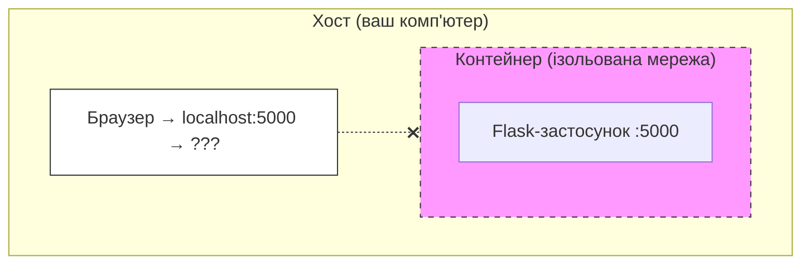
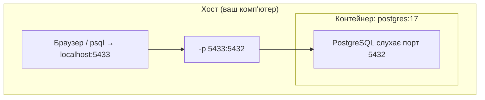
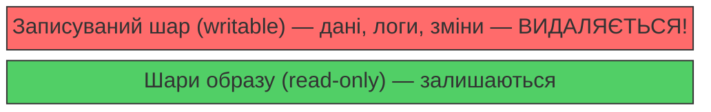
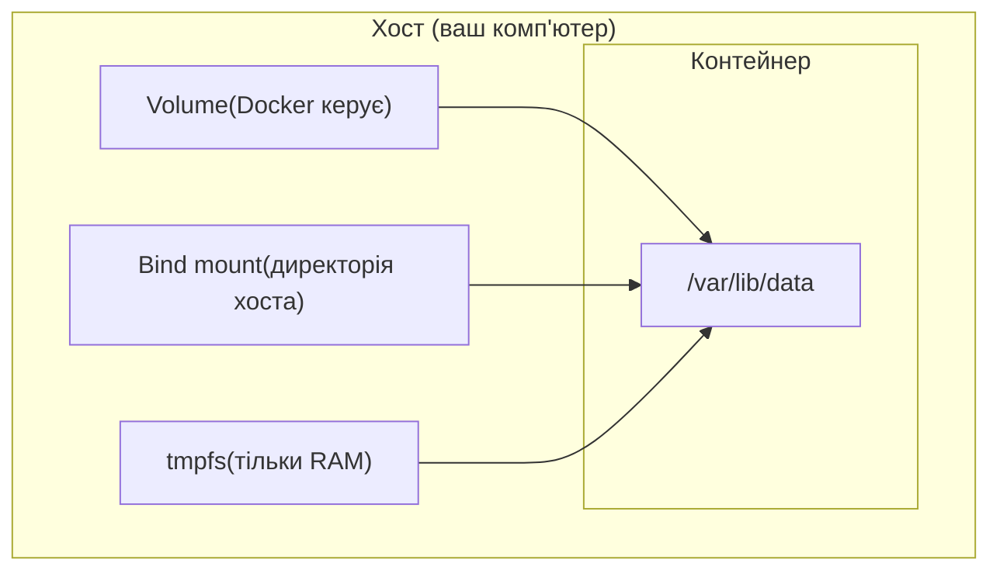
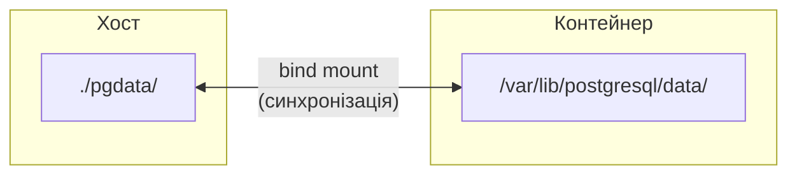
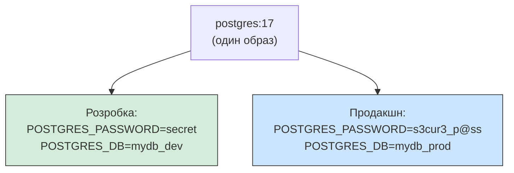

# 14. (Л) Керування контейнерами. Порти, volumes, змінні середовища

## Зміст лекції

1. Мережева модель Docker
2. Прокидання портів (-p)
3. Проблема збереження даних у контейнерах
4. Docker Volumes — постійне зберігання даних
5. Bind mounts — підключення директорій хоста
6. Змінні середовища (-e, --env-file)
7. Практичний приклад: PostgreSQL з volumes та env-файлом
8. Docker inspect та діагностика

## Мережева модель Docker

Кожен контейнер працює у своїй **ізольованій мережі**. За замовчуванням процеси всередині контейнера не доступні ззовні — навіть якщо застосунок слухає порт `5000`, з хостової машини до нього не дістатися.



Порт контейнера **недоступний ззовні** без прокидання.

Щоб зробити порт контейнера доступним, потрібно **прокинути** його на порт хоста.

## Прокидання портів (-p)

Прапорець `-p` (або `--publish`) створює зв'язок між портом хоста та портом контейнера.

### Синтаксис

```bash
docker run -p <порт_хоста>:<порт_контейнера> <образ>
```

### Приклади

```bash
# Порт 5432 контейнера → порт 5432 хоста
docker run -d -p 5432:5432 -e POSTGRES_PASSWORD=secret postgres:17

# Порт 5432 контейнера → порт 5433 хоста (інший порт!)
docker run -d -p 5433:5432 -e POSTGRES_PASSWORD=secret postgres:17

# Кілька портів одночасно (приклад з nginx)
docker run -d -p 8080:80 -p 8443:443 nginx
```

### Як це працює



Тепер `psql -h localhost -p 5433` на хості потрапить до PostgreSQL у контейнері.

### Прокидання на конкретний інтерфейс

За замовчуванням порт доступний на **всіх** мережевих інтерфейсах (`0.0.0.0`). Можна обмежити лише локальним доступом:

```bash
# Доступний тільки з localhost (безпечніше)
docker run -d -p 127.0.0.1:5432:5432 postgres:17

# Доступний з будь-якої адреси (за замовчуванням)
docker run -d -p 0.0.0.0:5432:5432 postgres:17
```

**Порада щодо безпеки:** на серверах завжди вказуйте `127.0.0.1`, якщо доступ потрібен лише локально. Інакше база даних буде доступна з інтернету.

### Перевірка портів

```bash
docker ps
```

```
CONTAINER ID   IMAGE         PORTS                     NAMES
a1b2c3d4e5f6   postgres:17   0.0.0.0:5433->5432/tcp    my-db
b2c3d4e5f6a7   nginx         0.0.0.0:8080->80/tcp      my-web
```

Колонка `PORTS` показує прокинуті порти у форматі `хост->контейнер`.

### Конфлікти портів

Два контейнери **не можуть** використовувати один порт хоста:

```bash
docker run -d -p 5432:5432 --name db1 postgres:17
# OK

docker run -d -p 5432:5432 --name db2 postgres:17
# ПОМИЛКА: port is already allocated
```

Рішення — використовувати різні порти хоста:

```bash
docker run -d -p 5432:5432 --name db1 postgres:17
docker run -d -p 5433:5432 --name db2 postgres:17
```

## Проблема збереження даних у контейнерах

У лекції 11 ми зазначили: дані в контейнері живуть лише до його видалення. Подивимося, як це виглядає на практиці.

### Демонстрація проблеми

```bash
# 1. Запускаємо PostgreSQL
docker run -d --name test-db \
  -e POSTGRES_PASSWORD=secret \
  -p 5432:5432 \
  postgres:17

# 2. Створюємо таблицю та додаємо дані
docker exec -it test-db psql -U postgres -c "
  CREATE TABLE notes (id SERIAL, text TEXT);
  INSERT INTO notes (text) VALUES ('Важлива нотатка');
"

# 3. Перевіряємо — дані є
docker exec -it test-db psql -U postgres -c "SELECT * FROM notes;"
#  id |      text
# ----+-----------------
#   1 | Важлива нотатка

# 4. Видаляємо контейнер
docker rm -f test-db

# 5. Запускаємо новий контейнер з тим самим образом
docker run -d --name test-db \
  -e POSTGRES_PASSWORD=secret \
  -p 5432:5432 \
  postgres:17

# 6. Дані зникли!
docker exec -it test-db psql -U postgres -c "SELECT * FROM notes;"
# ERROR:  relation "notes" does not exist
# LINE 1: SELECT * FROM notes;
```

Це тому що всі зміни зберігаються у **записуваному шарі** контейнера, який знищується разом з контейнером.



## Docker Volumes — постійне зберігання даних

**Volume** (том) — це механізм Docker для зберігання даних **поза контейнером**. Дані у volume зберігаються навіть після видалення контейнера.

### Типи зберігання даних у Docker



| Тип | Керує Docker | Де зберігається | Коли використовувати |
|---|---|---|---|
| **Volume** | Так | Внутрішнє сховище Docker | Бази даних, постійні дані |
| **Bind mount** | Ні | Будь-яка директорія хоста | Розробка, конфігурація |
| **tmpfs** | — | Оперативна пам'ять | Тимчасові дані, секрети |

### Створення та використання volumes

#### Створення volume

```bash
# Створити іменований volume
docker volume create pgdata

# Переглянути всі volumes
docker volume ls

# Інформація про volume
docker volume inspect pgdata
```

```json
[
    {
        "CreatedAt": "2026-03-09T10:31:17+02:00",
        "Driver": "local",
        "Labels": null,
        "Mountpoint": "/var/lib/docker/volumes/pgdata/_data",
        "Name": "pgdata",
        "Options": null,
        "Scope": "local"
    }
]
```

`Mountpoint` — фізичне розташування даних на хості. Docker керує цією директорією автоматично.

#### Підключення volume до контейнера

```bash
# Прапорець -v (або --volume)
docker run -d --name my-db \
  -v pgdata:/var/lib/postgresql/data \
  -e POSTGRES_PASSWORD=secret \
  postgres:17
```

Синтаксис `-v`:

```
-v <ім'я_volume>:<шлях_у_контейнері>
```

- `pgdata` — ім'я volume на хості
- `/var/lib/postgresql/data` — директорія всередині контейнера, де PostgreSQL зберігає свої файли

#### Альтернативний синтаксис --mount

Більш явний синтаксис, рекомендований для складних випадків:

```bash
docker run -d --name my-db \
  --mount type=volume,source=pgdata,target=/var/lib/postgresql/data \
  -e POSTGRES_PASSWORD=secret \
  postgres:17
```

### Демонстрація збереження даних

```bash
# 1. Створюємо volume та запускаємо PostgreSQL
docker volume create pgdata

docker run -d --name my-db \
  -v pgdata:/var/lib/postgresql/data \
  -e POSTGRES_PASSWORD=secret \
  -p 5432:5432 \
  postgres:17

# 2. Створюємо таблицю та додаємо дані
docker exec -it my-db psql -U postgres -c "
  CREATE TABLE notes (id SERIAL, text TEXT);
  INSERT INTO notes (text) VALUES ('Ці дані збережуться!');
"

# 3. Видаляємо контейнер
docker rm -f my-db

# 4. Запускаємо НОВИЙ контейнер з тим самим volume
docker run -d --name my-db-new \
  -v pgdata:/var/lib/postgresql/data \
  -e POSTGRES_PASSWORD=secret \
  -p 5432:5432 \
  postgres:17

# 5. Дані на місці!
docker exec -it my-db-new psql -U postgres -c "SELECT * FROM notes;"
#  id |         text
# ----+----------------------
#   1 | Ці дані збережуться!
```

### Автоматичне створення volumes

Якщо volume з вказаним ім'ям не існує, Docker створить його автоматично:

```bash
# Volume "pgdata" буде створено автоматично
docker run -d -v pgdata:/var/lib/postgresql/data -e POSTGRES_PASSWORD=secret postgres:17
```

### Керування volumes

```bash
# Список всіх volumes
docker volume ls

# Детальна інформація
docker volume inspect pgdata

# Видалити volume (дані будуть втрачені!)
docker volume rm pgdata

# Видалити всі невикористовувані volumes
docker volume prune
```

**Увага:** `docker volume rm` та `docker volume prune` **безповоротно** видаляють дані. Використовуйте обережно.

## Bind mounts — підключення директорій хоста

**Bind mount** підключає конкретну директорію або файл з хоста безпосередньо до контейнера. На відміну від volumes, ви самі обираєте розташування даних.

### Синтаксис

```bash
# Прапорець -v з абсолютним шляхом
docker run -v /home/user/pgdata:/var/lib/postgresql/data -e POSTGRES_PASSWORD=secret postgres:17

# Або --mount
docker run --mount type=bind,source=/home/user/pgdata,target=/var/lib/postgresql/data \
  -e POSTGRES_PASSWORD=secret postgres:17
```

**Ключова відмінність від volume:** якщо шлях починається з `/` або `./` — це bind mount. Якщо це просто ім'я (наприклад, `pgdata`) — це volume.

```bash
# Volume (Docker керує)
docker run -v pgdata:/var/lib/postgresql/data -e POSTGRES_PASSWORD=secret postgres:17

# Bind mount (вказана директорія хоста, створить /home/user/pgdata директорію на вашому хості)
docker run -v /home/user/pgdata:/var/lib/postgresql/data -e POSTGRES_PASSWORD=secret postgres:17
docker run -v ./pgdata:/var/lib/postgresql/data -e POSTGRES_PASSWORD=secret postgres:17
```

### Використання для розробки

Bind mounts ідеально підходять для розробки — зміни у файлах на хості одразу видно в контейнері:

```bash
# Підключити локальну директорію для даних PostgreSQL
docker run -d \
  --name postgres-dev \
  -v $(pwd)/pgdata:/var/lib/postgresql/data \
  -e POSTGRES_PASSWORD=secret \
  -p 5432:5432 \
  postgres:17
```



Файли бази даних зберігаються у `./pgdata/` на хості — їх можна переглядати, бекапити, переносити.

### Підключення файлів конфігурації

Можна підключати окремі файли, а не лише директорії:

```bash
# Підключити файл конфігурації
docker run -d \
  -v ./my-postgres.conf:/etc/postgresql/postgresql.conf \
  postgres:17
```

!!! warning "Файл повинен існувати до запуску контейнера"
    Якщо файл `my-postgres.conf` не існує на хості, Docker створить **директорію** з такою назвою замість файлу. Переконайтесь, що файл створено заздалегідь:

    ```bash
    touch my-postgres.conf
    ```

### Режим лише для читання

Додайте `:ro` для захисту від випадкових змін:

```bash
# Контейнер може лише читати, але не змінювати конфігурацію
docker run -d \
  -v ./my-postgres.conf:/etc/postgresql/postgresql.conf:ro \
  -e POSTGRES_PASSWORD=secret \
  postgres:17
```

### Volume vs Bind mount — порівняння

| Критерій | Volume | Bind mount |
|---|---|---|
| Хто керує | Docker | Ви самі |
| Розташування | `/var/lib/docker/volumes/` | Будь-де на хості |
| Портативність | Висока (працює скрізь) | Залежить від шляхів хоста |
| Продуктивність | Оптимальна | Може бути нижчою (macOS, Windows) |
| Бекапи | Через Docker CLI | Стандартними інструментами ОС |
| Найкраще для | Бази даних, продакшн | Розробка, конфігурація |

## Змінні середовища (-e, --env-file)

Змінні середовища — основний спосіб **конфігурації** контейнерів. Замість зміни коду або файлів конфігурації, ви передаєте параметри через змінні оточення.

### Навіщо це потрібно



### Передача через -e

```bash
# Одна змінна
docker run -e POSTGRES_PASSWORD=secret postgres:17

# Кілька змінних
docker run -d \
  -e POSTGRES_USER=myuser \
  -e POSTGRES_PASSWORD=secret \
  -e POSTGRES_DB=weather_db \
  postgres:17
```

### Передача значення з хостової системи

Якщо вказати тільки ім'я змінної (без `=`), Docker передасть її значення з хостової системи:

```bash
# Передати значення змінної з хоста
export POSTGRES_PASSWORD="secret"
docker run -e POSTGRES_PASSWORD postgres:17
# Всередині контейнера: POSTGRES_PASSWORD=secret
```

### Файл змінних середовища (--env-file)

Коли змінних багато, зручніше зберігати їх у файлі:

```bash
# Файл .env
POSTGRES_USER=myuser
POSTGRES_PASSWORD=secret
POSTGRES_DB=weather_db
```

```bash
# Передати всі змінні з файлу
docker run --env-file .env postgres:17
```

**Формат .env файлу:**

- Кожна змінна на окремому рядку: `KEY=VALUE`
- Коментарі починаються з `#`
- Порожні рядки ігноруються
- Лапки навколо значень **не** потрібні (вони стануть частиною значення)

```bash
# .env приклад
# Конфігурація бази даних
DB_HOST=localhost
DB_PORT=5432
DB_NAME=mydb

# Ніколи не комітьте .env у Git!
DB_PASSWORD=secret
```

### Безпека: ніколи не комітьте .env

Файл `.env` зазвичай містить паролі та секрети. Додайте його до `.gitignore`:

```
# .gitignore
.env
```

Замість цього створіть файл `.env.example` з прикладами (без реальних значень):

```bash
# .env.example — закомітити в Git
DB_HOST=localhost
DB_PORT=5432
DB_NAME=mydb
DB_USER=postgres
DB_PASSWORD=CHANGE_ME
```

### Перевірка змінних у контейнері

```bash
# Переглянути всі змінні середовища
docker exec my-container env

# Перевірити конкретну змінну
docker exec my-container printenv DB_HOST
```

### Пріоритет змінних

Якщо одна змінна задана кількома способами, пріоритет такий:

1. **-e** (найвищий) — прапорець командного рядка
2. **--env-file** — файл змінних
3. **ENV у Dockerfile** (найнижчий) — значення за замовчуванням

```bash
# ENV у Dockerfile: LOG_LEVEL=info
# .env: LOG_LEVEL=debug
# -e: LOG_LEVEL=тесь в момент запуску командиwarning

docker run --env-file .env -e POSTGRES_PASSWORD=override postgres:17
# Результат: POSTGRES_PASSWORD=override (пріоритет -e)
```

## Практичний приклад: PostgreSQL з volumes та env-файлом

Зберемо все разом — запустимо PostgreSQL із збереженням даних та зручною конфігурацією.

### Створюємо env-файл

```bash
# postgres.env
POSTGRES_USER=myuser
POSTGRES_PASSWORD=mysecretpassword
POSTGRES_DB=weather_db
```

### Запускаємо PostgreSQL

```bash
# Створюємо volume для даних
docker volume create postgres-data

# Запускаємо контейнер
docker run -d \
  --name postgres-dev \
  --env-file postgres.env \
  -v postgres-data:/var/lib/postgresql/data \
  -p 5432:5432 \
  postgres:17
```

### Перевіряємо

```bash
# Статус контейнера
docker ps

# Логи
docker logs postgres-dev

# Підключення
docker exec -it postgres-dev psql -U myuser -d weather_db
```

### Підключення з Python

```python
import psycopg2

conn = psycopg2.connect(
    host="localhost",
    port=5432,
    dbname="weather_db",
    user="myuser",
    password="mysecretpassword",
)

cur = conn.cursor()
cur.execute("SELECT version();")
print(cur.fetchone()[0])

cur.close()
conn.close()
```

### Повний цикл

```bash
# Зупинити контейнер (дані зберігаються у volume)
docker stop postgres-dev

# Видалити контейнер
docker rm postgres-dev

# Запустити новий контейнер з тим самим volume — дані на місці
docker run -d \
  --name postgres-dev \
  --env-file postgres.env \
  -v postgres-data:/var/lib/postgresql/data \
  -p 5432:5432 \
  postgres:17

# Коли volume більше не потрібен
docker volume rm postgres-data
```

## Docker inspect та діагностика

Команда `docker inspect` показує повну інформацію про контейнер у форматі JSON.

### Перегляд конфігурації контейнера

```bash
# Повна інформація (дуже багато даних)
docker inspect postgres-dev

# Тільки змінні середовища
docker inspect --format='{{range .Config.Env}}{{println .}}{{end}}' postgres-dev

# Тільки прокинуті порти
docker inspect --format='{{json .NetworkSettings.Ports}}' postgres-dev

# Тільки підключені volumes
docker inspect --format='{{json .Mounts}}' postgres-dev
```

### Перегляд використання ресурсів

```bash
# Статистика CPU, RAM, мережі в реальному часі
docker stats

# Для конкретного контейнера
docker stats postgres-dev
```

```
CONTAINER ID   NAME           CPU %   MEM USAGE / LIMIT   MEM %   NET I/O       BLOCK I/O
a1b2c3d4e5f6   postgres-dev   0.15%   48.5MiB / 7.7GiB   0.61%   1.2kB / 0B    12MB / 8MB
```

### Перегляд використання диску

```bash
# Скільки місця займають образи, контейнери, volumes
docker system df
```

```
TYPE            TOTAL     ACTIVE    SIZE      RECLAIMABLE
Images          24        15        10.41GB   7.932GB (76%)
Containers      61        1         22.26MB   22.26MB (99%)
Local Volumes   56        49        2.465GB   337.4MB (13%)
Build Cache     35        0         9.132GB   8.657GB
```

## Підсумок

| Концепція | Прапорець | Призначення |
|---|---|---|
| Прокидання портів | `-p хост:контейнер` | Доступ до сервісів контейнера |
| Volume | `-v ім'я:шлях` | Постійне зберігання даних |
| Bind mount | `-v ./шлях:шлях` | Підключення директорії хоста |
| Змінна середовища | `-e KEY=VALUE` | Конфігурація контейнера |
| Файл змінних | `--env-file .env` | Конфігурація з файлу |
| Тільки читання | `:ro` | Захист від змін |

## Корисні посилання

- [Docker Volumes — офіційна документація](https://docs.docker.com/engine/storage/volumes/)
- [Bind mounts](https://docs.docker.com/engine/storage/bind-mounts/)
- [Docker networking](https://docs.docker.com/engine/network/)
- [Environment variables in Docker](https://docs.docker.com/compose/how-tos/environment-variables/)
- [Офіційний образ PostgreSQL — змінні середовища](https://hub.docker.com/_/postgres)

## Домашнє завдання

1. Запустити PostgreSQL у контейнері з іменованим volume для збереження даних.
2. Створити таблицю та додати кілька записів.
3. Видалити контейнер (`docker rm -f`) та створити новий з тим самим volume.
4. Переконатися, що дані збереглися.
5. Використати `--env-file` для передачі конфігурації PostgreSQL.
