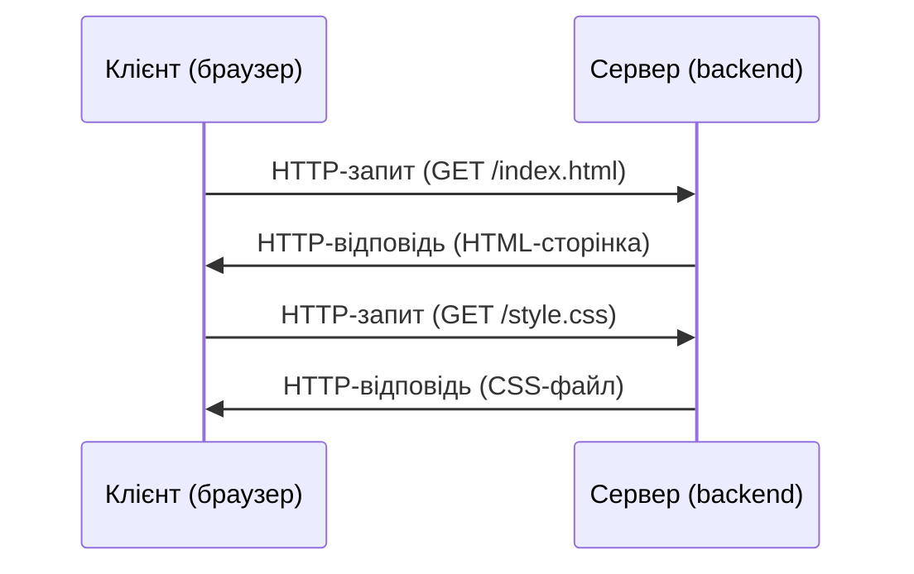
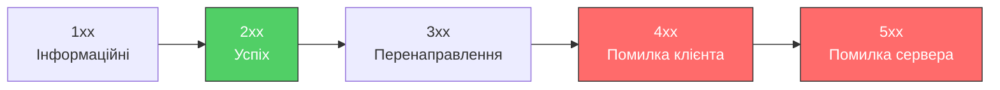
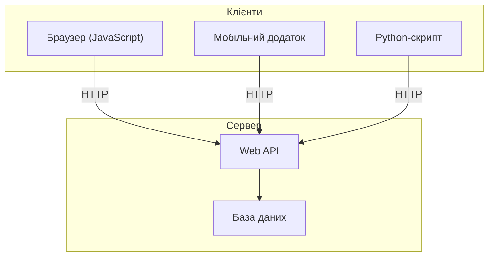
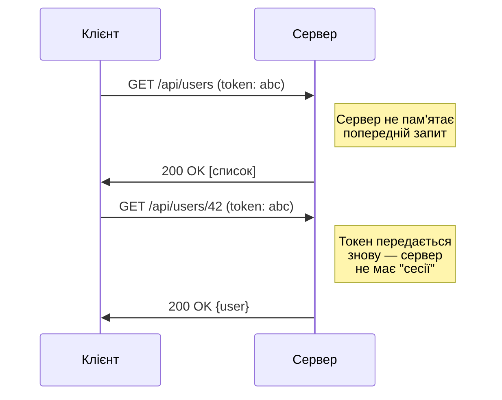
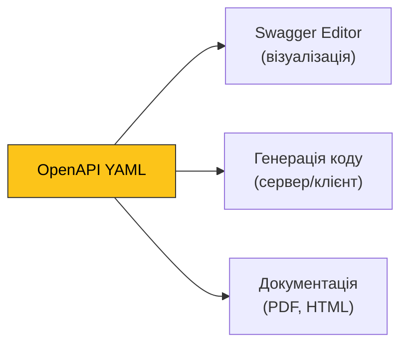

# 16. (Л) HTTP та архітектурний стиль REST

## Зміст лекції

1. Як працює веб: клієнт-серверна модель
2. Протокол HTTP
3. Структура HTTP-запиту та відповіді
4. HTTP-методи
5. Коди стану HTTP
6. Заголовки HTTP
7. Що таке API
8. Архітектурний стиль REST
9. Ресурси та URL
10. Приклад RESTful API
11. Формат JSON
12. Специфікація OpenAPI (Swagger)
13. Інструменти для роботи з HTTP

## Як працює веб: клієнт-серверна модель

Коли ви відкриваєте сайт у браузері, відбувається обмін даними між двома сторонами:

- **Клієнт** — програма, яка надсилає запит (браузер, мобільний додаток, Python-скрипт)
- **Сервер** — програма, яка приймає запит, обробляє його та повертає відповідь



Цей обмін відбувається за допомогою протоколу **HTTP**.

## Протокол HTTP

**HTTP** (HyperText Transfer Protocol) — це протокол прикладного рівня для передачі даних у вебі. Він визначає формат повідомлень між клієнтом і сервером.

### Ключові властивості HTTP

| Властивість | Опис |
|---|---|
| **Текстовий** | Повідомлення читабельні для людини |
| **Без стану (stateless)** | Сервер не пам'ятає попередні запити. Кожен запит — незалежний |
| **Запит-відповідь** | Клієнт завжди ініціює спілкування. Сервер лише відповідає |
| **Порт за замовчуванням** | 80 для HTTP, 443 для HTTPS |

**HTTPS** — це HTTP з шифруванням (TLS/SSL). Усі сучасні сайти використовують HTTPS для захисту даних.

### Версії HTTP

- **HTTP/1.1** (1997) — найпоширеніша версія, текстовий протокол
- **HTTP/2** (2015) — бінарний протокол, мультиплексування запитів
- **HTTP/3** (2022) — побудований на QUIC протоколі.


## Структура HTTP-запиту та відповіді

### HTTP-запит

```
POST /api/users HTTP/1.1            ← рядок запиту (метод, шлях, версія)
Host: example.com                   ← заголовки
Content-Type: application/json
Authorization: Bearer abc123
                                    ← порожній рядок (розділювач)
{                                   ← тіло запиту (необов'язкове)
    "name": "Тарас",
    "email": "taras@example.com"
}
```

Три частини запиту:

1. **Рядок запиту** — метод, шлях до ресурсу, версія протоколу
2. **Заголовки** — метадані запиту (пари ключ: значення)
3. **Тіло** — дані, що передаються серверу (не в усіх методах)

### HTTP-відповідь

```
HTTP/1.1 200 OK                      ← рядок статусу (версія, код, опис)
Content-Type: application/json        ← заголовки
Content-Length: 45

{"id": 42, "name": "Тарас"}          ← тіло відповіді
```

Три частини відповіді:

1. **Рядок статусу** — версія протоколу, код стану, текстовий опис
2. **Заголовки** — метадані відповіді
3. **Тіло** — дані, які повертає сервер

## HTTP-методи

HTTP-метод вказує, яку дію клієнт хоче виконати з ресурсом на сервері.

### Основні методи

**Ідемпотентний метод** — повторний виклик дає той самий результат. Наприклад, `DELETE /users/42` — видалити користувача 42. Перший виклик видаляє, другий — нічого не змінює (користувача вже немає). Результат однаковий.


| Метод | Призначення | Має тіло запиту | Ідемпотентний |
|---|---|---|---|
| **GET** | Отримати дані | Ні | Так |
| **POST** | Створити новий ресурс | Так | Ні |
| **PUT** | Замінити ресурс повністю | Так | Так |
| **PATCH** | Частково оновити ресурс | Так | Ні |
| **DELETE** | Видалити ресурс | Ні | Так |


`POST` — не ідемпотентний: кожен виклик `POST /users` створює нового користувача.

### Приклади запитів

```
# Отримати список користувачів
GET /api/users HTTP/1.1

# Створити нового користувача
POST /api/users HTTP/1.1
Content-Type: application/json

{"name": "Олена", "email": "olena@example.com"}

# Оновити користувача повністю
PUT /api/users/42 HTTP/1.1
Content-Type: application/json

{"name": "Олена", "email": "olena@new.com"}

# Частково оновити
PATCH /api/users/42 HTTP/1.1
Content-Type: application/json

{"email": "olena@new.com"}

# Видалити користувача
DELETE /api/users/42 HTTP/1.1
```

## Коди стану HTTP

Код стану — це тризначне число у відповіді сервера, яке повідомляє результат обробки запиту.

### Категорії кодів



### Найважливіші коди

| Код | Назва | Коли використовується |
|---|---|---|
| **200** | OK | Запит успішний (GET, PUT, PATCH) |
| **201** | Created | Ресурс створено (POST) |
| **204** | No Content | Успішно, але тіла відповіді немає (DELETE) |
| **400** | Bad Request | Невалідні дані у запиті |
| **401** | Unauthorized | Потрібна автентифікація |
| **403** | Forbidden | Доступ заборонено (навіть з автентифікацією) |
| **404** | Not Found | Ресурс не знайдено |
| **405** | Method Not Allowed | Метод не підтримується для цього ресурсу |
| **409** | Conflict | Конфлікт (наприклад, дублікат email) |
| **422** | Unprocessable Entity | Синтаксис правильний, але семантична помилка |
| **500** | Internal Server Error | Неочікувана помилка на сервері |

### Просте правило

- **2xx** — все добре
- **4xx** — клієнт щось зробив не так
- **5xx** — щось зламалося на сервері

## Заголовки HTTP

Заголовки передають додаткову інформацію про запит або відповідь. Формат: `Назва: Значення`.

### Найпоширеніші заголовки

**Заголовки запиту:**

| Заголовок | Призначення | Приклад |
|---|---|---|
| `Host` | Доменне ім'я сервера | `Host: api.example.com` |
| `Accept` | Які формати клієнт приймає | `Accept: application/json` |
| `Content-Type` | Формат тіла запиту | `Content-Type: application/json` |
| `Authorization` | Дані автентифікації | `Authorization: Bearer token123` |
| `User-Agent` | Інформація про клієнта | `User-Agent: Mozilla/5.0...` |

**Заголовки відповіді:**

| Заголовок | Призначення | Приклад |
|---|---|---|
| `Content-Type` | Формат тіла відповіді | `Content-Type: application/json` |
| `Content-Length` | Розмір тіла в байтах | `Content-Length: 256` |
| `Location` | URL нового ресурсу (з 201) | `Location: /api/users/43` |

## Що таке API

**API** (Application Programming Interface) — це набір правил, за якими програми спілкуються одна з одною.

Веб-сайт повертає HTML-сторінки для людей. **Web API** повертає структуровані дані (зазвичай JSON) для програм.



Один API може обслуговувати різних клієнтів — вебсайт, мобільний додаток, сторонні сервіси.

## Архітектурний стиль REST

**REST** (Representational State Transfer) — це архітектурний стиль для побудови Web API, запропонований Роєм Філдінгом у 2000 році в його докторській дисертації.

REST — це не протокол і не стандарт, а набір **принципів** (обмежень), яких слід дотримуватись при проєктуванні API.

### Принципи REST

#### 1. Клієнт-серверна архітектура

Клієнт і сервер розділені. Сервер не знає про інтерфейс клієнта, клієнт не знає про деталі зберігання даних. Вони спілкуються лише через API.

#### 2. Відсутність стану (Stateless)

Кожен запит містить **всю** інформацію, необхідну для його обробки. Сервер не зберігає контекст між запитами.



Це спрощує масштабування: будь-який сервер може обробити будь-який запит.

#### 3. Кешування

Відповіді сервера можуть бути позначені як такі, що кешуються. Клієнт може повторно використовувати відповідь замість повторного запиту.

#### 4. Єдиний інтерфейс (Uniform Interface)

Це ключовий принцип REST. API має бути однорідним і передбачуваним:

- **Ресурси ідентифікуються через URL** — `/api/users/42`
- **Маніпуляція через представлення** — клієнт отримує JSON-представлення ресурсу і може надіслати модифіковану версію назад
- **Самоописові повідомлення** — кожне повідомлення містить достатньо інформації для обробки (Content-Type, методи, коди стану)

#### 5. Багатошарова система

Клієнт не знає, чи спілкується безпосередньо із сервером, чи з проміжним шаром (балансувальник навантаження, кеш, проксі).

## Ресурси та URL

У REST все є **ресурсом** — сутністю, до якої можна звернутися через URL.

### Структура URL


| Частина | Приклад | Призначення |
|---|---|---|
| Схема | `https://` | Протокол |
| Хост | `api.example.com` | Адреса сервера |
| Префікс + версія | `/api/v1` | Базовий шлях API |
| Ресурс + ID | `/students/42` | Конкретний студент |
| Вкладений ресурс | `/courses` | Курси цього студента |

### Правила іменування URL

| Правило | Добре | Погано |
|---|---|---|
| Іменники, не дієслова | `/users` | `/getUsers` |
| Множина | `/students` | `/student` |
| Малі літери | `/courses` | `/Courses` |
| Дефіс для розділення | `/course-enrollments` | `/courseEnrollments` |
| Вкладеність для зв'язків | `/students/42/courses` | `/getStudentCourses?id=42` |
| Без слеша в кінці | `/users` | `/users/` |

### Типова структура RESTful URL

```
/api/students          — колекція студентів
/api/students/42       — конкретний студент
/api/students/42/courses — курси конкретного студента
```

## Приклад RESTful API

Розглянемо API для управління студентами.

### CRUD-операції

**CRUD** — Create, Read, Update, Delete — чотири базові операції над ресурсами.

| Операція | HTTP-метод | URL | Тіло запиту | Відповідь |
|---|---|---|---|---|
| Отримати всіх | GET | `/api/students` | — | 200 + список |
| Отримати одного | GET | `/api/students/42` | — | 200 + об'єкт |
| Створити | POST | `/api/students` | JSON | 201 + створений |
| Оновити | PUT | `/api/students/42` | JSON | 200 + оновлений |
| Видалити | DELETE | `/api/students/42` | — | 204 (без тіла) |

### Приклад діалогу клієнт-сервер

**Створення студента:**

```
POST /api/students HTTP/1.1
Content-Type: application/json

{
    "first_name": "Тарас",
    "last_name": "Шевченко",
    "email": "taras@example.com"
}
```

```
HTTP/1.1 201 Created
Content-Type: application/json
Location: /api/students/1

{
    "id": 1,
    "first_name": "Тарас",
    "last_name": "Шевченко",
    "email": "taras@example.com"
}
```

**Отримання списку:**

```
GET /api/students HTTP/1.1
Accept: application/json
```

```
HTTP/1.1 200 OK
Content-Type: application/json

[
    {
        "id": 1,
        "first_name": "Тарас",
        "last_name": "Шевченко",
        "email": "taras@example.com"
    },
    {
        "id": 2,
        "first_name": "Леся",
        "last_name": "Українка",
        "email": "lesya@example.com"
    }
]
```

**Видалення:**

```
DELETE /api/students/1 HTTP/1.1
```

```
HTTP/1.1 204 No Content
```

**Запит неіснуючого ресурсу:**

```
GET /api/students/999 HTTP/1.1
```

```
HTTP/1.1 404 Not Found
Content-Type: application/json

{
    "error": "Student not found"
}
```

## Формат JSON

**JSON** (JavaScript Object Notation) — стандартний формат обміну даними в сучасних Web API.

### Типи даних у JSON

```json
{
    "string": "текст у подвійних лапках",
    "number_int": 42,
    "number_float": 3.14,
    "boolean": true,
    "null_value": null,
    "array": [1, 2, 3],
    "object": {
        "key": "value"
    }
}
```

### Python та JSON

Python має вбудований модуль `json`:

```python
import json

# Python dict → JSON рядок
data = {"name": "Тарас", "age": 25, "courses": ["Python", "SQL"]}
json_string = json.dumps(data, ensure_ascii=False, indent=2)
print(json_string)
# {
#   "name": "Тарас",
#   "age": 25,
#   "courses": ["Python", "SQL"]
# }

# JSON рядок → Python dict
parsed = json.loads(json_string)
print(parsed["name"])  # Тарас
print(type(parsed))    # <class 'dict'>
```

### Відповідність типів Python ↔ JSON

| Python | JSON |
|---|---|
| `dict` | `object {}` |
| `list`, `tuple` | `array []` |
| `str` | `string` |
| `int`, `float` | `number` |
| `True` / `False` | `true` / `false` |
| `None` | `null` |

## Специфікація OpenAPI (Swagger)

Коли API стає складним, потрібен стандартний спосіб його **документування**. Саме для цього існує **OpenAPI**.

### Що таке OpenAPI

**OpenAPI Specification** (раніше Swagger Specification) — це стандартний формат опису REST API у вигляді YAML або JSON файлу. Цей файл описує:

- Які endpoint-и доступні
- Які HTTP-методи підтримуються
- Які параметри приймає кожен endpoint
- Які відповіді повертає сервер
- Структуру даних (схеми)



### Swagger Editor

[Swagger Editor](https://editor.swagger.io/) — безкоштовний онлайн-редактор для написання OpenAPI специфікацій. Він працює прямо в браузері без встановлення:

- Ліва панель — YAML-код специфікації
- Права панель — візуалізація API в реальному часі
- Валідація помилок на льоту
- Можливість експортувати документацію

### Структура OpenAPI-файлу

Специфікація пишеться у форматі **YAML**:

```yaml
openapi: 3.0.3
info:
  title: Student API
  description: API для управління студентами
  version: 1.0.0

paths:
  /api/students:
    get:
      summary: Отримати список студентів
      responses:
        '200':
          description: Список студентів
          content:
            application/json:
              schema:
                type: array
                items:
                  $ref: '#/components/schemas/Student'
    post:
      summary: Створити студента
      requestBody:
        required: true
        content:
          application/json:
            schema:
              $ref: '#/components/schemas/StudentCreate'
      responses:
        '201':
          description: Студент створений
          content:
            application/json:
              schema:
                $ref: '#/components/schemas/Student'
        '400':
          description: Невалідні дані

  /api/students/{id}:
    get:
      summary: Отримати студента за ID
      parameters:
        - name: id
          in: path
          required: true
          schema:
            type: integer
      responses:
        '200':
          description: Дані студента
          content:
            application/json:
              schema:
                $ref: '#/components/schemas/Student'
        '404':
          description: Студент не знайдений

components:
  schemas:
    Student:
      type: object
      properties:
        id:
          type: integer
          example: 1
        first_name:
          type: string
          example: Тарас
        last_name:
          type: string
          example: Шевченко
        email:
          type: string
          example: taras@example.com

    StudentCreate:
      type: object
      required:
        - first_name
        - last_name
        - email
      properties:
        first_name:
          type: string
          example: Тарас
        last_name:
          type: string
          example: Шевченко
        email:
          type: string
          example: taras@example.com
```

### Ключові секції

| Секція | Призначення |
|---|---|
| `openapi` | Версія специфікації (3.0.3) |
| `info` | Назва, опис, версія API |
| `paths` | Endpoint-и та їхні методи |
| `parameters` | Параметри запиту (path, query) |
| `requestBody` | Тіло запиту (для POST, PUT) |
| `responses` | Можливі відповіді з кодами стану |
| `components/schemas` | Моделі даних (перевикористовуються через `$ref`) |

### $ref — посилання на схеми

Замість дублювання структури даних у кожному endpoint-і, визначте схему один раз у `components/schemas` і посилайтесь на неї:

```yaml
# Визначення
components:
  schemas:
    Student:
      type: object
      properties:
        id:
          type: integer
        name:
          type: string

# Використання в будь-якому endpoint-і
responses:
  '200':
    content:
      application/json:
        schema:
          $ref: '#/components/schemas/Student'
```

### Параметри запиту

```yaml
# Path-параметр: /api/students/42
parameters:
  - name: id
    in: path
    required: true
    schema:
      type: integer

# Query-параметр: /api/students?status=active
parameters:
  - name: status
    in: query
    required: false
    schema:
      type: string
      enum: [active, inactive]
```

### Як спробувати

1. Відкрийте [editor.swagger.io](https://editor.swagger.io/)
2. Видаліть вміст лівої панелі
3. Вставте (повний) YAML-приклад вище
4. Праворуч з'явиться візуальна документація API

## Інструменти для роботи з HTTP

### curl — командний рядок

`curl` — утиліта для відправки HTTP-запитів з терміналу. Встановлена за замовчуванням у більшості систем.

```bash
# GET-запит
curl https://httpbin.org/get

# GET з заголовками
curl -v https://httpbin.org/get

# POST з JSON-тілом
curl -X POST https://httpbin.org/post \
  -H "Content-Type: application/json" \
  -d '{"name": "Тарас", "email": "taras@example.com"}'

# DELETE
curl -X DELETE https://httpbin.org/delete

# Тільки заголовки відповіді
curl -I https://httpbin.org/get
```

Корисні прапорці:

| Прапорець | Призначення |
|---|---|
| `-X METHOD` | HTTP-метод (GET, POST, PUT, DELETE) |
| `-H "Header: Value"` | Додати заголовок |
| `-d 'data'` | Тіло запиту |
| `-v` | Детальний вивід (verbose) |
| `-I` | Тільки заголовки відповіді |
| `-s` | Тихий режим (без прогрес-бару) |

### Python — бібліотека requests

`requests` — найпопулярніша Python-бібліотека для HTTP-запитів.

```bash
pip install requests
```

```python
import requests

# GET
response = requests.get("https://httpbin.org/get")
print(response.status_code)  # 200
print(response.json())       # dict з відповіддю

# POST з JSON
response = requests.post(
    "https://httpbin.org/post",
    json={"name": "Тарас", "email": "taras@example.com"},
)
print(response.status_code)  # 200
print(response.json())

# PUT
response = requests.put(
    "https://httpbin.org/put",
    json={"name": "Тарас", "email": "new@example.com"},
)

# DELETE
response = requests.delete("https://httpbin.org/delete")
print(response.status_code)  # 200

# Заголовки відповіді
print(response.headers["Content-Type"])  # application/json
```

### httpbin.org — тестовий сервер

[httpbin.org](https://httpbin.org) — безкоштовний сервіс для тестування HTTP-запитів. Він повертає інформацію про ваш запит у форматі JSON.

Корисні endpoint-и:

| URL | Опис |
|---|---|
| `/get` | Повертає дані GET-запиту |
| `/post` | Приймає POST-запит |
| `/put` | Приймає PUT-запит |
| `/delete` | Приймає DELETE-запит |
| `/status/{code}` | Повертає вказаний код стану |
| `/headers` | Повертає заголовки запиту |
| `/json` | Повертає приклад JSON |

## Підсумок

| Концепція | Опис |
|---|---|
| **HTTP** | Протокол обміну даними між клієнтом і сервером |
| **HTTP-метод** | Дія над ресурсом (GET, POST, PUT, DELETE) |
| **Код стану** | Числовий результат обробки запиту (200, 404, 500) |
| **Заголовки** | Метадані запиту/відповіді (Content-Type, Authorization) |
| **API** | Інтерфейс для спілкування програм між собою |
| **REST** | Архітектурний стиль: ресурси + HTTP-методи + коди стану |
| **JSON** | Стандартний формат даних у Web API |
| **CRUD** | Create (POST), Read (GET), Update (PUT), Delete (DELETE) |
| **OpenAPI** | Стандарт опису REST API у форматі YAML/JSON |

## Корисні посилання

- [MDN Web Docs — HTTP](https://developer.mozilla.org/en-US/docs/Web/HTTP)
- [HTTP Cats](https://http.cat/) — коди стану HTTP з котиками
- [REST API Tutorial](https://restfulapi.net/)
- [httpbin.org](https://httpbin.org/) — тестовий HTTP-сервіс
- [Документація requests](https://docs.python-requests.org/)
- [Дисертація Роя Філдінга (глава 5 — REST)](https://www.ics.uci.edu/~fielding/pubs/dissertation/rest_arch_style.htm)
- [JSON.org](https://www.json.org/json-ua.html)
- [OpenAPI Specification](https://spec.openapis.org/oas/v3.0.3) — офіційна специфікація
- [Swagger Editor](https://editor.swagger.io/) — онлайн-редактор OpenAPI

## Домашнє завдання

1. За допомогою `curl` надіслати GET-запит до `https://httpbin.org/get` та проаналізувати відповідь (заголовки, тіло).
2. За допомогою `curl` надіслати POST-запит з JSON-тілом до `https://httpbin.org/post`.
3. Написати Python-скрипт з використанням `requests`, який:
    - Відправляє GET-запит і виводить код стану та тіло відповіді
    - Відправляє POST-запит з JSON-даними і виводить результат
    - Відправляє запит до `https://httpbin.org/status/404` та обробляє код помилки
