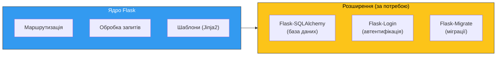
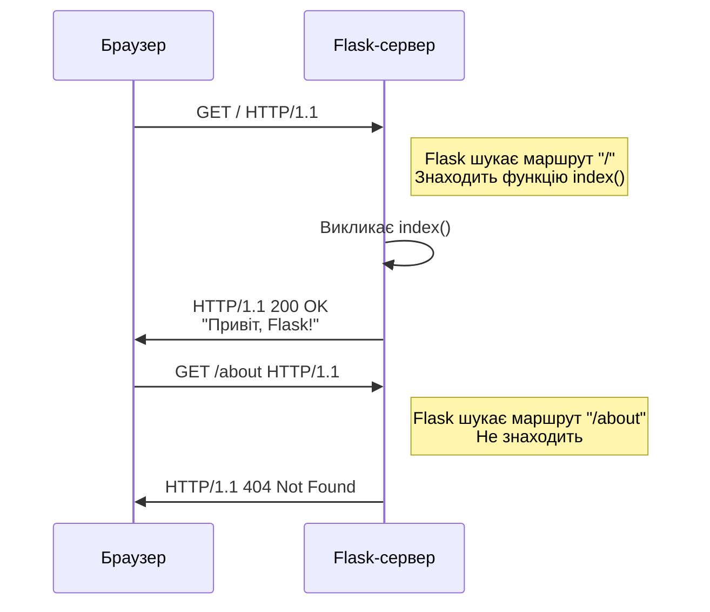

# 18. (Л) Знайомство з Flask. Маршрутизація (Routing)

## Зміст лекції

1. Що таке Flask
2. Встановлення та мінімальний застосунок
3. Як працює Flask-сервер
4. Маршрутизація: декоратор `@app.route`
5. Динамічні маршрути та конвертери
6. HTTP-методи у маршрутах
7. Об'єкт запиту `request`
8. Формування відповідей: `jsonify` та коди стану
9. Побудова URL: `url_for`
10. Режим налагодження (Debug mode)

## Що таке Flask

**Flask** — це мікрофреймворк для створення веб-застосунків на Python.

**Мікро** означає, що ядро Flask мінімальне: маршрутизація, обробка запитів та шаблони. Все інше (робота з базою даних, автентифікація, валідація) додається через розширення. Це дає розробнику свободу вибору інструментів.



### Flask vs Django

| Критерій | Flask | Django |
|---|---|---|
| Філософія | Мінімалізм, свобода вибору | «Батарейки включені» |
| Розмір ядра | Малий | Великий |
| ORM | Немає (підключається) | Вбудована |
| Адмін-панель | Немає | Вбудована |
| Навчання | Простіший старт | Більше концепцій одразу |
| Коли обрати | API, мікросервіси, навчання | Великі веб-застосунки з адмінкою |

Ми використовуємо Flask, тому що він дозволяє зрозуміти, як працюють веб-застосунки на базовому рівні, без «магії» великого фреймворку.

## Встановлення та мінімальний застосунок

### Встановлення

```bash
# Створення віртуального середовища
python3 -m venv env
source env/bin/activate

# Встановлення Flask
pip install flask
```

### Мінімальний застосунок

Створіть файл `app.py`:

```python
# Імпортуємо клас Flask
from flask import Flask

# Створюємо екземпляр застосунку
# __name__ — ім'я поточного модуля, Flask використовує його
# для пошуку шаблонів та статичних файлів
app = Flask(__name__)


# Декоратор @app.route пов'язує URL "/" з функцією index
@app.route("/")
def index():
    # Функція повертає відповідь клієнту
    return "Привіт, Flask!"
```

Функція `index` називається **view-функцією** (або обробником маршруту). Її ім'я може бути довільним — Flask зв'язує URL з функцією через декоратор `@app.route`, а не через назву функції.

Запуск:

```bash
flask run
```

```
 * Running on http://127.0.0.1:5000
```

Відкрийте `http://127.0.0.1:5000` у браузері — ви побачите текст «Привіт, Flask!».

## Як працює Flask-сервер

Коли ви запускаєте `flask run`, відбувається наступне:



Flask зберігає таблицю відповідності «URL → функція». Коли надходить запит, Flask знаходить відповідну функцію та викликає її. Якщо маршрут не знайдено — повертає 404.

### Змінна оточення `FLASK_APP`

Команда `flask run` шукає файл `app.py` або `wsgi.py` у поточній директорії. Якщо ваш файл має іншу назву, вкажіть його через змінну оточення:

```bash
# Якщо файл називається server.py
export FLASK_APP=server
flask run
```

!!! warning "Вбудований сервер — тільки для розробки"
    Вбудований сервер Flask не призначений для production. Він обробляє запити послідовно, не витримує навантажень і не має механізмів безпеки. У production використовують WSGI-сервери, наприклад Gunicorn.

## Маршрутизація: декоратор `@app.route`

**Маршрутизація** — це зв'язування URL-адрес з функціями, які їх обробляють.

### Кілька маршрутів

```python
@app.route("/")
def index():
    return "Головна сторінка"


@app.route("/about")
def about():
    return "Про нас"


@app.route("/contacts")
def contacts():
    return "Контакти: email@example.com"
```

Кожна view-функція повинна мати **унікальне ім'я**, навіть якщо маршрути різні.

### Кілька URL для однієї функції

```python
@app.route("/")
@app.route("/home")
@app.route("/index")
def index():
    return "Головна сторінка"
```

Усі три URL (`/`, `/home`, `/index`) викличуть одну й ту саму функцію.

### Слеш в кінці URL (trailing slash)

Flask розрізняє `/about` і `/about/`. Поведінка залежить від того, як оголошено маршрут:

```python
@app.route("/projects/")
def projects():
    return "Проєкти"


@app.route("/about")
def about():
    return "Про нас"
```

| Маршрут | Запит | Результат |
|---|---|---|
| `"/projects/"` | `GET /projects/` | 200 OK |
| `"/projects/"` | `GET /projects` | 301 → `/projects/` (перенаправлення) |
| `"/about"` | `GET /about` | 200 OK |
| `"/about"` | `GET /about/` | 404 Not Found |

**Чому так?** Flask використовує аналогію з файловою системою:

- **`/projects/`** (зі слешем) — це як **директорія**. Якщо ви звернетесь до директорії без слеша (`/projects`), система автоматично додасть слеш і перенаправить вас. Так само працюють веб-сервери (Apache, Nginx) — вони завжди додають `/` до шляхів директорій.

- **`/about`** (без слеша) — це як **файл**. Файл `/about` і файл `/about/` — це різні речі. Flask не вгадує, що ви мали на увазі, і повертає 404.

Для REST API зазвичай оголошують маршрути **без слеша** (`/api/tasks`, не `/api/tasks/`), згідно з конвенціями REST, які ми розглянули в [лекції 16](../module2/16-http-rest-lecture.md#url_2).

## Динамічні маршрути та конвертери

Часто URL містить змінні частини — ідентифікатор ресурсу, ім'я користувача тощо. Flask дозволяє оголошувати **динамічні маршрути**:

```python
@app.route("/users/<username>")
def user_profile(username):
    return f"Профіль: {username}"
```

Частина `<username>` у маршруті — це змінна. Flask витягне значення з URL і передасть його як аргумент функції.

```
GET /users/taras    → user_profile(username="taras")
GET /users/olena    → user_profile(username="olena")
```

### Конвертери типів

За замовчуванням змінна має тип `string`. Flask має вбудовані конвертери:

| Конвертер | Опис | Приклад URL |
|---|---|---|
| `string` | Будь-який текст без `/` (за замовчуванням) | `/users/taras` |
| `int` | Ціле число | `/users/42` |
| `float` | Число з плаваючою крапкою | `/price/19.99` |
| `path` | Як `string`, але дозволяє `/` | `/files/docs/readme.txt` |

```python
@app.route("/users/<int:user_id>")
def get_user(user_id):
    # user_id — це int, не str
    return f"Користувач #{user_id}"


@app.route("/files/<path:filepath>")
def get_file(filepath):
    return f"Файл: {filepath}"
```

```
GET /users/42       → get_user(user_id=42)    ✓
GET /users/abc      → 404 Not Found           ✗ (abc — не int)
GET /files/a/b/c    → get_file(filepath="a/b/c")
```

Конвертер `int` автоматично відхиляє нечислові значення — не потрібно перевіряти вручну.

### Кілька змінних у маршруті

```python
@app.route("/students/<int:student_id>/courses/<int:course_id>")
def student_course(student_id, course_id):
    return f"Студент {student_id}, курс {course_id}"
```

## HTTP-методи у маршрутах

У наступних прикладах маршрути починаються з префікса `/api/`. Це **конвенція**, а не вимога Flask — префікс `/api/` показує, що ці маршрути повертають JSON-дані для програм, а не HTML-сторінки для браузера. Ми дотримуємось правил іменування URL з [лекції 16](../module2/16-http-rest-lecture.md#url_2).

За замовчуванням маршрут приймає лише `GET`-запити. Щоб обробляти інші методи, вкажіть їх у параметрі `methods`:

```python
from flask import Flask, request

app = Flask(__name__)


@app.route("/api/tasks", methods=["GET"])
def get_tasks():
    return "Список задач"


@app.route("/api/tasks", methods=["POST"])
def create_task():
    return "Задача створена", 201


@app.route("/api/tasks/<int:task_id>", methods=["GET"])
def get_task(task_id):
    return f"Задача #{task_id}"


@app.route("/api/tasks/<int:task_id>", methods=["PUT"])
def update_task(task_id):
    return f"Задача #{task_id} оновлена"


@app.route("/api/tasks/<int:task_id>", methods=["DELETE"])
def delete_task(task_id):
    return f"Задача #{task_id} видалена"
```

Один URL може мати різні обробники для різних HTTP-методів.

Перевіримо POST-маршрут за допомогою `curl` (ми познайомились з ним у [лекції 16](../module2/16-http-rest-lecture.md#curl)):

```bash
curl -X POST http://127.0.0.1:5000/api/tasks
```

```
Задача створена
```

`-X POST` вказує HTTP-метод. Без нього `curl` надсилає GET за замовчуванням.

### Обробка кількох методів в одній функції

Можна обробляти кілька методів в одній функції та перевіряти метод через `request.method`:

```python
@app.route("/api/tasks", methods=["GET", "POST"])
def tasks():
    if request.method == "GET":
        return "Список задач"
    elif request.method == "POST":
        return "Задача створена", 201
```

Рекомендується **розділяти** обробники за методами — це робить код чистішим і зрозумілішим.

## Об'єкт запиту `request`

Flask надає глобальний об'єкт `request`, який містить усю інформацію про поточний HTTP-запит.

```python
from flask import Flask, request

app = Flask(__name__)


@app.route("/api/tasks/search")
def search():
    # Query-параметри: /api/tasks/search?q=flask&limit=10
    query = request.args.get("q", "")
    limit = request.args.get("limit", 10, type=int)
    return f"Пошук: '{query}', ліміт: {limit}"
```

### Основні атрибути `request`

| Атрибут | Опис | Приклад |
|---|---|---|
| `request.method` | HTTP-метод | `"GET"`, `"POST"` |
| `request.args` | Query-параметри (GET) | `request.args.get("q")` |
| `request.json` | JSON-тіло запиту | `{"title": "Задача"}` |
| `request.headers` | Заголовки запиту | `request.headers.get("Authorization")` |
| `request.path` | Шлях URL | `"/api/tasks"` |
| `request.url` | Повний URL | `"http://localhost:5000/api/tasks/search?q=test"` |

### Отримання JSON з тіла запиту

```python
@app.route("/api/tasks", methods=["POST"])
def create_task():
    data = request.json  # Парсить JSON з тіла запиту

    if data is None:
        return {"error": "Тіло запиту має бути JSON"}, 400

    title = data.get("title")
    if not title:
        return {"error": "Поле 'title' є обов'язковим"}, 400

    return {"id": 1, "title": title}, 201
```

!!! note "Коли `request.json` повертає `None`"
    `request.json` повертає `None`, якщо клієнт не надіслав заголовок `Content-Type: application/json` або тіло запиту порожнє.

### Отримання заголовків

```python
@app.route("/api/protected")
def protected():
    auth = request.headers.get("Authorization")
    if not auth:
        return {"error": "Потрібна автентифікація"}, 401
    return {"message": "Доступ дозволено"}
```

## Формування відповідей: `jsonify` та коди стану

### Повернення рядка

Найпростіший варіант — повернути рядок. Flask автоматично створить відповідь з `Content-Type: text/html`:

```python
@app.route("/")
def index():
    return "Привіт!"  # 200 OK, text/html
```

### Повернення JSON

Для REST API нам потрібен JSON. Є два способи:

```python
from flask import Flask, jsonify

app = Flask(__name__)


# Спосіб 1: повернути dict — Flask автоматично конвертує в JSON
@app.route("/api/tasks/<int:task_id>")
def get_task(task_id):
    return {"id": task_id, "title": "Вивчити Flask"}


# Спосіб 2: використати jsonify — потрібен для списків та складних випадків
@app.route("/api/tasks")
def get_tasks():
    tasks = [
        {"id": 1, "title": "Вивчити Flask"},
        {"id": 2, "title": "Написати API"},
    ]
    return jsonify(tasks)
```

!!! note "dict vs jsonify"
    Повернення `dict` працює для словників. Для списків та інших типів використовуйте `jsonify()`. На практиці `jsonify()` — універсальний і безпечний варіант.

### Коди стану

За замовчуванням Flask повертає код `200 OK`. Щоб вказати інший код, поверніть його як другий елемент кортежу:

```python
@app.route("/api/tasks", methods=["POST"])
def create_task():
    task = {"id": 1, "title": "Нова задача"}
    return jsonify(task), 201  # 201 Created


@app.route("/api/tasks/<int:task_id>", methods=["DELETE"])
def delete_task(task_id):
    return "", 204  # 204 No Content (порожнє тіло)


@app.route("/api/tasks/<int:task_id>")
def get_task(task_id):
    if task_id != 1:
        return jsonify({"error": "Задача не знайдена"}), 404
    return jsonify({"id": 1, "title": "Вивчити Flask"})
```

### Додавання заголовків

```python
@app.route("/api/tasks/<int:task_id>")
def get_task(task_id):
    response = jsonify({"id": task_id, "title": "Вивчити Flask"})
    response.headers["X-Custom-Header"] = "custom-value"
    return response
```

## Режим налагодження (Debug mode)

Під час розробки зручно використовувати режим налагодження:

```bash
flask run --debug
```

### Що дає debug mode

1. **Автоматичне перезавантаження** — сервер перезапускається при зміні коду. Не потрібно зупиняти та запускати сервер вручну
2. **Інтерактивний дебагер** — при помилці у браузері з'являється детальний traceback з можливістю виконувати Python-код прямо на сторінці помилки

!!! warning "Debug mode тільки для розробки"
    Ніколи не вмикайте debug mode на production-сервері. Інтерактивний дебагер дозволяє виконувати довільний Python-код — це критична вразливість.

## Повний приклад: міні-API для задач

Зберемо все разом — мінімальний API для управління задачами (in-memory, без бази даних):

```python
from flask import Flask, jsonify, request

app = Flask(__name__)

# Зберігаємо задачі у пам'яті (зникнуть при перезапуску)
tasks = []
next_id = 1


@app.route("/api/tasks", methods=["GET"])
def get_tasks():
    """Отримати список усіх задач."""
    return jsonify(tasks)


@app.route("/api/tasks/<int:task_id>", methods=["GET"])
def get_task(task_id):
    """Отримати задачу за ID."""
    for task in tasks:
        if task["id"] == task_id:
            return jsonify(task)
    return jsonify({"error": "Задача не знайдена"}), 404


@app.route("/api/tasks", methods=["POST"])
def create_task():
    """Створити нову задачу."""
    global next_id

    data = request.json
    if not data or not data.get("title"):
        return jsonify({"error": "Поле 'title' є обов'язковим"}), 400

    task = {
        "id": next_id,
        "title": data["title"],
        "description": data.get("description", ""),
        "status": data.get("status", "todo"),
    }
    tasks.append(task)
    next_id += 1

    return jsonify(task), 201


@app.route("/api/tasks/<int:task_id>", methods=["PUT"])
def update_task(task_id):
    """Оновити задачу."""
    data = request.json
    if not data:
        return jsonify({"error": "Тіло запиту має бути JSON"}), 400

    for task in tasks:
        if task["id"] == task_id:
            task["title"] = data.get("title", task["title"])
            task["description"] = data.get("description", task["description"])
            task["status"] = data.get("status", task["status"])
            return jsonify(task)

    return jsonify({"error": "Задача не знайдена"}), 404


@app.route("/api/tasks/<int:task_id>", methods=["DELETE"])
def delete_task(task_id):
    """Видалити задачу."""
    global tasks

    for task in tasks:
        if task["id"] == task_id:
            tasks.remove(task)
            return "", 204

    return jsonify({"error": "Задача не знайдена"}), 404
```

### Тестування за допомогою curl

```bash
# Запуск сервера
flask run --debug

# Створити задачу
curl -X POST http://127.0.0.1:5000/api/tasks \
  -H "Content-Type: application/json" \
  -d '{"title": "Learn Flask", "status": "in_progress"}'

# Відповідь:
# {"id": 1, "title": "Learn Flask", "description": "", "status": "in_progress"}

# Отримати всі задачі
curl http://127.0.0.1:5000/api/tasks

# Отримати одну задачу
curl http://127.0.0.1:5000/api/tasks/1

# Оновити задачу
curl -X PUT http://127.0.0.1:5000/api/tasks/1 \
  -H "Content-Type: application/json" \
  -d '{"status": "done"}'

# Видалити задачу
curl -X DELETE http://127.0.0.1:5000/api/tasks/1
```

## Підсумок

| Концепція | Опис |
|---|---|
| **Flask** | Мікрофреймворк для веб-застосунків на Python |
| **`@app.route`** | Декоратор для зв'язування URL з функцією |
| **Динамічні маршрути** | `<variable>` та `<int:variable>` в URL |
| **`methods`** | Параметр для вказання дозволених HTTP-методів |
| **`request`** | Об'єкт з інформацією про поточний запит |
| **`request.json`** | JSON-тіло запиту (dict або None) |
| **`request.args`** | Query-параметри запиту |
| **`jsonify`** | Функція для створення JSON-відповіді |
| **Код стану** | Другий елемент кортежу: `return data, 201` |
| **`url_for`** | Генерація URL за ім'ям view-функції |
| **Debug mode** | `flask run --debug` — автоперезавантаження + дебагер |

## Корисні посилання

- [Офіційна документація Flask](https://flask.palletsprojects.com/)
- [Flask Quickstart](https://flask.palletsprojects.com/quickstart/)
- [Flask — Routing](https://flask.palletsprojects.com/quickstart/#routing)
- [Flask API Reference — Request](https://flask.palletsprojects.com/api/#flask.Request)

## Домашнє завдання

1. Встановити Flask та запустити мінімальний застосунок. Переконатися, що `http://127.0.0.1:5000` відповідає.
2. Скопіювати повний приклад міні-API для задач та протестувати всі CRUD-операції через `curl` або бібліотеку `requests` з Python.
3. Додати до міні-API новий маршрут `GET /api/tasks/stats`, який повертає JSON зі статистикою:
    - `total` — загальна кількість задач
    - `by_status` — кількість задач у кожному статусі (`todo`, `in_progress`, `done`)
