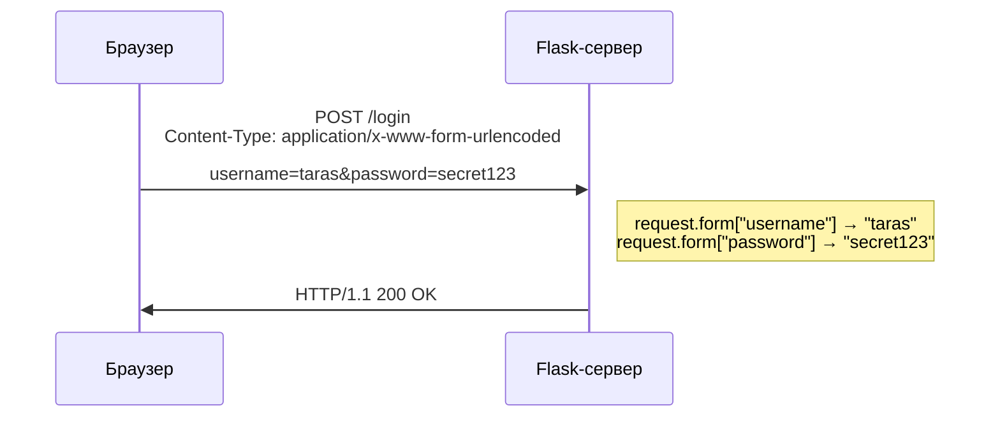
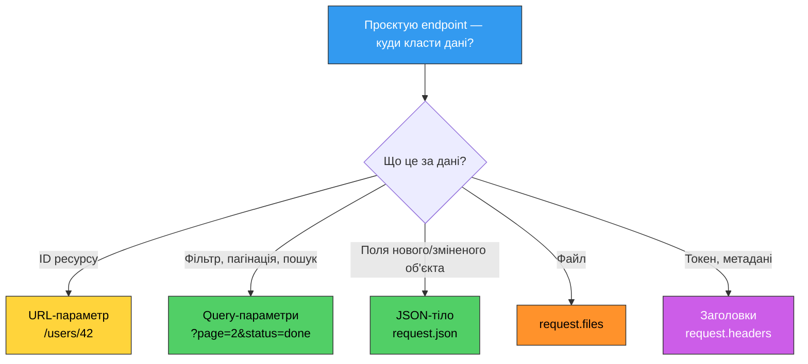

# 20. (Л) Доступ до даних в HTTP-запиті за допомогою Flask

## Зміст лекції

1. Об'єкт `request` — повна картина
2. Query-параметри: `request.args`
3. JSON-тіло запиту: `request.json` та `request.get_json()`
4. Дані форм: `request.form`
5. Завантаження файлів: `request.files`
6. Заголовки: `request.headers`
7. Інші атрибути запиту

## Об'єкт `request` — повна картина

У [лекції 18](../module2/18-flask-routing-lecture.md) ми познайомились з об'єктом `request` та його основними атрибутами. Тепер розглянемо всі способи отримання даних із HTTP-запиту.

Клієнт може передати дані серверу кількома способами:

- **URL-параметри** — частина шляху, наприклад `/users/42`
- **Query-параметри** — після `?` в URL, наприклад `?page=2&limit=10`
- **JSON-тіло** — структуровані дані в тілі запиту, наприклад `{"title": "..."}`
- **Дані форми** — пари ключ-значення, наприклад `username=taras`
- **Файли** — завантаження файлів через `multipart/form-data`
- **HTTP Заголовки** — метадані запиту, наприклад `Authorization: Bearer ...`

## Query-параметри: `request.args`

Query-параметри — це пари `ключ=значення` після знаку `?` в URL. Вони використовуються для фільтрації, пагінації, пошуку та інших операцій, що не змінюють ресурс.

```
GET /api/tasks?status=todo&priority=high&page=2
                └─────── query string ──────┘
```

### Базове отримання query параметрів

```python
from flask import Flask, request, jsonify

app = Flask(__name__)


@app.route("/api/tasks")
def get_tasks():
    # .get() returns None if the parameter is missing
    status = request.args.get("status")
    priority = request.args.get("priority")

    # Default values
    page = request.args.get("page", 1, type=int)
    limit = request.args.get("limit", 10, type=int)

    return jsonify({
        "status": status,
        "priority": priority,
        "page": page,
        "limit": limit,
    })
```

### Метод `get()` vs оператор `[]`

```python
@app.route("/api/search")
def search():
    # Safe — returns None if the parameter is missing
    q = request.args.get("q")

    # Unsafe — raises KeyError (and Flask returns 400)
    # if the parameter is missing
    # q = request.args["q"]

    if not q:
        return jsonify({"error": "Parameter 'q' is required"}), 400

    return jsonify({"query": q})
```

!!! warning "Завжди використовуйте `.get()`"
    Використовуйте `request.args.get("key")` замість `request.args["key"]`. Оператор `[]` викине `KeyError`, якщо параметр відсутній, і Flask автоматично поверне клієнту відповідь `400 Bad Request` без зрозумілого повідомлення. Метод `.get()` дозволяє обробити відсутність параметра явно.

### Автоматичне перетворення типів

Усі query-параметри надходять як рядки. Параметр `type` у методі `get()` дозволяє автоматично конвертувати значення:

```python
@app.route("/api/tasks")
def get_tasks():
    # Converts "10" → 10, or returns the default value
    # if conversion fails
    page = request.args.get("page", 1, type=int)
    limit = request.args.get("limit", 10, type=int)
    min_price = request.args.get("min_price", 0.0, type=float)

    return jsonify({"page": page, "limit": limit, "min_price": min_price})
```

```bash
# page=2 (int), limit=10 (default value)
curl "http://127.0.0.1:5000/api/tasks?page=2"

# page=1 (default value, because "abc" cannot be converted to int)
curl "http://127.0.0.1:5000/api/tasks?page=abc"
```

!!! note "Поведінка `type` при невдалій конвертації"
    Якщо конвертація не вдається (наприклад, `"abc"` в `int`), метод `.get()` повертає значення за замовчуванням, а **не** викидає помилку. Це зручно, але може приховати некоректний ввід. У production-коді краще валідувати параметри явно.

### Кілька значень для одного ключа

Деякі API дозволяють передавати кілька значень для одного параметра:

```
GET /api/tasks?tag=python&tag=flask&tag=api
```

```python
@app.route("/api/tasks")
def get_tasks():
    # .get() returns only the first value
    first_tag = request.args.get("tag")  # "python"

    # .getlist() returns a list of all values
    tags = request.args.getlist("tag")  # ["python", "flask", "api"]

    return jsonify({"first_tag": first_tag, "all_tags": tags})
```


## JSON-тіло запиту: `request.json` та `request.get_json()`

JSON-тіло — основний спосіб передачі даних у POST, PUT та PATCH запитах REST API.

### Як клієнт надсилає JSON

Щоб Flask розпізнав JSON, клієнт повинен:

1. Вказати заголовок `Content-Type: application/json`
2. Передати валідний JSON у тілі запиту

```bash
curl -X POST http://127.0.0.1:5000/api/tasks \
  -H "Content-Type: application/json" \
  -d '{"title": "New task", "priority": "high"}'
```

### `request.json` vs `request.get_json()`

Flask надає два способи отримати JSON з тіла запиту:

```python

@app.route("/api/tasks", methods=["POST"])
def create_task():
    # Спосіб 1: атрибут request.json
    data = request.json
    print(f"request.json {data}")

    # Спосіб 2: метод request.get_json()
    data = request.get_json()
    print(f"request.get_json() {data}")

    return "ok"
```

Різниця — у додаткових параметрах `get_json()`:

| Параметр | За замовчуванням | Опис |
|---|---|---|
| `force` | `False` | Якщо `True` — парсить тіло як JSON навіть без заголовка `Content-Type: application/json` |
| `silent` | `False` | Якщо `True` — повертає `None` замість помилки при невалідному JSON |

```python
@app.route("/api/tasks", methods=["POST"])
def create_task():
    # Парсить JSON навіть без правильного Content-Type
    data = request.get_json(force=True)

    # Не викидає помилку при невалідному JSON
    data = request.get_json(silent=True)

    ...
```

!!! note "Коли `request.json` повертає `None`"
    `request.json` повертає `None` у двох випадках:

    1. Клієнт не вказав заголовок `Content-Type: application/json`
    2. Тіло запиту порожнє

    Якщо клієнт надіслав заголовок `Content-Type: application/json`, але тіло містить невалідний JSON, Flask поверне помилку `400 Bad Request`.

### Робота з JSON-даними

```python

@app.route("/api/tasks", methods=["POST"])
def create_task():
    data = request.json

    # Перевірка наявності JSON
    if data is None:
        return jsonify({"error": "Request body must be JSON"}), 400

    # Отримання полів з перевіркою
    title = data.get("title")
    if not title:
        return jsonify({"error": "field 'title' is required"}), 400

    priority = data.get("priority", "medium")  # Значення за замовчуванням
    tags = data.get("tags", [])  # Очікуємо список

    task = {
        "id": 1,
        "title": title,
        "priority": priority,
        "tags": tags,
    }
    return jsonify(task), 201

```

### Тестування через curl

```bash
# Коректний запит
curl -X POST http://127.0.0.1:5000/api/tasks \
  -H "Content-Type: application/json" \
  -d '{"title": "Learn Flask", "priority": "high", "tags": ["python", "web"]}'

# Без Content-Type — request.json буде None
curl -X POST http://127.0.0.1:5000/api/tasks \
  -d '{"title": "Learn Flask"}'

# Порожнє тіло — request.json буде None
curl -X POST http://127.0.0.1:5000/api/tasks \
  -H "Content-Type: application/json"
```

## Дані форм: `request.form`

HTML-форми надсилають дані у форматі `application/x-www-form-urlencoded` (або `multipart/form-data` при завантаженні файлів). Flask надає доступ до цих даних через `request.form`.



### Приклад: HTML-форма + обробка на сервері

```python
from flask import Flask, request, jsonify

app = Flask(__name__)


@app.route("/")
def index():
    return """
    <h1>Login</h1>
    <form action="/login" method="post">
        <label>Username: <input name="username"></label><br><br>
        <label>Password: <input name="password" type="password"></label><br><br>
        <button type="submit">Login</button>
    </form>
    """


@app.route("/login", methods=["POST"])
def login():
    username = request.form.get("username")
    password = request.form.get("password")

    if not username or not password:
        return jsonify({"error": "username and password are required"}), 400

    # Перевірка облікових даних (спрощено для прикладу)
    if username == "admin" and password == "secret":
        return jsonify({"message": f"Welcome, {username}!"})

    return jsonify({"error": "Invalid credentials"}), 401
```

Відкрийте `http://127.0.0.1:5000/` у браузері — ви побачите форму логіну. Після натискання кнопки «Login» браузер надішле POST-запит на `/login` з даними форми, і Flask отримає їх через `request.form`.

Зверніть увагу на атрибути HTML-форми:

- `action="/login"` — URL, на який буде надіслано запит
- `method="post"` — HTTP-метод (за замовчуванням `get`)
- `name="username"` — ключ, за яким Flask знайде значення в `request.form`

### Тестування через curl

Також можлива відправка форми за допомогою curl:
```bash
# Дані форми (curl за замовчуванням використовує
# Content-Type: application/x-www-form-urlencoded для -d без -H)
curl -X POST http://127.0.0.1:5000/login \
  -d "username=admin&password=secret"
```

### `request.form` vs `request.json`

| Критерій | `request.form` | `request.json` |
|---|---|---|
| Content-Type | `application/x-www-form-urlencoded` | `application/json` |
| Формат даних | `key=value&key2=value2` | `{"key": "value"}` |
| Типи значень | Тільки рядки | Рядки, числа, масиви, об'єкти |
| Вкладеність | Не підтримується | Підтримується |
| Використання | HTML-форми | REST API |

Для REST API використовуйте JSON (`request.json`). Дані форм (`request.form`) зазвичай потрібні при роботі з HTML-формами.

## Завантаження файлів: `request.files`

Файли надсилаються через `multipart/form-data`. Flask надає доступ до них через `request.files`.

```python
import os
from flask import Flask, request, jsonify

app = Flask(__name__)

UPLOAD_FOLDER = "uploads"
os.makedirs(UPLOAD_FOLDER, exist_ok=True)


@app.route("/")
def index():
    return """
    <h1>Upload file</h1>
    <form action="/api/upload" method="post" enctype="multipart/form-data">
        <label>Choose file: <input type="file" name="file"></label><br><br>
        <button type="submit">Upload</button>
    </form>
    """


@app.route("/api/upload", methods=["POST"])
def upload_file():
    if "file" not in request.files:
        return jsonify({"error": "No file provided"}), 400

    file = request.files["file"]

    if file.filename == "":
        return jsonify({"error": "No file selected"}), 400

    filepath = os.path.join(UPLOAD_FOLDER, file.filename)
    file.save(filepath)

    return jsonify({
        "message": "File uploaded",
        "filename": file.filename,
    }), 201
```

Атрибути HTML-форми для завантаження файлів:

- `action="/api/upload"` — URL, на який відправляються дані форми
- `method="post"` — HTTP-метод відправки
- `enctype="multipart/form-data"` — **обов'язковий** для завантаження файлів (без нього браузер надішле лише ім'я файлу як текст, а не його вміст)
- `type="file"` — створює кнопку вибору файлу в браузері
- `name="file"` — ключ, за яким файл буде доступний у `request.files`

### Атрибути об'єкта файлу

| Атрибут | Опис |
|---|---|
| `file.filename` | Оригінальне ім'я файлу від клієнта |
| `file.content_type` | MIME-тип файлу (наприклад, `image/png`) |
| `file.content_length` | Розмір файлу в байтах |
| `file.save(path)` | Зберігає файл на диск |
| `file.read()` | Читає вміст файлу в байтах |


## Заголовки: `request.headers`

HTTP-заголовки передають метаінформацію про запит: тип вмісту, автентифікацію, мову тощо.

```python
@app.route("/api/info")
def request_info():
    # Отримання конкретного заголовка
    content_type = request.headers.get("Content-Type")
    user_agent = request.headers.get("User-Agent")
    auth = request.headers.get("Authorization")

    return jsonify({
        "content_type": content_type,
        "user_agent": user_agent,
        "authorization": auth,
    })
```

## Інші атрибути запиту

Flask надає ще кілька корисних атрибутів `request`:

```python
@app.route("/api/debug")
def debug_info():
    return jsonify({
        # HTTP-метод запиту
        "method": request.method,            # "GET"

        # Повний URL
        "url": request.url,                  # "http://localhost:5000/api/debug?x=1"

        # Базовий URL (без query-параметрів)
        "base_url": request.base_url,        # "http://localhost:5000/api/debug"

        # Шлях URL
        "path": request.path,                # "/api/debug"

        # IP-адреса клієнта
        "remote_addr": request.remote_addr,  # "127.0.0.1"

        # Сирі дані тіла запиту (bytes)
        "content_length": request.content_length,
    })
```


## Підсумок

| Джерело даних | Атрибут Flask | Метод отримання | Приклад |
|---|---|---|---|
| **Query-параметри** | `request.args` | `.get("key", default, type)` | `?page=2&limit=10` |
| **JSON-тіло** | `request.json` | `.get("key")` | `{"title": "..."}` |
| **Дані форми** | `request.form` | `.get("key")` | `username=taras` |
| **Файли** | `request.files` | `.get("key")` | `-` |
| **Заголовки** | `request.headers` | `.get("Header-Name")` | `Authorization: Bearer ...` |
| **Сирі дані** | `request.data` | — | `bytes` |

### Коли що використовувати

Коли ви проєктуєте endpoint, потрібно вирішити: **де саме клієнт повинен передавати кожен фрагмент даних?** Ось правила:

| Що передається | Куди класти | Приклад |
|---|---|---|
| **Ідентифікатор ресурсу** — ID об'єкта, slug, унікальне ім'я | URL-параметр (частина шляху) | `GET /api/users/42` |
| **Фільтрація, сортування, пагінація, пошук** — параметри, що впливають на вибірку, але не змінюють ресурс | Query-параметри (`request.args`) | `GET /api/tasks?status=todo&page=2` |
| **Дані для створення/оновлення ресурсу** — поля нового або зміненого об'єкта | JSON-тіло (`request.json`) | `POST /api/tasks` з `{"title": "..."}` |
| **Файли** — зображення, документи, архіви | Файл (`request.files`) | `POST /api/upload` з `multipart/form-data` |
| **Авторизація, метадані** — токени, мова, версія API | Заголовки (`request.headers`) | `Authorization: Bearer eyJ...` |

**Приклад:** endpoint для пошуку завдань конкретного користувача з пагінацією:

```
GET /api/users/42/tasks?status=done&page=3
     └── URL-параметр ──┘ └─ query-параметри ─┘
     (який користувач)    (фільтр і пагінація)
```

А заголовок `Authorization: Bearer ...` передає токен автентифікації.

**Приклад:** endpoint для створення нового завдання:

```
POST /api/tasks
Header: Authorization: Bearer eyJ...   ← хто створює (заголовок)
Header: Content-Type: application/json

Body: {"title": "Нове завдання", "priority": "high"}   ← що створити (JSON-тіло)
```



## Корисні посилання

- [Flask — Request Object](https://flask.palletsprojects.com/api/#flask.Request)
- [Flask — File Uploads](https://flask.palletsprojects.com/patterns/fileuploads/)

## Домашнє завдання

Ознайомитись з корисними посиланнями
