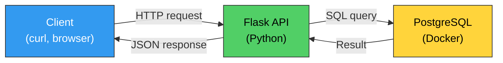
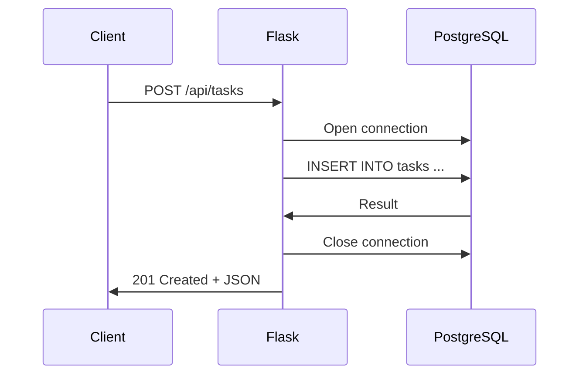

# 22. (Л) CRUD операції у Flask REST API з використанням PostgreSQL

## Зміст лекції

1. Що ми будемо будувати
2. Підготовка середовища: PostgreSQL у Docker
3. Структура проєкту
4. Підключення Flask до PostgreSQL
5. Ініціалізація бази даних
6. CREATE — створення ресурсу
7. READ — отримання ресурсів
8. UPDATE — оновлення ресурсу
9. DELETE — видалення ресурсу
10. Повний код застосунку
11. Тестування через curl

## Що ми будемо будувати

У [лекції 18](../module2/18-flask-routing-lecture.md) ми створили міні-API для задач, де дані зберігалися в пам'яті (список `tasks`). Проблема такого підходу — дані зникають при перезапуску сервера.

Тепер ми побудуємо повноцінний REST API, де дані зберігаються в **PostgreSQL**. Ми об'єднаємо знання з кількох попередніх тем:

- **Flask** — маршрутизація, обробка запитів, формування відповідей ([лекції 18](../module2/18-flask-routing-lecture.md), [20](../module2/20-flask-request-data-lecture.md))
- **psycopg2** — робота з PostgreSQL з Python ([лекція 3](../module1/03-psycopg2-lecture.md))
- **Docker** — розгортання PostgreSQL у контейнері ([лекції 11–14](../module1/11-docker-lecture.md))
- **REST** — принципи проєктування API ([лекція 16](../module2/16-http-rest-lecture.md))



## Підготовка середовища: PostgreSQL у Docker

Запустимо PostgreSQL у Docker-контейнері

```bash
docker run -d \
  --name flask-postgres \
  -e POSTGRES_PASSWORD=secret \
  -e POSTGRES_DB=tasks_db \
  -p 5432:5432 \
  postgres:17
```

Перевіримо, що контейнер працює:

```bash
docker ps
```

```
CONTAINER ID   IMAGE         ...   PORTS                    NAMES
abc123def456   postgres:17   ...   0.0.0.0:5432->5432/tcp   flask-postgres
```

## Структура проєкту

```
flask-crud/
├── app.py              # Flask app with all routes
└── requirements.txt    # Dependencies
```

Файл `requirements.txt`:

```
flask
psycopg2-binary
```

Встановлення залежностей:

```bash
python3 -m venv env
source env/bin/activate
pip install -r requirements.txt
```

## Підключення Flask до PostgreSQL

Для роботи з PostgreSQL нам потрібне з'єднання з базою даних. Створимо допоміжну функцію, яка повертає нове з'єднання:

```python
import psycopg2

DB_CONFIG = {
    "host": "localhost",
    "port": 5432,
    "database": "tasks_db",
    "user": "postgres",
    "password": "secret",
}


def get_db_connection():
    """Створює та повертає нове з'єднання з базою даних."""
    conn = psycopg2.connect(**DB_CONFIG)
    return conn
```

Кожен HTTP-запит відкриватиме з'єднання, виконуватиме SQL-запити та закриватиме з'єднання. Це найпростіший підхід — в production використовують пул з'єднань (connection pooling), але для навчання цього достатньо.



!!! warning "Чому нове з'єднання для кожного запиту?"
    У нашому прикладі ми створюємо нове з'єднання для кожного запиту і закриваємо його в блоці `finally`. Це простий і безпечний підхід: з'єднання гарантовано закривається навіть при помилці. Для навантажених систем використовують **пул з'єднань** (наприклад, `psycopg2.pool`), який тримає кілька з'єднань відкритими та перевикористовує їх.

## Ініціалізація бази даних

Перед тим як працювати з даними, потрібно створити таблицю. Напишемо функцію ініціалізації:

```python
def init_db():
    """Створює таблицю tasks, якщо вона не існує."""
    conn = get_db_connection()
    try:
        with conn.cursor() as cur:
            cur.execute("""
                CREATE TABLE IF NOT EXISTS tasks (
                    id SERIAL PRIMARY KEY,
                    title VARCHAR(200) NOT NULL,
                    description TEXT DEFAULT '',
                    status VARCHAR(20) DEFAULT 'todo'
                )
            """)
            conn.commit()
    finally:
        conn.close()
```

Виклик `init_db()` при старті застосунку гарантує, що таблиця існує:

```python
from flask import Flask

app = Flask(__name__)

init_db()
```

## CREATE — створення ресурсу

Створення нової задачі — це `POST /api/tasks` з JSON-тілом:

```python
from flask import request, jsonify


@app.route("/api/tasks", methods=["POST"])
def create_task():
    data = request.json

    if not data or not data.get("title"):
        return jsonify({"error": "field 'title' is required"}), 400

    title = data["title"]
    description = data.get("description", "")
    status = data.get("status", "todo")

    conn = get_db_connection()
    try:
        with conn.cursor() as cur:
            cur.execute(
                """
                INSERT INTO tasks (title, description, status)
                VALUES (%s, %s, %s)
                RETURNING id, title, description, status
                """,
                (title, description, status),
            )
            task = cur.fetchone()
            conn.commit()
    finally:
        conn.close()

    return jsonify({
        "id": task[0],
        "title": task[1],
        "description": task[2],
        "status": task[3],
    }), 201
```

### Ключові моменти

- **Валідація** — перевіряємо, що клієнт надіслав JSON і що поле `title` присутнє
- **Параметризовані запити** (`%s`) — захист від SQL-ін'єкцій (ніколи не підставляйте значення через f-string!)
- **`RETURNING`** — PostgreSQL-специфічний синтаксис, який повертає дані щойно вставленого рядка. Це зручніше, ніж робити окремий `SELECT` після `INSERT`
- **Код 201** — `201 Created` відповідно до REST-конвенцій ([лекція 16](../module2/16-http-rest-lecture.md))

!!! warning "SQL-ін'єкції"
    Завжди використовуйте параметризовані запити (`%s`). Ніколи не формуйте SQL через конкатенацію рядків або f-string:

    ```python
    # НЕБЕЗПЕЧНО — SQL-ін'єкція!
    cur.execute(f"INSERT INTO tasks (title) VALUES ('{title}')")

    # БЕЗПЕЧНО — параметризований запит
    cur.execute("INSERT INTO tasks (title) VALUES (%s)", (title,))
    ```

## READ — отримання ресурсів

### Отримати всі задачі

```python
@app.route("/api/tasks", methods=["GET"])
def get_tasks():
    conn = get_db_connection()
    try:
        with conn.cursor() as cur:
            cur.execute("SELECT id, title, description, status FROM tasks ORDER BY id")
            rows = cur.fetchall()
    finally:
        conn.close()

    tasks = []
    for row in rows:
        tasks.append({
            "id": row[0],
            "title": row[1],
            "description": row[2],
            "status": row[3],
        })

    return jsonify(tasks)
```

### Отримати одну задачу за ID

```python
@app.route("/api/tasks/<int:task_id>", methods=["GET"])
def get_task(task_id):
    conn = get_db_connection()
    try:
        with conn.cursor() as cur:
            cur.execute(
                "SELECT id, title, description, status FROM tasks WHERE id = %s",
                (task_id,),
            )
            row = cur.fetchone()
    finally:
        conn.close()

    if row is None:
        return jsonify({"error": "Task not found"}), 404

    return jsonify({
        "id": row[0],
        "title": row[1],
        "description": row[2],
        "status": row[3],
    })
```

Конвертер `<int:task_id>` у маршруті гарантує, що `task_id` буде цілим числом. Якщо клієнт передасть `/api/tasks/abc`, Flask автоматично поверне `404`.

## UPDATE — оновлення ресурсу

Оновлення задачі — це `PUT /api/tasks/<id>` з JSON-тілом:

```python
@app.route("/api/tasks/<int:task_id>", methods=["PUT"])
def update_task(task_id):
    data = request.json

    if not data:
        return jsonify({"error": "Request body must be JSON"}), 400

    conn = get_db_connection()
    try:
        with conn.cursor() as cur:
            # Спочатку перевіримо, чи існує задача
            cur.execute("SELECT id FROM tasks WHERE id = %s", (task_id,))
            if cur.fetchone() is None:
                return jsonify({"error": "Task not found"}), 404

            cur.execute(
                """
                UPDATE tasks
                SET title = COALESCE(%s, title),
                    description = COALESCE(%s, description),
                    status = COALESCE(%s, status)
                WHERE id = %s
                RETURNING id, title, description, status
                """,
                (
                    data.get("title"),
                    data.get("description"),
                    data.get("status"),
                    task_id,
                ),
            )
            task = cur.fetchone()
            conn.commit()
    finally:
        conn.close()

    return jsonify({
        "id": task[0],
        "title": task[1],
        "description": task[2],
        "status": task[3],
    })
```

### COALESCE — оновлення лише переданих полів

Функція `COALESCE(a, b)` повертає перше не-`NULL` значення:

- Якщо клієнт передав `"title": "New title"` — оновиться на `"New title"`
- Якщо клієнт не передав `"title"` — `data.get("title")` поверне `None`, і PostgreSQL залишить старе значення

Це дозволяє клієнту оновити лише ті поля, які він хоче змінити, без необхідності передавати всі поля.

```bash
# Оновити лише статус, title та description залишаться без змін
curl -X PUT http://127.0.0.1:5000/api/tasks/1 \
  -H "Content-Type: application/json" \
  -d '{"status": "done"}'
```

## DELETE — видалення ресурсу

```python
@app.route("/api/tasks/<int:task_id>", methods=["DELETE"])
def delete_task(task_id):
    conn = get_db_connection()
    try:
        with conn.cursor() as cur:
            cur.execute(
                "DELETE FROM tasks WHERE id = %s RETURNING id",
                (task_id,),
            )
            deleted = cur.fetchone()
            conn.commit()
    finally:
        conn.close()

    if deleted is None:
        return jsonify({"error": "Task not found"}), 404

    return "", 204
```

- **`RETURNING id`** — перевіряємо, чи рядок був дійсно видалений. Якщо задачі з таким ID не було, `fetchone()` поверне `None`
- **Код 204** — `No Content`, стандартна відповідь на успішне видалення (порожнє тіло)

## Повний код застосунку

Файл `app.py`:

```python
import psycopg2
from flask import Flask, jsonify, request

app = Flask(__name__)

DB_CONFIG = {
    "host": "localhost",
    "port": 5432,
    "database": "tasks_db",
    "user": "postgres",
    "password": "secret",
}


def get_db_connection():
    """Створює та повертає нове з'єднання з базою даних."""
    return psycopg2.connect(**DB_CONFIG)


def init_db():
    """Створює таблицю tasks, якщо вона не існує."""
    conn = get_db_connection()
    try:
        with conn.cursor() as cur:
            cur.execute("""
                CREATE TABLE IF NOT EXISTS tasks (
                    id SERIAL PRIMARY KEY,
                    title VARCHAR(200) NOT NULL,
                    description TEXT DEFAULT '',
                    status VARCHAR(20) DEFAULT 'todo'
                )
            """)
            conn.commit()
    finally:
        conn.close()


def row_to_dict(row):
    """Перетворює рядок результату в словник."""
    return {
        "id": row[0],
        "title": row[1],
        "description": row[2],
        "status": row[3],
    }


@app.route("/api/tasks", methods=["GET"])
def get_tasks():
    """Отримати список усіх задач."""
    conn = get_db_connection()
    try:
        with conn.cursor() as cur:
            cur.execute("SELECT id, title, description, status FROM tasks ORDER BY id")
            rows = cur.fetchall()
    finally:
        conn.close()

    return jsonify([row_to_dict(row) for row in rows])


@app.route("/api/tasks/<int:task_id>", methods=["GET"])
def get_task(task_id):
    """Отримати задачу за ID."""
    conn = get_db_connection()
    try:
        with conn.cursor() as cur:
            cur.execute(
                "SELECT id, title, description, status FROM tasks WHERE id = %s",
                (task_id,),
            )
            row = cur.fetchone()
    finally:
        conn.close()

    if row is None:
        return jsonify({"error": "Task not found"}), 404

    return jsonify(row_to_dict(row))


@app.route("/api/tasks", methods=["POST"])
def create_task():
    """Створити нову задачу."""
    data = request.json

    if not data or not data.get("title"):
        return jsonify({"error": "field 'title' is required"}), 400

    title = data["title"]
    description = data.get("description", "")
    status = data.get("status", "todo")

    conn = get_db_connection()
    try:
        with conn.cursor() as cur:
            cur.execute(
                """
                INSERT INTO tasks (title, description, status)
                VALUES (%s, %s, %s)
                RETURNING id, title, description, status
                """,
                (title, description, status),
            )
            task = cur.fetchone()
            conn.commit()
    finally:
        conn.close()

    return jsonify(row_to_dict(task)), 201


@app.route("/api/tasks/<int:task_id>", methods=["PUT"])
def update_task(task_id):
    """Оновити задачу."""
    data = request.json

    if not data:
        return jsonify({"error": "Request body must be JSON"}), 400

    conn = get_db_connection()
    try:
        with conn.cursor() as cur:
            cur.execute("SELECT id FROM tasks WHERE id = %s", (task_id,))
            if cur.fetchone() is None:
                return jsonify({"error": "Task not found"}), 404

            cur.execute(
                """
                UPDATE tasks
                SET title = COALESCE(%s, title),
                    description = COALESCE(%s, description),
                    status = COALESCE(%s, status)
                WHERE id = %s
                RETURNING id, title, description, status
                """,
                (
                    data.get("title"),
                    data.get("description"),
                    data.get("status"),
                    task_id,
                ),
            )
            task = cur.fetchone()
            conn.commit()
    finally:
        conn.close()

    return jsonify(row_to_dict(task))


@app.route("/api/tasks/<int:task_id>", methods=["DELETE"])
def delete_task(task_id):
    """Видалити задачу."""
    conn = get_db_connection()
    try:
        with conn.cursor() as cur:
            cur.execute(
                "DELETE FROM tasks WHERE id = %s RETURNING id",
                (task_id,),
            )
            deleted = cur.fetchone()
            conn.commit()
    finally:
        conn.close()

    if deleted is None:
        return jsonify({"error": "Task not found"}), 404

    return "", 204


init_db()
```

## Тестування через curl

Запустіть сервер:

```bash
flask run --debug
```

### Створення задач

```bash
# Створити першу задачу
curl -X POST http://127.0.0.1:5000/api/tasks \
  -H "Content-Type: application/json" \
  -d '{"title": "Learn Flask", "description": "Routing and requests"}'

# Відповідь:
# {"id": 1, "title": "Learn Flask", "description": "Routing and requests", "status": "todo"}

# Створити другу задачу
curl -X POST http://127.0.0.1:5000/api/tasks \
  -H "Content-Type: application/json" \
  -d '{"title": "Write REST API", "status": "in_progress"}'

# Спроба створити задачу без title
curl -X POST http://127.0.0.1:5000/api/tasks \
  -H "Content-Type: application/json" \
  -d '{"description": "No title"}'

# Відповідь:
# {"error": "field 'title' is required"} (400)
```

### Отримання задач

```bash
# Отримати всі задачі
curl http://127.0.0.1:5000/api/tasks

# Відповідь:
# [
#   {"id": 1, "title": "Learn Flask", "description": "Routing and requests", "status": "todo"},
#   {"id": 2, "title": "Write REST API", "description": "", "status": "in_progress"}
# ]

# Отримати задачу за ID
curl http://127.0.0.1:5000/api/tasks/1

# Задача, якої не існує
curl http://127.0.0.1:5000/api/tasks/999

# Відповідь:
# {"error": "Task not found"} (404)
```

### Оновлення задачі

```bash
# Оновити статус задачі
curl -X PUT http://127.0.0.1:5000/api/tasks/1 \
  -H "Content-Type: application/json" \
  -d '{"status": "done"}'

# Відповідь:
# {"id": 1, "title": "Learn Flask", "description": "Routing and requests", "status": "done"}

# Оновити кілька полів
curl -X PUT http://127.0.0.1:5000/api/tasks/2 \
  -H "Content-Type: application/json" \
  -d '{"title": "Write CRUD API", "status": "done"}'
```

### Видалення задачі

```bash
# Видалити задачу
curl -X DELETE http://127.0.0.1:5000/api/tasks/1

# Відповідь: порожнє тіло, код 204

# Спроба видалити неіснуючу задачу
curl -X DELETE http://127.0.0.1:5000/api/tasks/999

# Відповідь:
# {"error": "Task not found"} (404)

# Перевірити, що задача видалена
curl http://127.0.0.1:5000/api/tasks
```

### Перевірка збереження даних

На відміну від in-memory API з [лекції 18](../module2/18-flask-routing-lecture.md), дані зберігаються в PostgreSQL. Перезапустіть Flask-сервер і виконайте:

```bash
curl http://127.0.0.1:5000/api/tasks
```

Задачі залишаться на місці — вони зберігаються в базі даних, а не в пам'яті процесу.

## Підсумок

| Операція | HTTP-метод | URL | SQL | Код відповіді |
|---|---|---|---|---|
| Створити задачу | `POST` | `/api/tasks` | `INSERT ... RETURNING` | 201 Created |
| Отримати всі | `GET` | `/api/tasks` | `SELECT ... ORDER BY` | 200 OK |
| Отримати одну | `GET` | `/api/tasks/<id>` | `SELECT ... WHERE id = %s` | 200 / 404 |
| Оновити | `PUT` | `/api/tasks/<id>` | `UPDATE ... RETURNING` | 200 / 404 |
| Видалити | `DELETE` | `/api/tasks/<id>` | `DELETE ... RETURNING` | 204 / 404 |

Ми побудували повноцінний CRUD API, який:

- Використовує **Flask** для обробки HTTP-запитів
- Зберігає дані в **PostgreSQL** (у Docker-контейнері)
- Дотримується **REST-конвенцій** (правильні HTTP-методи та коди стану)
- Захищений від **SQL-ін'єкцій** через параметризовані запити
- Повертає зрозумілі **повідомлення про помилки**

## Корисні посилання

- [Flask — Quickstart](https://flask.palletsprojects.com/quickstart/)
- [psycopg2 — Basic usage](https://www.psycopg.org/docs/usage.html)
- [PostgreSQL — INSERT ... RETURNING](https://www.postgresql.org/docs/current/dml-returning.html)
- [PostgreSQL — COALESCE](https://www.postgresql.org/docs/current/functions-conditional.html#FUNCTIONS-COALESCE-NVL-IFNULL)

## Домашнє завдання

1. Запустити PostgreSQL у Docker та повторити повний приклад із лекції. Протестувати всі CRUD-операції через `curl`.
2. Додати до API фільтрацію: `GET /api/tasks?status=todo` повинен повертати лише задачі з відповідним статусом. Використайте `request.args.get("status")` (див. [лекцію 20](../module2/20-flask-request-data-lecture.md)).
