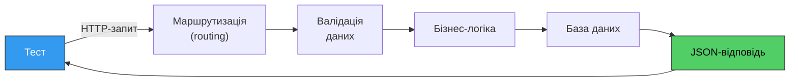
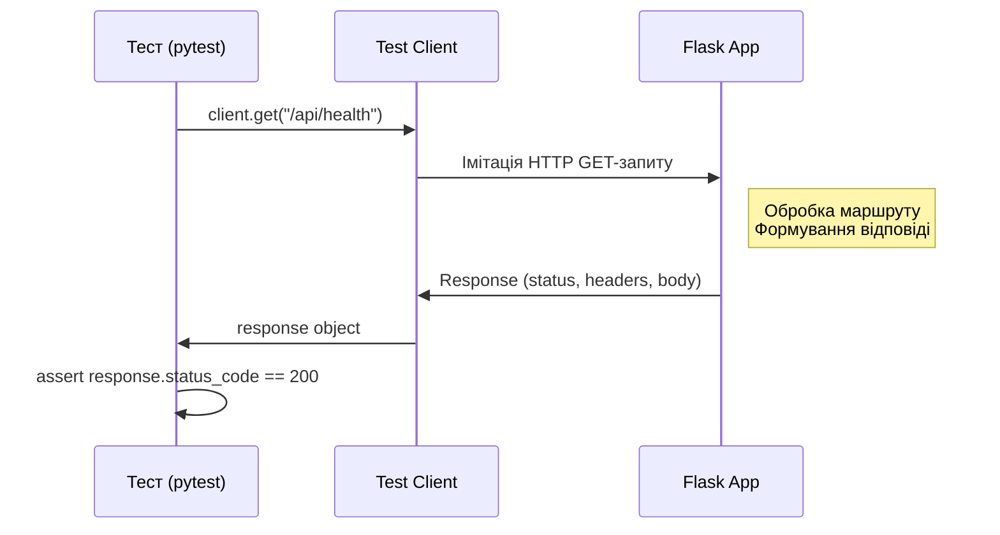
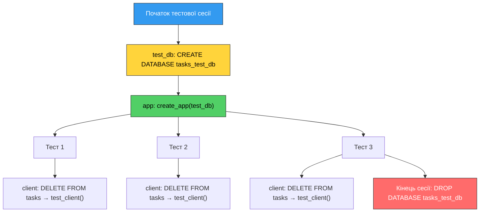

# 26. (Л) Тестування REST API за допомогою pytest

## Зміст лекції

1. Навіщо тестувати REST API
2. Flask test client
3. Тестування з базою даних (PostgreSQL)
4. Організація тестового проєкту

## Навіщо тестувати REST API

У [лекції 9](../module1/09-testing-lecture.md) ми тестували Python-функції та класи, що працюють з базою даних. Тепер ми будемо тестувати **HTTP-endpoint'и** — перевіряти, що наш API правильно обробляє запити та повертає очікувані відповіді.

Тестування REST API перевіряє весь ланцюг обробки запиту:



На відміну від модульних тестів, які перевіряють окрему функцію, тести API перевіряють **інтеграцію** всіх компонентів: маршрути, валідацію, логіку, роботу з БД та формування відповіді.

Що саме ми перевіряємо:

- **HTTP-статус відповіді** — `200`, `201`, `400`, `404` тощо
- **Тіло відповіді** — правильна структура JSON, очікувані значення полів
- **Граничні випадки** — відсутні поля, неіснуючий ресурс, некоректні дані
- **Побічні ефекти** — чи дійсно дані збережені в базі після POST-запиту

## Flask test client

Flask надає вбудований **тестовий клієнт**, який дозволяє надсилати HTTP-запити до застосунку **без запуску сервера**. Це означає, що тести працюють швидко — не потрібно піднімати сервер на порту.

### Мінімальний приклад

Створимо простий застосунок і напишемо для нього тест:

```python
# app.py
from flask import Flask, jsonify

app = Flask(__name__)


@app.route("/api/health")
def health():
    return jsonify({"status": "ok"})
```

```python
# test_app.py
from app import app


def test_health():
    # Створюємо тестовий клієнт
    client = app.test_client()

    # Надсилаємо GET-запит
    response = client.get("/api/health")

    # Перевіряємо статус
    assert response.status_code == 200

    # Перевіряємо тіло відповіді
    data = response.get_json()
    assert data == {"status": "ok"}
```

```bash
pytest test_app.py -v
```

### Як працює тестовий клієнт



Тестовий клієнт **не використовує мережу** — він викликає Flask-застосунок напряму через WSGI-інтерфейс. Це робить тести:

- **Швидкими** — немає мережевих затримок
- **Надійними** — не залежать від вільних портів чи стану мережі
- **Ізольованими** — кожен тест отримує чистий клієнт

### Основні методи тестового клієнта

| Метод | HTTP-метод | Приклад |
|---|---|---|
| `client.get(url)` | GET | `client.get("/api/tasks")` |
| `client.post(url, json=...)` | POST | `client.post("/api/tasks", json={"title": "New"})` |
| `client.put(url, json=...)` | PUT | `client.put("/api/tasks/1", json={"title": "Updated"})` |
| `client.delete(url)` | DELETE | `client.delete("/api/tasks/1")` |

Параметр `json=` автоматично:

- Серіалізує словник у JSON
- Додає заголовок `Content-Type: application/json`

### Об'єкт Response

Відповідь тестового клієнта містить всю інформацію про HTTP-відповідь:

```python
response = client.get("/api/tasks")

response.status_code    # 200, 404, 500 тощо
response.get_json()     # Десеріалізований JSON (dict або list)
response.data           # Тіло відповіді як bytes
response.headers        # HTTP-заголовки відповіді
```

!!! info "`app.config['TESTING'] = True`"
    Прапорець `TESTING` вмикає режим тестування Flask. У цьому режимі Flask не перехоплює винятки — якщо endpoint кине помилку, вона пробросиметься до тесту. Це допомагає побачити справжню причину помилки замість загального `500 Internal Server Error`.

## Тестування з базою даних (PostgreSQL)

Розглянемо, як тестувати Flask API, що використовує PostgreSQL — на основі застосунку з [лекції 22](../module2/22-flask-crud-postgres-lecture.md).

### Підготовка застосунку для тестування

Щоб тести могли підставити тестову базу даних, потрібно зробити конфігурацію бази гнучкою. Для цього використаємо **фабрику застосунків** (application factory) — функцію, яка створює та налаштовує Flask-застосунок:

```python
# app.py
import psycopg2
from flask import Flask, jsonify, request

# Конфігурація за замовчуванням (production)
DEFAULT_DB_CONFIG = {
    "host": "localhost",
    "port": 5432,
    "database": "tasks_db",
    "user": "postgres",
    "password": "secret",
}


def get_db_connection(db_config):
    return psycopg2.connect(**db_config)


def init_db(db_config):
    conn = get_db_connection(db_config)
    try:
        with conn.cursor() as cur:
            cur.execute("""
                CREATE TABLE IF NOT EXISTS tasks (
                    id SERIAL PRIMARY KEY,
                    title VARCHAR(200) NOT NULL,
                    description TEXT DEFAULT '',
                    status VARCHAR(20) DEFAULT 'todo'
                )
            """)
            conn.commit()
    finally:
        conn.close()


def create_app(db_config=None):
    """Фабрика застосунків — створює Flask app із заданою конфігурацією БД"""
    app = Flask(__name__)

    if db_config is None:
        db_config = DEFAULT_DB_CONFIG

    # Зберігаємо конфігурацію БД у config застосунку
    app.config["DB_CONFIG"] = db_config

    init_db(db_config)

    @app.route("/api/tasks", methods=["GET"])
    def get_tasks():
        conn = get_db_connection(app.config["DB_CONFIG"])
        try:
            with conn.cursor() as cur:
                cur.execute(
                    "SELECT id, title, description, status FROM tasks ORDER BY id"
                )
                rows = cur.fetchall()
        finally:
            conn.close()

        tasks = [
            {"id": r[0], "title": r[1], "description": r[2], "status": r[3]}
            for r in rows
        ]
        return jsonify(tasks)

    @app.route("/api/tasks/<int:task_id>", methods=["GET"])
    def get_task(task_id):
        conn = get_db_connection(app.config["DB_CONFIG"])
        try:
            with conn.cursor() as cur:
                cur.execute(
                    "SELECT id, title, description, status FROM tasks WHERE id = %s",
                    (task_id,),
                )
                row = cur.fetchone()
        finally:
            conn.close()

        if row is None:
            return jsonify({"error": "Task not found"}), 404

        return jsonify(
            {"id": row[0], "title": row[1], "description": row[2], "status": row[3]}
        )

    @app.route("/api/tasks", methods=["POST"])
    def create_task():
        data = request.json

        if not data or not data.get("title"):
            return jsonify({"error": "field 'title' is required"}), 400

        conn = get_db_connection(app.config["DB_CONFIG"])
        try:
            with conn.cursor() as cur:
                cur.execute(
                    """
                    INSERT INTO tasks (title, description, status)
                    VALUES (%s, %s, %s)
                    RETURNING id, title, description, status
                    """,
                    (data["title"], data.get("description", ""), data.get("status", "todo")),
                )
                task = cur.fetchone()
                conn.commit()
        finally:
            conn.close()

        return jsonify(
            {"id": task[0], "title": task[1], "description": task[2], "status": task[3]}
        ), 201

    return app


if __name__ == "__main__":
    app = create_app()
    app.run(debug=True)
```

!!! info "Фабрика застосунків (Application Factory)"
    Паттерн **application factory** — це стандартний підхід у Flask для створення застосунків. Замість глобального `app = Flask(__name__)` ми використовуємо функцію `create_app()`, яка приймає конфігурацію як параметр. Це дозволяє створювати різні екземпляри застосунку з різними налаштуваннями — наприклад, для тестів підставити тестову базу даних.

### Фікстури для тестування з PostgreSQL

```python
# conftest.py
import pytest
import psycopg2
from app import create_app

TEST_DB_CONFIG = {
    "host": "localhost",
    "port": 5432,
    "database": "tasks_test_db",
    "user": "postgres",
    "password": "secret",
}


@pytest.fixture(scope="session")
def test_db():
    """Створює тестову базу даних на початку тестової сесії"""
    # Підключаємося до дефолтної бази, щоб створити тестову
    conn = psycopg2.connect(
        host=TEST_DB_CONFIG["host"],
        port=TEST_DB_CONFIG["port"],
        user=TEST_DB_CONFIG["user"],
        password=TEST_DB_CONFIG["password"],
        database="postgres",
    )
    conn.autocommit = True

    db_name = TEST_DB_CONFIG["database"]
    with conn.cursor() as cur:
        # Видаляємо базу, якщо існує, і створюємо нову
        cur.execute(f"DROP DATABASE IF EXISTS {db_name}")
        cur.execute(f"CREATE DATABASE {db_name}")

    conn.close()

    yield TEST_DB_CONFIG

    # Очищення: видаляємо тестову базу після всіх тестів
    conn = psycopg2.connect(
        host=TEST_DB_CONFIG["host"],
        port=TEST_DB_CONFIG["port"],
        user=TEST_DB_CONFIG["user"],
        password=TEST_DB_CONFIG["password"],
        database="postgres",
    )
    conn.autocommit = True
    with conn.cursor() as cur:
        cur.execute(f"DROP DATABASE IF EXISTS {db_name}")
    conn.close()


@pytest.fixture(scope="session")
def app(test_db):
    """Flask-застосунок із тестовою базою даних"""
    app = create_app(db_config=test_db)
    app.config["TESTING"] = True
    return app


@pytest.fixture
def client(app):
    """Тестовий клієнт із очищенням БД перед кожним тестом"""
    # Очищуємо таблицю перед кожним тестом
    conn = psycopg2.connect(**app.config["DB_CONFIG"])
    try:
        with conn.cursor() as cur:
            cur.execute("DELETE FROM tasks")
            conn.commit()
    finally:
        conn.close()

    with app.test_client() as client:
        yield client
```

Ця структура фікстур забезпечує:

| Фікстура | Scope | Що робить |
|---|---|---|
| `test_db` | `session` | Створює тестову БД один раз, видаляє після всіх тестів |
| `app` | `session` | Створює Flask-застосунок із тестовою БД один раз |
| `client` | `function` | Очищує дані та створює тестовий клієнт для кожного тесту |



### Тести для API з базою даних

Тести виглядають **ідентично** тестам без бази даних — це і є мета хорошої архітектури:

```python
# test_tasks_api.py


class TestGetTasks:
    def test_empty_list(self, client):
        response = client.get("/api/tasks")

        assert response.status_code == 200
        assert response.get_json() == []

    def test_list_with_tasks(self, client):
        client.post("/api/tasks", json={"title": "Task 1"})
        client.post("/api/tasks", json={"title": "Task 2"})

        response = client.get("/api/tasks")
        data = response.get_json()

        assert len(data) == 2

    def test_get_by_id(self, client):
        response = client.post("/api/tasks", json={"title": "Learn Flask"})
        task_id = response.get_json()["id"]

        response = client.get(f"/api/tasks/{task_id}")

        assert response.status_code == 200
        assert response.get_json()["title"] == "Learn Flask"

    def test_get_not_found(self, client):
        response = client.get("/api/tasks/99999")

        assert response.status_code == 404


class TestCreateTask:
    def test_create_success(self, client):
        response = client.post("/api/tasks", json={
            "title": "New task",
            "description": "Description",
            "status": "in_progress",
        })

        assert response.status_code == 201
        data = response.get_json()
        assert data["title"] == "New task"
        assert data["status"] == "in_progress"
        assert "id" in data

    def test_create_without_title(self, client):
        response = client.post("/api/tasks", json={"description": "No title"})

        assert response.status_code == 400

    def test_create_persists(self, client):
        """Задача зберігається в базі після створення"""
        client.post("/api/tasks", json={"title": "Persistent"})

        response = client.get("/api/tasks")
        data = response.get_json()

        assert len(data) == 1
        assert data[0]["title"] == "Persistent"
```

### Запуск тестів

Переконайтеся, що PostgreSQL запущений у Docker:

```bash
docker run -d \
  --name flask-test-postgres \
  -e POSTGRES_PASSWORD=secret \
  -p 5432:5432 \
  postgres:17
```

Запуск:

```bash
pip install pytest flask psycopg2-binary

pytest -v
```

Очікуваний результат:

```
test_tasks_api.py::TestGetTasks::test_empty_list PASSED
test_tasks_api.py::TestGetTasks::test_list_with_tasks PASSED
test_tasks_api.py::TestGetTasks::test_get_by_id PASSED
test_tasks_api.py::TestGetTasks::test_get_not_found PASSED
test_tasks_api.py::TestCreateTask::test_create_success PASSED
test_tasks_api.py::TestCreateTask::test_create_without_title PASSED
test_tasks_api.py::TestCreateTask::test_create_persists PASSED

========================= 7 passed =========================
```

## Організація тестового проєкту

### Структура файлів

```
flask-crud/
├── app.py                # Flask-застосунок
├── conftest.py           # Фікстури pytest
├── test_tasks_api.py     # Тести API
└── requirements.txt      # Залежності
```

Файл `requirements.txt`:

```
flask
psycopg2-binary
pytest
```

### Поради щодо написання тестів

**1. Один тест — одна перевірка.** Кожен тест перевіряє один конкретний сценарій. Це спрощує діагностику, коли тест падає.

**2. Назви тестів описують сценарій.** З назви тесту має бути зрозуміло, що саме перевіряється:

```python
# Добре
def test_create_task_without_title():
def test_delete_nonexistent_task():

# Погано
def test_post():
def test_error():
```

**3. Тести незалежні один від одного.** Кожен тест починає з чистого стану завдяки фікстурі `client`, яка очищує базу.

**4. Тестуйте і успішні сценарії, і помилки.** Для кожного endpoint'у перевіряйте:

- Успішний запит (happy path)
- Відсутній ресурс (404)
- Некоректні дані (400)
- Побічні ефекти (дані збереглися/видалились)

## Підсумок

| Інструмент | Призначення |
|---|---|
| `app.test_client()` | Тестовий HTTP-клієнт Flask (без запуску сервера) |
| `client.get(url)` | Імітація GET-запиту |
| `client.post(url, json=...)` | Імітація POST-запиту з JSON-тілом |
| `response.status_code` | HTTP-статус відповіді |
| `response.get_json()` | Десеріалізоване тіло відповіді |
| `create_app(config)` | Фабрика застосунків для гнучкої конфігурації |

Ключові принципи тестування API:

- **Тестовий клієнт Flask** дозволяє тестувати API без запуску сервера
- **Фікстури pytest** забезпечують підготовку та очищення стану
- **Тестова база даних** ізолює тести від production-даних
- **Application factory** дозволяє створювати застосунок із різною конфігурацією
- Кожен тест має бути **незалежним** — очищення стану перед кожним тестом

## Корисні посилання

- [Flask — Testing](https://flask.palletsprojects.com/testing/)
- [Flask — Application Factories](https://flask.palletsprojects.com/patterns/appfactories/)
- [pytest — Fixtures](https://docs.pytest.org/en/stable/how-to/fixtures.html)
- [pytest — Documentation](https://docs.pytest.org/)

## Домашнє завдання

1. Повторити приклад з лекції: створити Flask API з PostgreSQL та написати тести для GET і POST. Запустити `pytest -v` та переконатися, що всі тести проходять.
2. Додати до API endpoint'и PUT та DELETE (з [лекції 22](../module2/22-flask-crud-postgres-lecture.md)) та написати тести для них: перевірити успішне оновлення/видалення, неіснуючий ресурс (404), збереження змін у базі.
3. Додати до API endpoint `GET /api/tasks?status=todo`, який фільтрує задачі за статусом. Написати тести для цього endpoint'у: перевірити фільтрацію з різними значеннями статусу, поведінку при відсутньому параметрі, поведінку при неіснуючому статусі.
