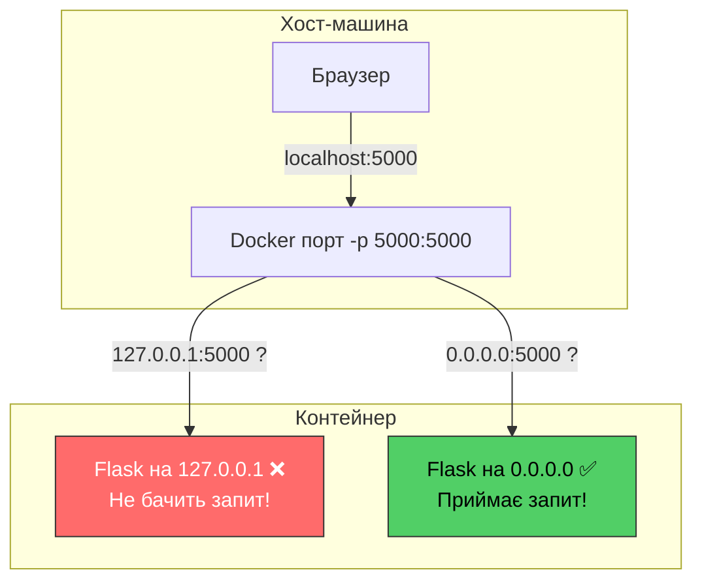
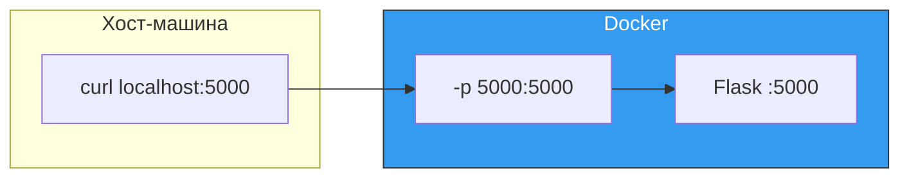

# 30. (Л) Контейнеризація Flask-застосунків за допомогою Docker

## Зміст лекції

1. Навіщо контейнеризувати Flask-застосунок
2. Простий Flask-сервіс
3. Dockerfile для Flask
4. Збірка та запуск контейнера
5. Прокидання портів

## Навіщо контейнеризувати Flask-застосунок

У [лекції 12](../module1/12-dockerfile-lecture.md) ми навчилися створювати Dockerfile для Python-скриптів. Але веб-застосунок має важливу відмінність — він **слухає порт** і працює постійно.


Контейнеризація Flask-застосунку дає ті ж переваги, що й контейнеризація будь-якого іншого застосунку:

- **Відтворюваність** — однакове середовище на будь-якій машині
- **Ізоляція** — не конфліктує з іншими проєктами та їх залежностями
- **Простий деплой** — один образ можна запустити на будь-якому сервері з Docker
- **CI/CD** — образ збирається та тестується автоматично (як ми бачили в [лекції 28](../module2/28-ci-github-actions-lecture.md))

## Простий Flask-сервіс

Для цієї лекції ми використаємо максимально простий Flask-застосунок без бази даних — щоб зосередитися саме на контейнеризації.

### Структура проєкту

```
flask-docker-demo/
├── app.py
├── requirements.txt
└── Dockerfile
```

### app.py

```python
from flask import Flask, jsonify

app = Flask(__name__)


@app.route("/")
def index():
    return jsonify({"message": "Hello from Flask!"})


@app.route("/health")
def health():
    return jsonify({"status": "ok"})


if __name__ == "__main__":
    app.run(host="0.0.0.0", port=5000)
```

Зверніть увагу на `host="0.0.0.0"` — це **критично важливо** для Docker. За замовчуванням Flask слухає лише `127.0.0.1` (localhost), що означає "тільки з цього ж комп'ютера". Але всередині контейнера `127.0.0.1` — це мережа **самого контейнера**, а не хоста. Якщо Flask слухає `127.0.0.1`, запити ззовні контейнера не потрапляють до нього:



`0.0.0.0` означає "слухати на всіх мережевих інтерфейсах" — це дозволяє приймати запити як зсередини контейнера, так і ззовні.

### requirements.txt

```
flask==3.1.1
```

## Dockerfile для Flask

```dockerfile
FROM python:3.13-slim

ENV PYTHONDONTWRITEBYTECODE=1
ENV PYTHONUNBUFFERED=1

WORKDIR /app

COPY requirements.txt .
RUN pip install --no-cache-dir -r requirements.txt

COPY . .

EXPOSE 5000

CMD ["python", "app.py"]
```

Цей Dockerfile майже ідентичний тому, що ми писали в [лекції 12](../module1/12-dockerfile-lecture.md). Єдина відмінність — інструкція `EXPOSE 5000`, яка документує, що застосунок слухає порт 5000.

## Збірка та запуск контейнера

### Збірка образу

```bash
docker build -t flask-demo .
```

```
[+] Building 12.5s (10/10) FINISHED
 => [1/5] FROM python:3.13-slim                          0.0s (cached)
 => [2/5] WORKDIR /app                                   0.1s
 => [3/5] COPY requirements.txt .                        0.1s
 => [4/5] RUN pip install --no-cache-dir -r req...      10.2s
 => [5/5] COPY . .                                       0.1s
 => exporting to image                                   1.8s
```

### Запуск контейнера

```bash
docker run -d --name flask-app -p 5000:5000 flask-demo
```

Розберемо прапорці:

| Прапорець | Значення |
|---|---|
| `-d` | Запуск у фоновому режимі (detached) |
| `--name flask-app` | Ім'я контейнера |
| `-p 5000:5000` | Прокидання порту: `хост:контейнер` |
| `flask-demo` | Назва образу |

### Перевірка

```bash
# Перевірити, що контейнер працює
docker ps
```

```
CONTAINER ID   IMAGE        COMMAND            CREATED         STATUS         PORTS                    NAMES
a1b2c3d4e5f6   flask-demo   "python app.py"    5 seconds ago   Up 4 seconds   0.0.0.0:5000->5000/tcp   flask-app
```

```bash
# Надіслати запит до застосунку
curl http://localhost:5000/
```

```json
{"message":"Hello from Flask!"}
```

```bash
curl http://localhost:5000/health
```

```json
{"status":"ok"}
```

### Перегляд логів

```bash
docker logs flask-app
```

```
 * Serving Flask app 'app'
 * Running on all addresses (0.0.0.0)
 * Running on http://127.0.0.1:5000
 * Running on http://172.17.0.2:5000
```

```bash
# Стежити за логами в реальному часі
docker logs -f flask-app
```

## Прокидання портів

Прапорець `-p` прокидає порт з контейнера на хост-машину. Формат: `-p <порт_хоста>:<порт_контейнера>`.



Порти хоста та контейнера **не обов'язково** мають збігатися:

```bash
# Flask працює на порті 5000 в контейнері,
# але доступний на порті 8080 хоста
docker run -d -p 8080:5000 flask-demo

curl http://localhost:8080/
```

Це корисно, коли порт 5000 на хості вже зайнятий іншим сервісом.

### Кілька контейнерів одночасно

Можна запустити кілька екземплярів одного образу на різних портах:

```bash
docker run -d --name flask-1 -p 5001:5000 flask-demo
docker run -d --name flask-2 -p 5002:5000 flask-demo
docker run -d --name flask-3 -p 5003:5000 flask-demo
```

Кожен контейнер ізольований і слухає свій порт 5000 всередині, але зовні доступний на різних портах хоста.

## Повний приклад

Фінальна версія всіх файлів:

### app.py

```python
from flask import Flask, jsonify

app = Flask(__name__)


@app.route("/")
def index():
    return jsonify({"message": "Hello from Flask!"})


@app.route("/health")
def health():
    return jsonify({"status": "ok"})


if __name__ == "__main__":
    app.run(host="0.0.0.0", port=5000)
```

### requirements.txt

```
flask==3.1.1
```

### Dockerfile

```dockerfile
FROM python:3.13-slim

ENV PYTHONDONTWRITEBYTECODE=1
ENV PYTHONUNBUFFERED=1

WORKDIR /app

COPY requirements.txt .
RUN pip install --no-cache-dir -r requirements.txt

COPY . .

EXPOSE 5000

CMD ["python", "app.py"]
```

### Збірка та запуск

```bash
docker build -t flask-demo .
docker run -d --name flask-app -p 5000:5000 flask-demo

# Перевірка
curl http://localhost:5000/
curl http://localhost:5000/health
```

## Підсумок

| Концепція | Опис |
|---|---|
| `host="0.0.0.0"` | Flask слухає всі інтерфейси (обов'язково для Docker) |
| `-p хост:контейнер` | Прокидання порту з контейнера на хост |
| `EXPOSE` | Документація порту в Dockerfile |

Ключові принципи:

- **Завжди використовуйте `0.0.0.0`** — інакше Flask не буде доступний ззовні контейнера
- **Оптимізуйте шари** — спочатку `requirements.txt`, потім код

## Корисні посилання

- [Flask — Deployment Options](https://flask.palletsprojects.com/en/stable/deploying/)
- [Docker — Dockerfile reference](https://docs.docker.com/reference/dockerfile/)
- [Best practices for writing Dockerfiles](https://docs.docker.com/build/building/best-practices/)

## Домашнє завдання

1. Створити простий Flask-застосунок з двома ендпоінтами: `GET /` (привітання) та `GET /health` (перевірка стану). Написати Dockerfile та зібрати образ. Запустити контейнер та перевірити роботу через `curl` або браузер.
2. Додати ще один ендпоінт `GET /info`, який повертає JSON з назвою застосунку та версією. Перезібрати образ та перевірити, що новий ендпоінт працює.
3. Запустити два контейнери з одного образу на різних портах (наприклад, 5001 та 5002) та перевірити, що обидва працюють незалежно.
