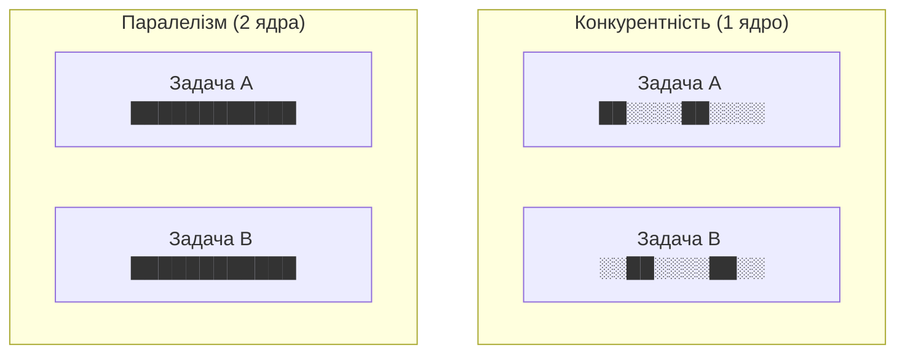
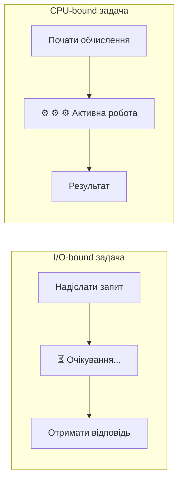
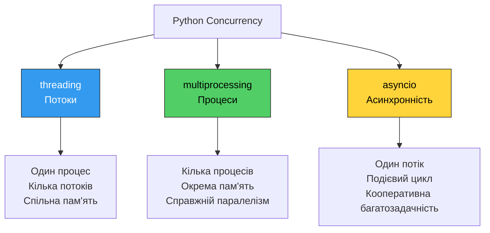
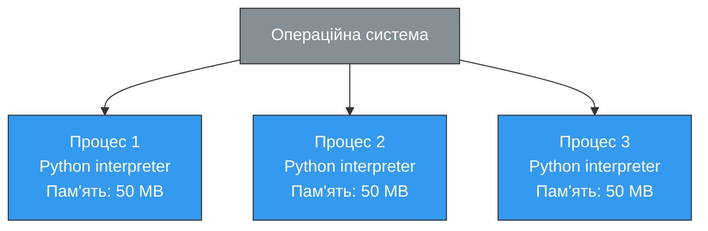
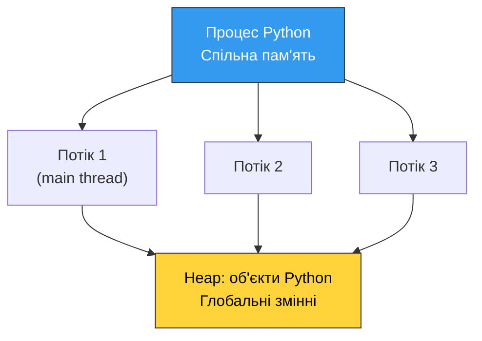
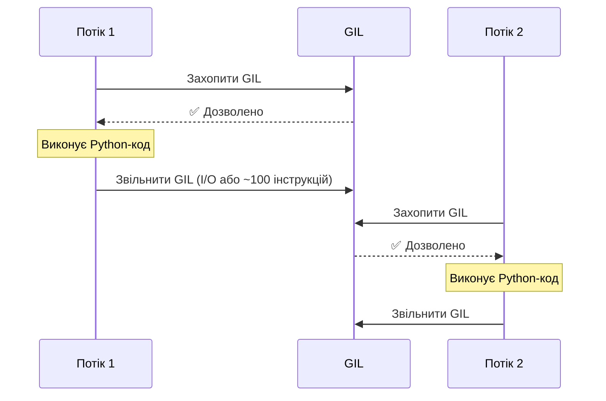
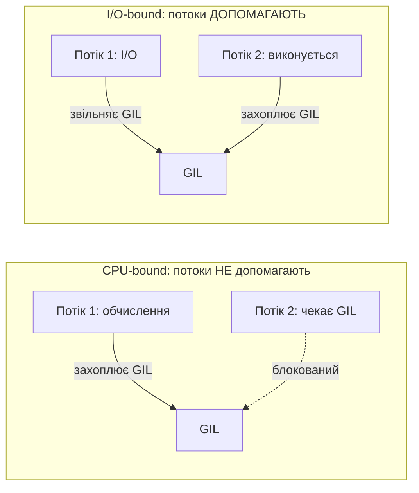
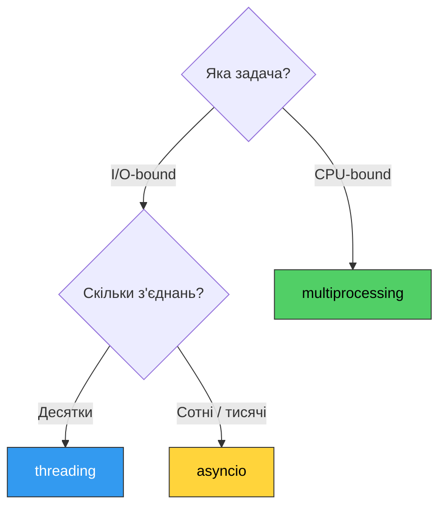

# 32. (Л) Основи асинхронного програмування та конкурентності в Python

## Зміст лекції

1. Конкурентність vs паралелізм
2. Моделі конкурентності в Python
3. Процеси та потоки: базові концепції
4. GIL — Global Interpreter Lock
5. Коли що використовувати
6. Огляд модуля 3

## Конкурентність vs паралелізм

Ці два поняття часто плутають, але між ними є принципова різниця.

**Конкурентність (Concurrency)** — це здатність програми мати кілька задач у процесі виконання одночасно. Задачі можуть чергуватися, але в один момент часу виконується лише одна з них.

**Паралелізм (Parallelism)** — це справжнє одночасне виконання кількох задач на різних процесорних ядрах.



!!! info "Аналогія"
    Уявіть кухаря. **Конкурентність** — один кухар готує кілька страв по черзі: поки одна вариться, він ріже іншу. **Паралелізм** — два кухарі готують страви одночасно, кожен свою.

### Типи задач за характером навантаження

| Тип | Назва | Приклади | Вузьке місце |
|---|---|---|---|
| I/O-bound | Навантаження введення/виведення | HTTP-запити, читання файлів, БД | Очікування відповіді |
| CPU-bound | Навантаження на процесор | Математичні обчислення, стиснення, шифрування | Час процесора |



Вибір інструменту конкурентності залежить від типу задачі:

- **I/O-bound** → потоки (`threading`) або asyncio
- **CPU-bound** → процеси (`multiprocessing`)

## Моделі конкурентності в Python

Python надає три основні моделі:



| Модель | Паралелізм | Пам'ять | Накладні витрати | Найкраще для |
|---|---|---|---|---|
| `threading` | Обмежений (GIL) | Спільна | Низькі | I/O-bound задачі |
| `multiprocessing` | Справжній | Ізольована | Високі | CPU-bound задачі |
| `asyncio` | Конкурентність | Спільна | Мінімальні | Багато I/O-bound задач |

## Процеси та потоки: базові концепції

### Процес

**Процес** — це незалежна програма, що виконується операційною системою. Кожен процес має:

- власний адресний простір пам'яті
- власні ресурси (файлові дескриптори тощо)
- щонайменше один потік виконання



**Переваги процесів:**

- справжній паралелізм (кожен на своєму ядрі)
- ізоляція — збій одного процесу не впливає на інші

**Недоліки процесів:**

- велике споживання пам'яті
- складний обмін даними між процесами (IPC)
- повільне створення

### Потік

**Потік (thread)** — це одиниця виконання всередині процесу. Кілька потоків одного процесу:

- спільно використовують пам'ять та ресурси
- виконуються «одночасно» (з перемиканням)



**Переваги потоків:**

- швидке створення (дешевше за процеси)
- легкий обмін даними через спільну пам'ять

**Недоліки потоків:**

- GIL обмежує паралелізм у CPython
- гонки даних (race conditions) при спільному доступі

### Порівняння на прикладі

```python
import time


def task(name: str, duration: float) -> None:
    print(f"{name}: початок")
    time.sleep(duration)  # Імітація I/O
    print(f"{name}: завершення")


# Послідовне виконання — найповільніше
start = time.time()
task("A", 2)
task("B", 2)
task("C", 2)
print(f"Послідовно: {time.time() - start:.1f}с")  # ~6.0с
```

З потоками або asyncio ті самі три задачі виконаються приблизно за 2 секунди — ми детально розглянемо це в наступних лекціях.

## GIL — Global Interpreter Lock

**М'ютекс (mutex, від mutual exclusion — взаємне виключення)** — це примітив синхронізації, який захищає спільний ресурс від одночасного доступу кількох потоків. М'ютекс працює як замок: перший потік, що його «захоплює», отримує доступ до ресурсу, а всі інші потоки, що намагаються захопити той самий м'ютекс, змушені чекати, поки він не буде звільнений.

**GIL (Global Interpreter Lock)** — це м'ютекс у CPython, який дозволяє виконуватись лише одному потоку Python в один момент часу.



### Чому існує GIL?

CPython управляє пам'яттю через підрахунок посилань (reference counting). Без GIL два потоки могли б одночасно змінювати лічильник, що призвело б до помилок пам'яті.

```python
# Внутрішньо кожен об'єкт Python має лічильник
import sys

x = [1, 2, 3]
print(sys.getrefcount(x))  # Кількість посилань на об'єкт
```

### Вплив GIL на різні типи задач



!!! warning "GIL і CPU-bound задачі"
    Для CPU-bound задач потоки в CPython **не дають прискорення** і навіть можуть сповільнити програму через накладні витрати на перемикання. Для справжнього паралелізму обчислень використовуйте `multiprocessing`.

!!! info "GIL і I/O-bound задачі"
    Під час очікування I/O (мережа, диск) потік **звільняє GIL**. Тому `threading` ефективний для I/O-bound задач: поки один потік чекає відповіді від сервера, інший може виконуватись.

### Альтернативи без GIL

- **PyPy** — альтернативна реалізація Python з JIT (власний підхід до GIL)
- **Python 3.13+** — експериментальний режим без GIL (`--disable-gil`)
- **Cython, C extensions** — можуть звільняти GIL для обчислювального коду

## Коли що використовувати



### Практичні приклади вибору

| Задача | Рекомендація | Причина |
|---|---|---|
| Завантаження 10 файлів із мережі | `threading` або `asyncio` | I/O-bound, просто |
| Обробка зображень (resize 1000 фото) | `multiprocessing` | CPU-bound |
| Веб-сервер з тисячами з'єднань | `asyncio` | Масштабованість |
| Парсинг 50 сайтів | `asyncio` | Багато I/O-bound |
| Шифрування великих файлів | `multiprocessing` | CPU-bound |
| Простий скрипт з 2–3 запитами | Послідовний код | Не варто ускладнювати |

!!! tip "Золоте правило"
    Не додавайте конкурентність без потреби. Послідовний код простіший у розробці та налагодженні. Додавайте конкурентність лише тоді, коли є вимірювана потреба в продуктивності.

## Огляд модуля 3

До кінця модуля ви зможете:

- запускати задачі паралельно за допомогою `threading` та `multiprocessing`
- писати асинхронний код із `asyncio`
- завантажувати дані з мережі конкурентно
- вимірювати та порівнювати продуктивність різних підходів
- налагоджувати асинхронні програми

## Підсумок

| Концепція | Опис |
|---|---|
| **Конкурентність** | Кілька задач у процесі виконання, чергуються |
| **Паралелізм** | Кілька задач виконуються одночасно на різних ядрах |
| **I/O-bound** | Задача, що чекає на введення/виведення |
| **CPU-bound** | Задача, що активно використовує процесор |
| **GIL** | М'ютекс CPython — один потік Python в один момент |
| **threading** | Потоки в одному процесі, ефективні для I/O-bound |
| **multiprocessing** | Окремі процеси, справжній паралелізм для CPU-bound |
| **asyncio** | Один потік, подієвий цикл, тисячі конкурентних I/O-bound задач |

Ключові принципи:

- **Розрізняйте I/O-bound і CPU-bound** — від цього залежить вибір інструменту
- **GIL обмежує потоки для CPU-bound** — для обчислень використовуйте процеси
- **asyncio масштабується краще** — але потребує асинхронних бібліотек
- **Послідовний код завжди простіший** — додавайте конкурентність лише за потреби

## Корисні посилання

- [Python docs — threading](https://docs.python.org/3/library/threading.html)
- [Python docs — multiprocessing](https://docs.python.org/3/library/multiprocessing.html)
- [Python docs — asyncio](https://docs.python.org/3/library/asyncio.html)
- [Real Python — Python Concurrency](https://realpython.com/python-concurrency/)
- [PEP 703 — Making the Global Interpreter Lock Optional](https://peps.python.org/pep-0703/)
