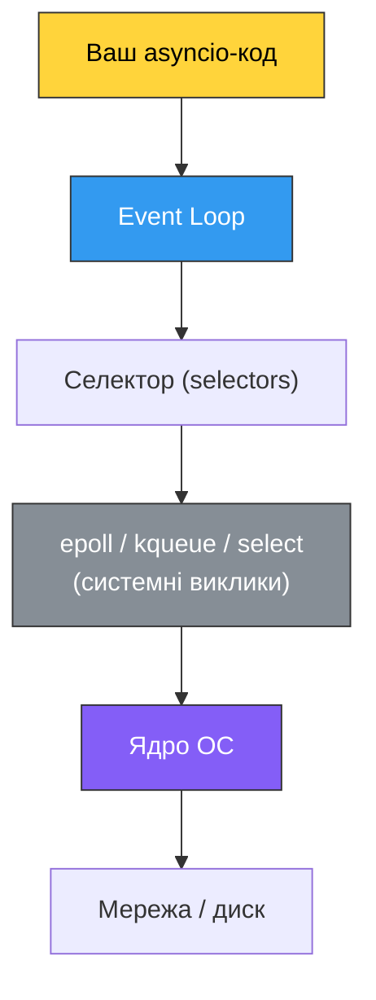
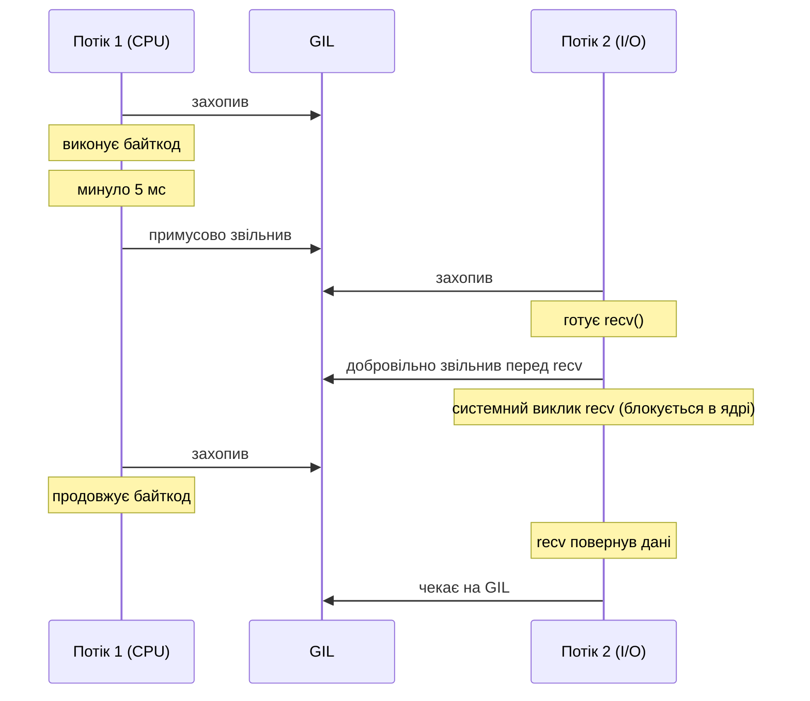
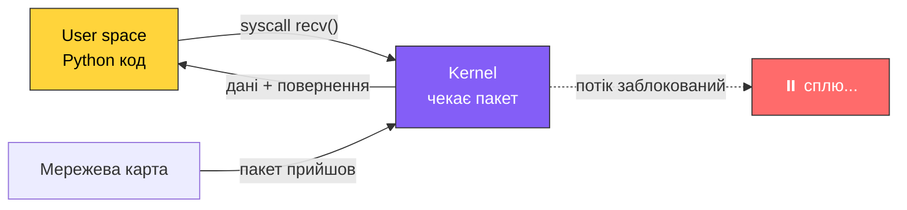
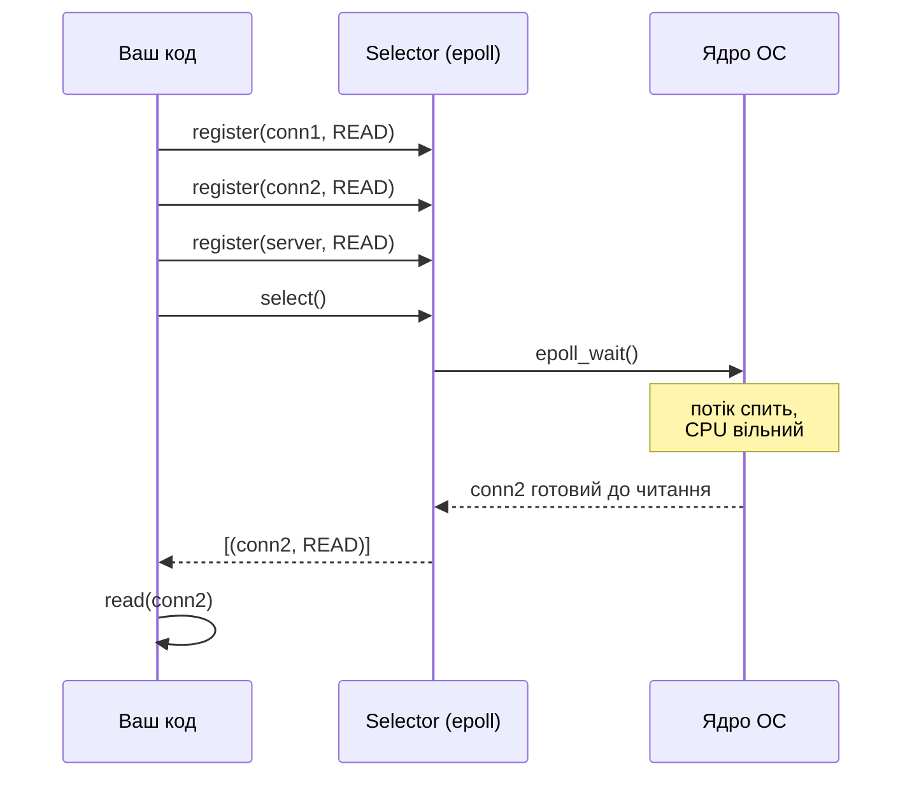
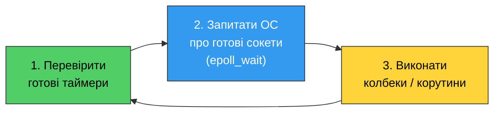

# 34. (Л) Асинхронність усередині Python: GIL, подієвий цикл і сокети

## Зміст лекції

1. Що ми будемо досліджувати
2. GIL зсередини: як відбувається перемикання потоків
3. Системні виклики та природа блокування
4. Блокуючі та неблокуючі сокети
5. Моніторинг готовності: модуль `selectors`
6. Подієвий цикл: як він збирається з цих деталей

## Що ми будемо досліджувати

У лекції 32 ми оглядово познайомилися з моделями конкурентності: `threading`, `multiprocessing`, `asyncio`. Ми говорили, що потоки «звільняють GIL під час I/O», а `asyncio` «використовує подієвий цикл». Тепер настав час зазирнути під капот і побачити, **як саме** це працює.

!!! info "Чому це важливо"
    Без розуміння механіки асинхронність здається магією: `await` десь щось чекає, і якимось чином тисячі з'єднань обслуговуються одним потоком. Коли ви розумієте `epoll` і неблокуючі сокети, `asyncio` перетворюється на прозору тонку обгортку над класичними механізмами ОС.



Знизу догори: ядро ОС уміє повідомляти, що сокет готовий до читання; селектор загортає цей механізм у Python-API; event loop використовує селектор, щоб знати, яку корутину пробуджувати; ваш код просто пише `await`.

## GIL зсередини: як відбувається перемикання потоків

### Два види перемикання

У CPython потоки можуть віддати GIL у двох ситуаціях:

1. **Примусово** — після певного інтервалу часу (default 5 мс), інтерпретатор сам перевіряє, чи не час віддати GIL.
2. **Добровільно** — коли потік заходить у системний виклик, що може блокуватися (`read`, `recv`, `sleep`, тощо). Перед викликом C-функція явно викликає `Py_BEGIN_ALLOW_THREADS`, який тимчасово звільняє GIL.



### Інтервал перемикання

```python
import sys

# Поточний інтервал у секундах
print(sys.getswitchinterval())  # 0.005 (5 мс)

# Змінити інтервал (зазвичай не варто)
sys.setswitchinterval(0.001)
```

### Чому I/O звільняє GIL

Коли Python викликає, наприклад, `socket.recv()`, усередині CPython виконується приблизно така послідовність:

```c
// спрощено, реальний код у Modules/socketmodule.c
Py_BEGIN_ALLOW_THREADS          // звільнити GIL
n = recv(fd, buf, len, flags);  // системний виклик ядра
Py_END_ALLOW_THREADS            // знову захопити GIL
```

Поки потік стоїть у `recv`, GIL вільний — інші потоки можуть виконувати Python-код. Саме тому `threading` ефективний для I/O-bound задач.

## Системні виклики та природа блокування

Щоб зрозуміти асинхронність, треба зрозуміти, **що саме** блокує звичайний код.

**Системний виклик (syscall)** — це запит програми до ядра ОС: відкрити файл, прочитати з сокета, виділити пам'ять тощо. Все I/O — це системні виклики.

Коли ви пишете:

```python
data = sock.recv(4096)
```

ось що відбувається:

1. Python кличе C-функцію `recv`.
2. `recv` переходить у режим ядра.
3. Якщо даних немає — ядро **приспає ваш процес/потік**, доки дані не прийдуть.
4. Коли пакет прийшов — ядро копіює дані у ваш буфер і повертає керування.



Ключова ідея: **блокує не Python, а ядро**. Ядро свідомо приспає потік, бо поки даних нема — робити нічого.

Щоб обслуговувати багато з'єднань одним потоком, треба **не давати ядру нас приспати** — замість цього питати: «чи є вже дані?», і якщо немає — займатися іншим з'єднанням.

## Блокуючі та неблокуючі сокети

За замовчуванням сокети в Python — **блокуючі**. Це означає, що `recv` чекає даних, а `accept` чекає з'єднань.

У сокета є прапорець `O_NONBLOCK`, який змінює поведінку: якщо даних немає — `recv` одразу повертає помилку `BlockingIOError` замість того, щоб чекати.

!!! note "Коротко про `telnet`"
    `telnet` — проста консольна утиліта, яка відкриває TCP-з'єднання на вказану адресу та порт. Нам вона згодиться як «ручний клієнт», щоб підключитись до власного сервера з іншого термінала.

    ```bash
    sudo apt install telnet         # Debian / Ubuntu, якщо ще не встановлено
    telnet 127.0.0.1 8000           # підключення до локального сервера
    ```

    Щоб закрити з'єднання, натисніть `Ctrl+]`, потім уведіть `quit` та Enter.

### Блокуючий сокет

Сервер у циклі чекає на клієнта:

```python
import socket

server = socket.socket(socket.AF_INET, socket.SOCK_STREAM)
server.bind(("127.0.0.1", 8000))
server.listen()

while True:
    print("Waiting for client...")
    conn, addr = server.accept()        # 🛑 БЛОК: спимо тут, доки хтось не підключиться
    print(f"Connected {addr}")
    conn.close()
```

Коли запустимо:

```text
Waiting for client...
# ... програма зависла всередині accept(), потік спить у ядрі
```

Поки клієнта немає — **програма нічого іншого робити не може**. Потік ОС заблокований усередині `accept`. Щоб «розбудити» його, з іншого термінала підключаємось телнетом:

```bash
$ telnet 127.0.0.1 8000
Trying 127.0.0.1...
Connected to 127.0.0.1.
Escape character is '^]'.
Connection closed by foreign host.
```

У першому терміналі сервер одразу продовжить:

```text
Connected ('127.0.0.1', 54321)
Waiting for client...
```

і знову застрягне на `accept` — у нескінченному очікуванні наступного клієнта.

### Неблокуючий сокет

Той самий сервер, але `accept` не блокує — між перевірками програма встигає зробити щось інше:

```python
import socket
import time

server = socket.socket(socket.AF_INET, socket.SOCK_STREAM)
server.setblocking(False)               # вмикаємо неблокуючий режим
server.bind(("127.0.0.1", 8000))
server.listen()

while True:
    try:
        conn, addr = server.accept()    # ⚡ НЕ БЛОКУЄ: одразу повертає або кидає
    except BlockingIOError:
        print("No clients — doing useful work")
        time.sleep(1)                   # імітуємо "щось корисне", щоб не спалити CPU
        continue

    print(f"Connected {addr}")
    conn.close()
```

Запуск:

```text
No clients — doing useful work
No clients — doing useful work
No clients — doing useful work
# ... і так далі, програма НЕ застрягла в ядрі
```

Якщо посеред цього виконати `telnet 127.0.0.1 8000` у іншому терміналі, то на найближчій ітерації циклу `accept` поверне з'єднання:

```text
No clients — doing useful work
No clients — doing useful work
Connected ('127.0.0.1', 54322)
No clients — doing useful work
```

Головна різниця: **блокуючий** варіант віддає керування ядру та засинає до події; **неблокуючий** тримає керування у себе, сам вирішує, що робити в паузі, і сам повертається перевіряти знову. Але зверніть увагу на `time.sleep(1)` — без нього цикл крутився б тисячі разів на секунду й даремно спалив би 100% CPU. Це той самий **busy-wait**, від якого ми хочемо позбутися.

!!! tip "Ключова ідея неблокуючого I/O"
    Замість «чекай, доки будуть дані» ми питаємо «чи є дані просто зараз?». Це дозволяє одному потоку перевіряти тисячі сокетів по черзі — але постає питання: **як не робити це в холостому циклі (busy-wait), який з'їсть 100% CPU?**

## Моніторинг готовності: модуль `selectors`

Операційна система надає механізм: «ось мій список файлових дескрипторів, розбуди мене, коли хоча б один із них буде готовий». Це — основа event loop.

У Python цей механізм загорнуто у стандартний модуль `selectors`. Він сам обирає найкращу реалізацію для вашої ОС (на Linux — `epoll`, на macOS/BSD — `kqueue`, на Windows — `select`), а ми працюємо з однаковим Python-API.

### Як працює `selectors`

1. **Створюємо селектор**: `sel = selectors.DefaultSelector()`.
2. **Реєструємо** сокети, за якими треба стежити: `sel.register(sock, selectors.EVENT_READ, data=callback)`. Ми кажемо: «розбуди мене, коли цей сокет стане готовий для читання, і разом із подією поверни мені ось цей об'єкт `data`».
3. **Викликаємо `sel.select(timeout)`** — це один блокуючий виклик, що засинає до настання **будь-якої** із зареєстрованих подій. Поки нічого не відбулось — потік спить у ядрі (CPU вільний). Щойно бодай один сокет готовий — виклик повертає список таких сокетів разом із їх `data`.
4. Ми **обробляємо** готові сокети й знову викликаємо `sel.select`.

Ключова ідея: замість того, щоб у циклі самостійно питати кожен сокет «а ти готовий?», ми один раз передаємо весь список ядру й засинаємо на `sel.select`, доки ядро само не сповістить нас про готові. Жодного busy-wait: CPU вільний, поки немає роботи.

### Приклад: ехо-сервер на `selectors`

```python
import selectors
import socket

sel = selectors.DefaultSelector()


def accept(server_sock: socket.socket) -> None:
    conn, addr = server_sock.accept()
    print(f"New connection from {addr}")
    conn.setblocking(False)
    sel.register(conn, selectors.EVENT_READ, data=read)


def read(conn: socket.socket) -> None:
    data = conn.recv(4096)
    if data:
        conn.sendall(data)              # ехо
    else:
        print("Client closed the connection")
        sel.unregister(conn)
        conn.close()


server = socket.socket(socket.AF_INET, socket.SOCK_STREAM)
server.setsockopt(socket.SOL_SOCKET, socket.SO_REUSEADDR, 1)
server.bind(("127.0.0.1", 8000))
server.listen()
server.setblocking(False)
sel.register(server, selectors.EVENT_READ, data=accept)

print("Listening on 127.0.0.1:8000")
while True:
    events = sel.select(timeout=None)   # чекаємо на будь-яку готовність
    for key, mask in events:
        handler = key.data              # функція для обробки
        handler(key.fileobj)
```

Цей код обслуговує **сотні з'єднань одним потоком**, і робить це ефективно — поки нема готових сокетів, він спить у ядрі (всередині `sel.select`), а не крутиться у холостому циклі.



## Подієвий цикл: як він збирається з цих деталей

**Event loop** — це нескінченний цикл, який:

1. Питає ОС: «які дескриптори зараз готові?» (через `epoll` або подібне).
2. Для кожного готового дескриптора викликає зареєстрований колбек / продовжує корутину.
3. Повертається до кроку 1.



Event loop — це не чорна магія, а приблизно 100 рядків коду, що обертаються навколо `selectors` і черги задач. Саме так влаштований і `asyncio`: це event loop поверх `selectors`, доповнений підтримкою корутин (`async`/`await`), скасування, таймерів і сигналів.

!!! tip "Чому блокуючі виклики вбивають asyncio"
    Якщо всередині корутини ви викличете звичайний блокуючий `requests.get()` або `time.sleep(5)`, ви заблокуєте **весь event loop** — а разом із ним усі тисячі інших корутин. Саме тому для `asyncio` потрібні асинхронні бібліотеки (`aiohttp`, `asyncpg`, `httpx` з AsyncClient) та `await asyncio.sleep()` замість `time.sleep()`.

## Підсумок

| Поняття | Суть |
|---|---|
| **GIL** | М'ютекс CPython; звільняється на таймері (5 мс) та перед блокуючими syscalls |
| **Syscall** | Запит до ядра; блокуючі syscalls приспають потік у ядрі |
| **Неблокуючий сокет** | Кидає `BlockingIOError` замість очікування |
| **`selectors`** | Python-модуль, що сам обирає найкращий механізм моніторингу готовності для ОС |
| **Event loop** | Цикл: таймери → селектор → виконання готових задач |

Ключові принципи:

- **Асинхронність — це неблокуючі сокети + `selectors`**, без магії.
- **Один потік може обслуговувати тисячі з'єднань**, бо 99% часу він спить у `sel.select`, а не у `recv` окремого сокета.
- **Блокуючі виклики всередині event loop — це катастрофа**: вони зупиняють увесь цикл, а не тільки свою корутину.

## Корисні посилання

- [Python docs — selectors](https://docs.python.org/3/library/selectors.html)
- [Python docs — socket](https://docs.python.org/3/library/socket.html)
- [Python docs — asyncio event loop](https://docs.python.org/3/library/asyncio-eventloop.html)
- [man epoll(7)](https://man7.org/linux/man-pages/man7/epoll.7.html)
- [David Beazley — «Build Your Own Async»](https://www.youtube.com/watch?v=Y4Gt3Xjd7G8)
- [PEP 3156 — Asynchronous IO Support Rebooted](https://peps.python.org/pep-3156/)
