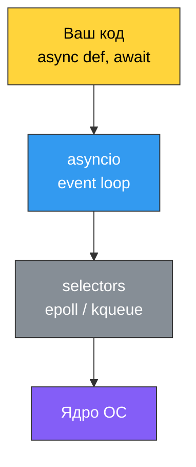
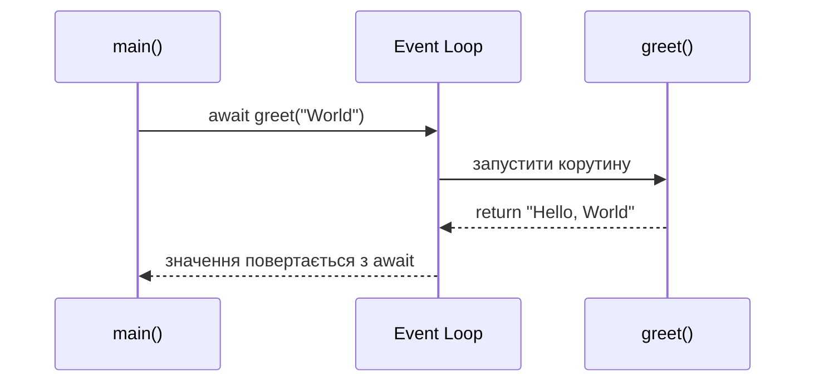
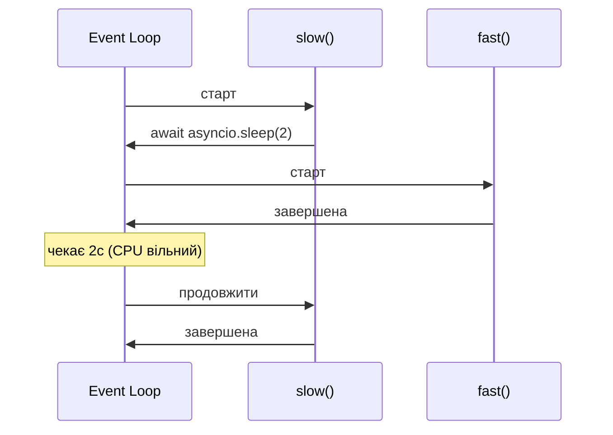

# 36. (Л) Основи asyncio. Корутини, затримки та виконання задач

## Зміст лекції

1. Від event loop до asyncio
2. Корутини: `async def` та `await`
3. Запуск асинхронної програми: `asyncio.run`
4. Затримки: `asyncio.sleep` проти `time.sleep`
5. Послідовне виконання корутин
6. Конкурентне виконання через `asyncio.gather`
7. Повернення значень та порівняння з послідовним кодом

## Від event loop до asyncio

У лекції 34 ми побачили, що event loop — це приблизно 100 рядків коду поверх `selectors`. Ми самі могли б написати ехо-сервер, який обслуговує тисячі з'єднань одним потоком. Але коли задач стає багато, керувати колбеками вручну стає незручно: треба пам'ятати, який колбек для якого сокета, як передавати дані між ними, як скасовувати операції.

**`asyncio`** — це стандартна бібліотека Python, що надає готовий event loop і зручний синтаксис `async`/`await` для роботи з ним.



!!! info "asyncio — це не магія"
    Усі принципи з лекції 34 залишаються: один потік, неблокуючі сокети, `epoll`, цикл обробки подій. `asyncio` лише ховає ці деталі за синтаксисом `async`/`await` і надає готові примітиви: задачі, таймери, блокування, черги.

## Корутини: `async def` та `await`

**Корутина (coroutine)** — це функція, яку можна призупиняти та відновлювати. Для event loop це зручна одиниця роботи: замість колбеків ми пишемо звичайний код, а `await` позначає точки, де корутину можна «поставити на паузу».

### Оголошення корутини

Щоб оголосити корутину, використовуємо ключове слово `async`:

```python
async def greet(name: str) -> str:
    return f"Hello, {name}"
```

!!! warning "Виклик корутини НЕ запускає її"
    Якщо написати `greet("World")` — ви отримаєте об'єкт корутини, але код всередині **не виконається**. Корутина починає працювати лише тоді, коли її запустить event loop.

    ```python
    result = greet("World")
    print(result)
    # <coroutine object greet at 0x7f...>
    # RuntimeWarning: coroutine 'greet' was never awaited
    ```

### `await` — очікування результату

Усередині іншої корутини об'єкт корутини виконується через `await`:

```python
async def main() -> None:
    message = await greet("World")
    print(message)  # Hello, World
```

`await` працює з об'єктами, що мають протокол awaitable — це корутини, задачі (`Task`) та майбутні результати (`Future`). Звичайну функцію через `await` викликати не можна.



## Запуск асинхронної програми: `asyncio.run`

Щоб корутина почала виконуватись, потрібен event loop. Найпростіший спосіб — функція `asyncio.run`:

```python
import asyncio


async def main() -> None:
    print("Hello from asyncio")


asyncio.run(main())
```

`asyncio.run` робить три речі:

1. створює новий event loop;
2. запускає передану корутину до її завершення;
3. закриває event loop.

!!! tip "Одна точка входу"
    В одному процесі викликайте `asyncio.run` **один раз** — у самій верхівці програми. Усе інше має бути корутинами, які викликаються через `await` з `main`.

## Затримки: `asyncio.sleep` проти `time.sleep`

У синхронному коді для паузи ми використовували `time.sleep`. У асинхронному коді він **заборонений** — і ось чому.

### `time.sleep` блокує event loop

```python
import asyncio
import time


async def slow() -> None:
    print("slow: start")
    time.sleep(2)               # 🛑 блокує увесь потік на 2 секунди
    print("slow: done")


async def fast() -> None:
    print("fast: start")
    print("fast: done")


async def main() -> None:
    await asyncio.gather(slow(), fast())


asyncio.run(main())
```

Запустимо — і побачимо, що `fast` чекає на `slow`, хоча мав би виконатись одразу:

```text
slow: start
slow: done
fast: start
fast: done
```

Причина — `time.sleep` заходить у системний виклик, який приспає **весь потік**. А в asyncio потік один, тож event loop теж спить, і жодна інша корутина не може виконуватись.

### `asyncio.sleep` віддає керування event loop

```python
import asyncio


async def slow() -> None:
    print("slow: start")
    await asyncio.sleep(2)      # ⚡ віддає керування event loop
    print("slow: done")


async def fast() -> None:
    print("fast: start")
    print("fast: done")


async def main() -> None:
    await asyncio.gather(slow(), fast())


asyncio.run(main())
```

Тепер порядок виконання інший:

```text
slow: start
fast: start
fast: done
slow: done
```

`await asyncio.sleep(2)` каже event loop: «поставте мене на паузу на 2 секунди, а тим часом можете виконувати інші корутини». Поки `slow` спить у таймері, `fast` встигає виконатись повністю.



!!! warning "Будь-який блокуючий виклик — проблема"
    Це стосується не тільки `time.sleep`. `requests.get`, синхронні драйвери БД, важкі CPU-обчислення — усе це блокує event loop. Для мережі потрібні асинхронні бібліотеки (`aiohttp`, `httpx` з `AsyncClient`, `asyncpg`), для CPU-bound коду — винесення в окремий потік або процес.

## Послідовне виконання корутин

Якщо просто поставити `await` один за одним, корутини виконуються **послідовно** — наступна стартує лише після завершення попередньої.

```python
import asyncio
import time


async def fetch(name: str, delay: float) -> str:
    print(f"{name}: start")
    await asyncio.sleep(delay)
    print(f"{name}: done")
    return f"result-{name}"


async def main() -> None:
    start = time.perf_counter()

    a = await fetch("A", 2)
    b = await fetch("B", 2)
    c = await fetch("C", 2)

    elapsed = time.perf_counter() - start
    print(f"results: {a}, {b}, {c}")
    print(f"elapsed: {elapsed:.1f}s")


asyncio.run(main())
```

Результат:

```text
A: start
A: done
B: start
B: done
C: start
C: done
results: result-A, result-B, result-C
elapsed: 6.0s
```

Три задачі по 2 секунди — **6 секунд сумарно**. Це той самий час, що й у послідовному синхронному коді: ми нічого не виграли, бо щоразу чекаємо завершення попередньої.

!!! info "Коли послідовно — це правильно"
    Якщо результат задачі `B` залежить від результату задачі `A`, послідовний `await` — єдиний правильний варіант. Конкурентне виконання має сенс лише для **незалежних** задач.

## Конкурентне виконання через `asyncio.gather`

Щоб запустити кілька корутин **одночасно**, є функція `asyncio.gather`. Вона стартує всі передані корутини та чекає завершення всіх.

```python
import asyncio
import time


async def fetch(name: str, delay: float) -> str:
    print(f"{name}: start")
    await asyncio.sleep(delay)
    print(f"{name}: done")
    return f"result-{name}"


async def main() -> None:
    start = time.perf_counter()

    results = await asyncio.gather(
        fetch("A", 2),
        fetch("B", 2),
        fetch("C", 2),
    )

    elapsed = time.perf_counter() - start
    print(f"results: {results}")
    print(f"elapsed: {elapsed:.1f}s")


asyncio.run(main())
```

Результат:

```text
A: start
B: start
C: start
A: done
B: done
C: done
results: ['result-A', 'result-B', 'result-C']
elapsed: 2.0s
```

Три задачі по 2 секунди виконалися **за 2 секунди сумарно**. Поки одна спить у таймері, event loop переключається на наступну.

### Порядок результатів у `gather`

`asyncio.gather` повертає список у **тому самому порядку**, у якому корутини були передані — незалежно від того, хто завершився першим:

```python
async def main() -> None:
    results = await asyncio.gather(
        fetch("slow", 3),
        fetch("fast", 1),
    )
    print(results)  # ['result-slow', 'result-fast']
```

Це зручно для обробки: ви наперед знаєте, який елемент списку який запит описує.

## Повернення значень та порівняння з послідовним кодом

Розглянемо приклад ближчий до реального — «завантаження» трьох ресурсів з імітованими затримками.

```python
import asyncio
import time


async def download(url: str, size_mb: int) -> dict:
    print(f"downloading {url}")
    # Імітуємо мережеву затримку пропорційно розміру
    await asyncio.sleep(size_mb * 0.5)
    return {"url": url, "size_mb": size_mb}


async def main() -> None:
    start = time.perf_counter()
    results = await asyncio.gather(
        download("https://example.com/a", 2),
        download("https://example.com/b", 3),
        download("https://example.com/c", 1),
    )
    elapsed = time.perf_counter() - start

    for r in results:
        print(r)
    print(f"elapsed: {elapsed:.1f}s")


asyncio.run(main())
```

Послідовна версія витратила б `2*0.5 + 3*0.5 + 1*0.5 = 3.0` секунди. Конкурентна через `gather` — `max(1.0, 1.5, 0.5) = 1.5` секунди, тобто час найдовшого запиту.

| Виконання | Час (цей приклад) | Формула |
|---|---|---|
| Послідовно (`await` по черзі) | 3.0с | сума всіх затримок |
| Конкурентно (`gather`) | 1.5с | найдовша затримка |

!!! tip "Коли конкурентність дає найбільший виграш"
    Чим більше **незалежних** I/O-задач і чим довші їхні затримки — тим більший виграш від конкурентності. Для одного запиту асинхронність не дає прискорення, для 100 — прискорення може бути кратне десяткам разів.

## Підсумок

| Поняття | Суть |
|---|---|
| **Корутина** | Функція з `async def`; може призупинятися на `await` |
| **`await`** | Віддає керування event loop до завершення awaitable |
| **`asyncio.run`** | Створює event loop, запускає корутину, закриває loop |
| **`asyncio.sleep`** | Асинхронна пауза; не блокує event loop |
| **Послідовний `await`** | Чекаємо одну корутину, потім наступну — загальний час сумується |
| **`asyncio.gather`** | Запускає корутини конкурентно; час = найдовший із запитів |

Ключові принципи:

- **`async def` оголошує, `await` запускає** — саме виклик `f()` нічого не виконує.
- **Ніколи не використовуйте блокуючі виклики всередині корутин** — вони зупиняють весь event loop.
- **`gather` — найпростіший спосіб паралелити I/O**, коли задач небагато і вони відомі заздалегідь.
- **Асинхронність допомагає тільки для I/O-bound** — для CPU-bound задач використовуйте `multiprocessing`.

## Корисні посилання

- [Python docs — asyncio](https://docs.python.org/3/library/asyncio.html)
- [Python docs — Coroutines and Tasks](https://docs.python.org/3/library/asyncio-task.html)
- [Python docs — asyncio.sleep](https://docs.python.org/3/library/asyncio-task.html#sleeping)
- [Python docs — asyncio.gather](https://docs.python.org/3/library/asyncio-task.html#asyncio.gather)
- [PEP 492 — Coroutines with async and await syntax](https://peps.python.org/pep-0492/)
