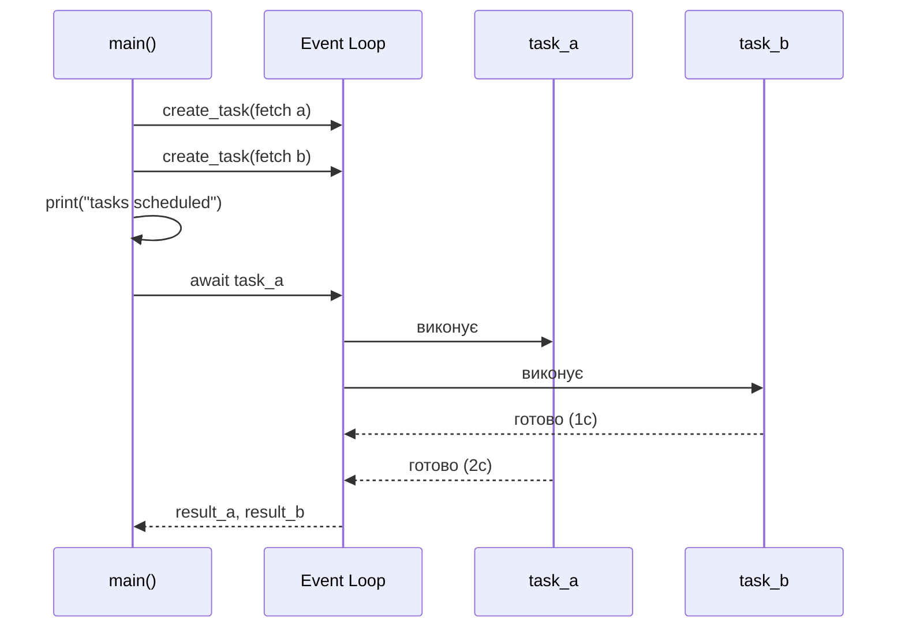
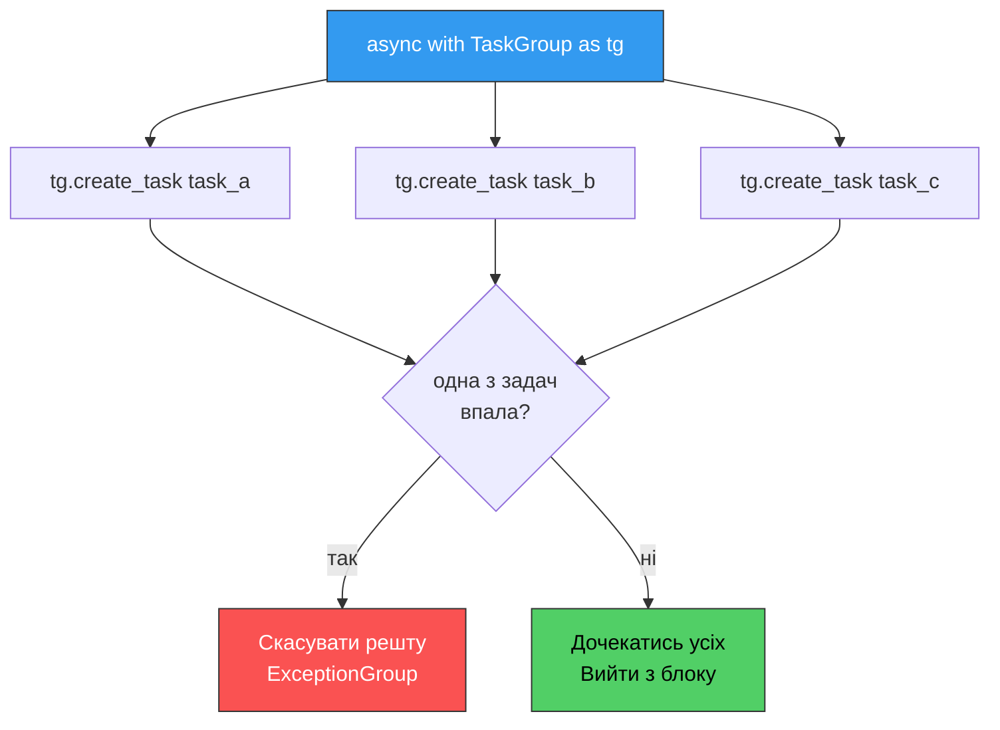

# 38. (Л) Керування асинхронними задачами та вимірювання продуктивності в asyncio

## Зміст лекції

1. Корутина vs `Task`: у чому різниця
2. Створення задач через `asyncio.create_task`
3. `asyncio.gather` vs `asyncio.wait` vs `asyncio.as_completed`
4. Тайм-аути та скасування задач
5. `TaskGroup` — структурована конкурентність
6. Обмеження одночасних задач через `Semaphore`
7. Вимірювання продуктивності асинхронного коду

## Корутина vs `Task`: у чому різниця

У лекції 36 ми вже використовували термін «задача», але насправді працювали переважно з корутинами. Час розібратись із різницею.

| Поняття | Що це | Коли починає виконуватись |
|---|---|---|
| **Coroutine** | Об'єкт, що повертається з виклику `async def` функції | Лише коли її чекають через `await` |
| **Task** | Обгортка над корутиною, зареєстрована в event loop | Одразу після створення, у фоновому режимі |

Корутина без `await` — це інертний об'єкт. `Task` — навпаки, активна одиниця: щойно створили — event loop одразу планує її виконання.

```python
import asyncio


async def work(name: str) -> str:
    print(f"{name}: running")
    await asyncio.sleep(1)
    return name


async def main() -> None:
    coro = work("coro")          # ще не виконується
    task = asyncio.create_task(work("task"))  # вже планується

    await asyncio.sleep(0.1)
    print("after 0.1s")

    await coro
    await task


asyncio.run(main())
```

Вивід:

```text
task: running
after 0.1s
coro: running
```

Зверніть увагу: `task` стартував одразу, а `coro` — лише після свого `await`. Це фундаментальна властивість, на якій будується вся подальша робота з паралельними операціями.

## Створення задач через `asyncio.create_task`

`asyncio.create_task` бере корутину і повертає об'єкт `Task`, який event loop почне виконувати при першій же нагоді (коли поточна корутина дійде до `await`).

```python
import asyncio


async def fetch(url: str, delay: float) -> str:
    await asyncio.sleep(delay)
    return f"data from {url}"


async def main() -> None:
    # Запускаємо обидві задачі у фоні
    task_a = asyncio.create_task(fetch("https://a.example", 2))
    task_b = asyncio.create_task(fetch("https://b.example", 1))

    # Тут ми можемо робити іншу роботу, поки задачі виконуються
    print("tasks scheduled")

    # Збираємо результати, коли вони знадобляться
    result_a = await task_a
    result_b = await task_b

    print(result_a)
    print(result_b)


asyncio.run(main())
```



!!! warning "Зберігайте посилання на задачі"
    Event loop тримає лише **слабке посилання** на `Task`. Якщо ви не зберегли результат `create_task` у змінній (або колекції), збирач сміття може видалити задачу до її завершення. Це часта причина «зникаючих» фонових операцій.

    ```python
    # 🛑 Небезпечно: посилання на задачу втрачено
    asyncio.create_task(background_work())

    # ✅ Безпечно
    task = asyncio.create_task(background_work())
    # або зберігаємо у множині на рівні модуля
    ```

### `gather` фактично робить це за вас

`asyncio.gather(coro1, coro2, ...)` всередині обгортає кожну корутину в `Task`, тож можна писати коротко:

```python
results = await asyncio.gather(
    fetch("https://a.example", 2),
    fetch("https://b.example", 1),
)
```

Різниця у виразності: `create_task` дає вам **посилання на конкретну задачу** (можна скасувати, перевірити стан, додати callback), а `gather` оптимізований для випадку «запустити N задач і чекати всі».

## `asyncio.gather` vs `asyncio.wait` vs `asyncio.as_completed`

У стандартній бібліотеці є **три способи чекати на групу задач**, і вони відповідають різним сценаріям.

### `asyncio.gather` — «потрібні всі результати у відомому порядку»

Найпростіший та найчастіше використовуваний варіант. Повертає список результатів **у тому самому порядку**, в якому передані корутини.

```python
results = await asyncio.gather(coro_a, coro_b, coro_c)
```

Особливості:

- Чекає **завершення всіх** задач.
- Якщо одна з задач кидає виняток, за замовчуванням `gather` теж прокидує цей виняток, **скасовуючи** інші задачі. Параметр `return_exceptions=True` змінює поведінку: винятки повертаються як значення в результуючому списку.

```python
results = await asyncio.gather(
    risky_call("a"),
    risky_call("b"),
    return_exceptions=True,
)

for r in results:
    if isinstance(r, Exception):
        print(f"failed: {r}")
    else:
        print(f"ok: {r}")
```

### `asyncio.wait` — «потрібен гнучкий контроль»

`asyncio.wait` повертає два множини задач: завершені (`done`) та ті, що ще працюють (`pending`). Корисно, коли треба зреагувати раніше, ніж усі завершаться.

```python
import asyncio


async def fetch(url: str, delay: float) -> str:
    await asyncio.sleep(delay)
    return f"data from {url}"


async def main() -> None:
    tasks = [
        asyncio.create_task(fetch("a", 3)),
        asyncio.create_task(fetch("b", 1)),
        asyncio.create_task(fetch("c", 2)),
    ]

    done, pending = await asyncio.wait(
        tasks,
        return_when=asyncio.FIRST_COMPLETED,
    )

    for task in done:
        print(f"first done: {task.result()}")

    for task in pending:
        task.cancel()


asyncio.run(main())
```

Параметр `return_when` приймає три значення:

| Значення | Поведінка |
|---|---|
| `ALL_COMPLETED` (за замовч.) | Чекати завершення всіх |
| `FIRST_COMPLETED` | Повернутись, коли завершиться будь-яка |
| `FIRST_EXCEPTION` | Повернутись при першій помилці (або всі завершились) |

### `asyncio.as_completed` — «обробляти у міру готовності»

Ітератор, що віддає задачі **у порядку їх завершення** — спершу найшвидшу. Зручно, коли хочемо стримити результати у користувацький код, не чекаючи найповільнішої задачі.

```python
import asyncio


async def fetch(url: str, delay: float) -> str:
    await asyncio.sleep(delay)
    return f"data from {url}"


async def main() -> None:
    coros = [
        fetch("slow", 3),
        fetch("medium", 2),
        fetch("fast", 1),
    ]

    for coro in asyncio.as_completed(coros):
        result = await coro
        print(f"got: {result}")


asyncio.run(main())
```

Вивід (у порядку завершення):

```text
got: data from fast
got: data from medium
got: data from slow
```

### Який інструмент коли обирати

| Сценарій | Інструмент |
|---|---|
| Потрібні всі результати, у відомому порядку | `gather` |
| Потрібен лише найшвидший, інші — скасувати | `wait(return_when=FIRST_COMPLETED)` |
| Стрімити результати в UI / лог у міру готовності | `as_completed` |
| Зупинитись на першій помилці | `wait(return_when=FIRST_EXCEPTION)` |
| Усі результати плюс зібрати винятки | `gather(return_exceptions=True)` |

## Тайм-аути та скасування задач

Будь-яка мережева операція може зависнути. Без тайм-ауту програма блокується, чекаючи на відповідь, якої не буде. asyncio пропонує три механізми.

### `asyncio.wait_for` — обмежити одну задачу

```python
import asyncio


async def slow_call() -> str:
    await asyncio.sleep(10)
    return "done"


async def main() -> None:
    try:
        result = await asyncio.wait_for(slow_call(), timeout=2)
        print(result)
    except asyncio.TimeoutError:
        print("operation timed out")


asyncio.run(main())
```

`wait_for` запускає корутину і чекає завершення максимум `timeout` секунд. Якщо час вийшов — задача **скасовується**, а назовні кидається `asyncio.TimeoutError`.

### `asyncio.timeout` — контекстний менеджер (Python 3.11+)

Більш сучасний варіант, що обмежує цілий блок коду:

```python
import asyncio


async def step_one() -> None:
    await asyncio.sleep(0.5)


async def step_two() -> None:
    await asyncio.sleep(0.5)


async def step_three() -> None:
    await asyncio.sleep(2)


async def main() -> None:
    try:
        async with asyncio.timeout(2):
            await step_one()
            await step_two()
            await step_three()
    except TimeoutError:
        print("did not finish within 2s")


asyncio.run(main())
```

Перевага: усі операції всередині `async with` рахуються одним тайм-аутом, а не кожна окремо.

### Скасування задач: `task.cancel()`

Коли ви скасовуєте задачу, всередину неї кидається спеціальний виняток `asyncio.CancelledError` у точці, де вона зараз чекає на `await`. Корутина може **прийняти** скасування або зробити швидку очистку (наприклад, закрити файл) і пропустити виняток далі.

```python
import asyncio


async def worker() -> None:
    try:
        while True:
            print("working...")
            await asyncio.sleep(1)
    except asyncio.CancelledError:
        print("worker: cleanup before exit")
        raise  # 🠔 важливо прокинути далі


async def main() -> None:
    task = asyncio.create_task(worker())
    await asyncio.sleep(2.5)
    task.cancel()
    try:
        await task
    except asyncio.CancelledError:
        print("main: task cancelled")


asyncio.run(main())
```

!!! warning "Не «ковтайте» CancelledError"
    Якщо у блоці `except asyncio.CancelledError` не зробити `raise`, asyncio вважатиме, що ви відмінили скасування. Це призводить до «зомбі»-задач, які продовжують жити після того, як їх просили зупинитись. Завжди робіть `raise` після очистки.

## `TaskGroup` — структурована конкурентність

Починаючи з **Python 3.11** з'явився `asyncio.TaskGroup` — рекомендований спосіб запускати групу задач із гарантованою обробкою помилок.

```python
import asyncio


async def fetch(url: str, delay: float) -> str:
    await asyncio.sleep(delay)
    return f"data from {url}"


async def main() -> None:
    async with asyncio.TaskGroup() as tg:
        task_a = tg.create_task(fetch("a", 2))
        task_b = tg.create_task(fetch("b", 1))
        task_c = tg.create_task(fetch("c", 3))

    # Сюди потрапляємо лише після завершення всіх задач групи
    print(task_a.result(), task_b.result(), task_c.result())


asyncio.run(main())
```

Чому це краще за `gather`:

- При виході з `async with` гарантовано очікуються **усі** задачі — якщо програма вилітає з блоку через виняток, фонові задачі не залишаться «висіти».
- Якщо одна з задач кидає виняток, **усі інші скасовуються автоматично**, а `TaskGroup` піднімає `ExceptionGroup` зі списком усіх помилок.
- Код виглядає лінійно: запустили — отримали результати під одним відступом.



!!! tip "Що використовувати у новому коді"
    Для нових проєктів на Python 3.11+ `TaskGroup` — кращий вибір, ніж `gather`. Він робить керування життєвим циклом задач явним і безпечним. `gather` залишається корисним для лаконічного отримання результатів у відомому порядку.

## Обмеження одночасних задач через `Semaphore`

Конкурентність — потужний інструмент, але без обмежень вона стає проблемою:

- 1000 одночасних HTTP-запитів зруйнують сервер, який ви опитуєте (і вас можуть забанити).
- Драйвер БД має пул із, наприклад, 10 з'єднань — більше задач просто чекатимуть у черзі.
- Ваш процес упреться в ліміти ОС на кількість відкритих сокетів.

Розв'язок — **семафор**, лічильник, що дозволяє одночасно виконуватись лише N задачам.

```python
import asyncio


async def download(sem: asyncio.Semaphore, url: str) -> str:
    async with sem:                       # отримати «дозвіл»
        print(f"downloading {url}")
        await asyncio.sleep(1)
        print(f"done {url}")
    return url


async def main() -> None:
    sem = asyncio.Semaphore(3)            # максимум 3 одночасно

    urls = [f"https://example.com/{i}" for i in range(10)]
    tasks = [download(sem, url) for url in urls]
    results = await asyncio.gather(*tasks)
    print(f"finished {len(results)} downloads")


asyncio.run(main())
```

`async with sem:` чекає, поки звільниться місце, потім зменшує лічильник на 1; на виході — повертає його. Так із 10 задач у будь-який момент активні максимум 3, а решта чемно стоять у черзі.

```mermaid
gantt
    title Semaphore(3) — 10 задач по 1 секунді
    dateFormat ss
    axisFormat %S
    section slot 1
    task 1 :a1, 00, 1s
    task 4 :a4, after a1, 1s
    task 7 :a7, after a4, 1s
    task 10:a10, after a7, 1s
    section slot 2
    task 2 :b2, 00, 1s
    task 5 :b5, after b2, 1s
    task 8 :b8, after b5, 1s
    section slot 3
    task 3 :c3, 00, 1s
    task 6 :c6, after c3, 1s
    task 9 :c9, after c6, 1s
```



10 задач по 1 секунді з обмеженням 3 → ~4 секунди сумарно (10/3, заокруглене вгору).

## Вимірювання продуктивності асинхронного коду

Без вимірювань неможливо стверджувати, що ваш асинхронний код справді швидкий. Розглянемо кілька прийомів.

### `time.perf_counter` — для загального часу виконання

Найточніший таймер у стандартній бібліотеці; повертає монотонне значення в секундах.

```python
import asyncio
import time


async def main() -> None:
    start = time.perf_counter()
    await asyncio.gather(*[fetch(f"url-{i}") for i in range(100)])
    elapsed = time.perf_counter() - start
    print(f"100 requests in {elapsed:.2f}s")


asyncio.run(main())
```

!!! warning "Не використовуйте `time.time` для вимірювань"
    `time.time` показує «настінний» час, який може стрибнути назад при синхронізації NTP. `time.perf_counter` монотонний — гарантовано не зменшується.

### Вимірювання окремої операції

Для діагностики «де ми витрачаємо час» обгортайте окремі ділянки:

```python
async def fetch_with_timing(url: str) -> tuple[str, float]:
    start = time.perf_counter()
    result = await actual_fetch(url)
    elapsed = time.perf_counter() - start
    return result, elapsed
```

### Метрики, які варто збирати у проді

| Метрика | Що показує |
|---|---|
| Загальний час відповіді | Чи не повільнішає сервіс |
| Кількість одночасних задач | Чи не виходимо за ліміти ресурсів |
| Тривалість окремих `await` | Де вузьке місце — мережа, БД, наш код |
| Час «зайнятості» loop | Якщо близько до 100% — час масштабувати |
| Помилки тайм-ауту / скасування | Чи витримує зовнішня залежність навантаження |

## Підсумок

| Поняття | Суть |
|---|---|
| `Task` vs Coroutine | `Task` починає виконуватись одразу; корутина — лише на `await` |
| `asyncio.create_task` | Планує корутину у фоновому режимі |
| `gather` | Чекати всіх, у заданому порядку |
| `wait` | Гнучке очікування з `FIRST_COMPLETED` / `FIRST_EXCEPTION` |
| `as_completed` | Стрімити результати у міру готовності |
| `wait_for` / `timeout` | Обмежити час виконання |
| `task.cancel()` | Кинути `CancelledError` у задачу |
| `TaskGroup` | Структурована конкурентність із автоматичним скасуванням |
| `Semaphore` | Обмежити кількість одночасних задач |
| `time.perf_counter` | Точний таймер для вимірювань |

Ключові принципи:

- **Коротка задача — `gather`, складна група — `TaskGroup`**: для нового коду на 3.11+ `TaskGroup` безпечніший.
- **Завжди обмежуйте час** через `wait_for` чи `asyncio.timeout` для будь-якого зовнішнього виклику.
- **Не «ковтайте» `CancelledError`** — після очистки робіть `raise`.
- **Обмежуйте конкурентність семафором** для I/O, що йде до зовнішніх сервісів.
- **Вимірюйте через `time.perf_counter`**, а не `time.time`.

## Корисні посилання

- [Python docs — Coroutines and Tasks](https://docs.python.org/3/library/asyncio-task.html)
- [Python docs — asyncio.create_task](https://docs.python.org/3/library/asyncio-task.html#asyncio.create_task)
- [Python docs — asyncio.TaskGroup](https://docs.python.org/3/library/asyncio-task.html#task-groups)
- [Python docs — asyncio.timeout](https://docs.python.org/3/library/asyncio-task.html#timeouts)
- [Python docs — asyncio.Semaphore](https://docs.python.org/3/library/asyncio-sync.html#asyncio.Semaphore)
- [PEP 654 — Exception Groups and except*](https://peps.python.org/pep-0654/)
