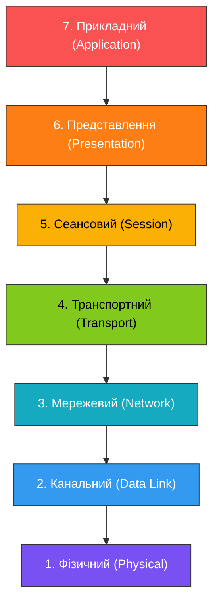
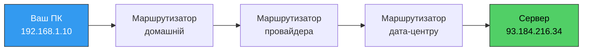
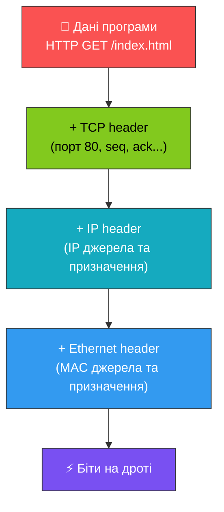
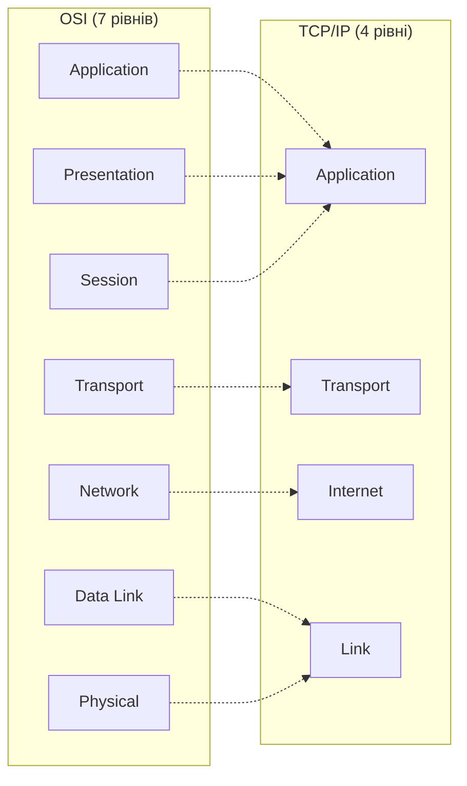

# 42. (Л) Знайомство з моделлю OSI

## Зміст лекції

1. Навіщо потрібна модель OSI
2. Сім рівнів моделі OSI
3. Інкапсуляція та декапсуляція даних
4. OSI vs TCP/IP
5. Як модель OSI допомагає програмісту

## Навіщо потрібна модель OSI

Коли ви відкриваєте сайт у браузері, за лічені мілісекунди відбувається безліч речей: запит проходить через драйвер мережевої карти, перетворюється на електричні або радіосигнали, мандрує по маршрутизаторах інтернету, знову стає байтами на сервері, а потім текстом у HTTP-відповіді. Усе це — десятки взаємопов'язаних задач: адресація, надійна передача, шифрування, формат даних.

Щоб не змішувати їх в одну величезну задачу «передати дані по мережі», у 1984 році ISO (International Organization for Standardization) запропонувала **модель OSI** (Open Systems Interconnection) — концептуальний поділ мережевої взаємодії на сім рівнів.

!!! info "Аналогія з поштою"
    Уявіть, як ви відправляєте лист:

    - **Ви** пишете текст (зміст листа).
    - **Конверт** із адресою відправника та одержувача.
    - **Поштове відділення** відповідає за маршрутизацію між містами.
    - **Літак чи машина** фізично перевозить мішки з листами.

    Кожен учасник знає лише свій рівень. Поштар не читає лист, ви не вибираєте літак, а літак не дбає, чи правильно написана адреса. **Те саме робить OSI** — розділяє мережеву взаємодію на незалежні шари.

### Принципи моделі

- **Шарова архітектура** — кожен рівень виконує свою задачу і не залежить від внутрішньої реалізації сусідів.
- **Чіткі інтерфейси** — рівень взаємодіє лише з рівнем безпосередньо вище та нижче.
- **Інкапсуляція** — рівень додає свій заголовок до даних і передає вниз; на іншому боці заголовки знімаються знизу вгору.

## Сім рівнів моделі OSI



Розглянемо кожен рівень — згори донизу, як проходять дані від програми до проводу.

### 7. Прикладний рівень (Application)

Це рівень, з яким працює **користувач і програміст**. Тут живуть протоколи, що визначають формат повідомлень між програмами:

- **HTTP / HTTPS** — веб
- **FTP, SFTP** — передача файлів
- **SMTP, IMAP, POP3** — електронна пошта
- **DNS** — перетворення доменів на IP
- **WebSocket, gRPC** — двостороння комунікація

```python
import urllib.request

# Програміст працює саме на цьому рівні
response = urllib.request.urlopen("https://example.com")
print(response.status)
```

Коли ви викликаєте `urlopen`, бібліотека формує HTTP-запит — це і є дані прикладного рівня.

### 6. Рівень представлення (Presentation)

Відповідає за **формат даних**: кодування й стиснення. Саме тут текст перетворюється на байти, а JSON — на UTF-8.

| Що робить | Приклади |
|---|---|
| Кодування | UTF-8, ASCII, Base64 |
| Стиснення | gzip, brotli |
| Серіалізація | JSON, XML, Protobuf |

```python
text = "Hello, world!"
encoded = text.encode("utf-8")        # text -> bytes (presentation)
decoded = encoded.decode("utf-8")     # bytes -> text
```

!!! note "На практиці"
    У сучасних мережах рівень представлення часто «вбудований» у бібліотеки прикладного рівня. Наприклад, Python автоматично кодує рядки в UTF-8 при відправці HTTP-запиту.

### 5. Сеансовий рівень (Session)

Керує **сесіями** між двома сторонами: відкриває з'єднання, підтримує його, закриває. Сюди потрапляють механізми авторизації, токенів, cookie-сесій (хоча на практиці більшість цього робиться на прикладному рівні).

Приклади концепцій сеансу:

- авторизація користувача та підтримка стану входу
- відновлення з'єднання після обриву
- синхронізація сторін у голосових/відео-дзвінках

### 4. Транспортний рівень (Transport)

Гарантує **надійну (або швидку) доставку даних** між програмами. На цьому рівні з'являється поняття **порту** — числа, що ідентифікує конкретну програму на машині.

Два головні протоколи:

| Протокол | Властивості | Коли використовувати |
|---|---|---|
| **TCP** | Надійний, з'єднання, порядок | HTTP, бази даних, SSH |
| **UDP** | Без з'єднання, швидкий, без гарантій | DNS, відеодзвінки, ігри |

Детально розглянемо в наступній лекції.

### 3. Мережевий рівень (Network)

Відповідає за **маршрутизацію** пакетів між мережами. Саме тут живе **IP-адреса** — глобальний ідентифікатор пристрою в інтернеті.



Ключовий протокол — **IP** (Internet Protocol), із двома версіями: **IPv4** (`192.168.1.1`) та **IPv6** (`2001:0db8::1`).

### 2. Канальний рівень (Data Link)

Передає дані **між двома сусідніми вузлами** — наприклад, між вашим комп'ютером і Wi-Fi роутером. Тут з'являється **MAC-адреса** — апаратний ідентифікатор мережевої карти.

Приклади технологій:

- **Ethernet** — провідна мережа
- **Wi-Fi (IEEE 802.11)** — бездротова
- **PPP** — точка-точка

### 1. Фізичний рівень (Physical)

Найнижчий рівень: **електричні сигнали, радіохвилі, світло у волокні**. Тут визначаються характеристики середовища: напруга, частота, тип роз'єму.

| Середовище | Приклад |
|---|---|
| Мідь | Ethernet-кабель (RJ-45) |
| Оптичне волокно | SFP-модулі дата-центрів |
| Радіо | Wi-Fi, Bluetooth, 5G |

## Інкапсуляція та декапсуляція даних

Коли програма надсилає повідомлення, дані рухаються **згори вниз** через рівні. Кожен рівень додає свій заголовок (header) — цей процес називається **інкапсуляцією**.



На іншому боці відбувається зворотний процес — **декапсуляція**: кожен рівень знімає свій заголовок і передає дані вище.

### Назви одиниць даних

На різних рівнях ту саму «порцію даних» називають по-різному:

| Рівень | Назва |
|---|---|
| Прикладний / Представлення / Сеансовий | Data (дані) |
| Транспортний | Segment (TCP) / Datagram (UDP) |
| Мережевий | Packet (пакет) |
| Канальний | Frame (кадр) |
| Фізичний | Bits (біти) |

!!! tip "Чому це важливо знати"
    Коли ви читаєте документацію на `Wireshark`, `tcpdump` або помилки на кшталт `MTU exceeded`, терміни «фрейм», «пакет», «сегмент» зустрічаються на кожному кроці. Знаючи рівні, ви одразу розумієте, де саме виникла проблема.

## OSI vs TCP/IP

OSI — модель **теоретична**. У реальному інтернеті використовується спрощена **модель TCP/IP** із чотирьох рівнів. Вона з'явилася раніше і виявилася більш практичною.



Відповідність:

| OSI | TCP/IP | Приклади |
|---|---|---|
| Application + Presentation + Session | Application | HTTP, DNS, SMTP |
| Transport | Transport | TCP, UDP |
| Network | Internet | IP, ICMP |
| Data Link + Physical | Link | Ethernet, Wi-Fi |

!!! info "Що використовувати"
    На практиці кажуть «4-рівнева модель TCP/IP», коли описують реальну роботу інтернету, і «7-рівнева модель OSI», коли пояснюють концепції або обговорюють мережеве обладнання. Ці моделі **не конкурують** — вони доповнюють одна одну.

## Як модель OSI допомагає програмісту

Здавалося б — навіщо програмісту, який пише веб-сервер, знати про MAC-адреси та електричні сигнали? Виявляється, рівні OSI постійно «прориваються» в повсякденну роботу.

### Діагностика проблем

Коли щось не працює, перше питання — **на якому рівні** виникла помилка:

| Симптом | Рівень | Інструмент |
|---|---|---|
| `ConnectionRefusedError` | Транспортний | telnet, nc |
| `Name or service not known` | Прикладний (DNS) | dig, nslookup |
| `No route to host` | Мережевий | ping, traceroute |
| Повільний канал, втрати пакетів | Канальний / Фізичний | iperf, ethtool |
| Невірне кодування символів | Представлення | iconv, hex-перегляд |

### Вибір технологій

- **Чат із тисячею клієнтів** → транспортний рівень: TCP (надійність) або WebSocket (на TCP).
- **Пошук серверів у локальній мережі** → канальний рівень: broadcast / multicast.
- **VPN** → мережевий рівень: тунелювання IP.
- **Балансувальник навантаження** буває L4 (TCP) і L7 (HTTP) — це прямі посилання на рівні OSI.

### Розуміння бібліотек

Багато бібліотек чітко відповідають конкретному рівню:

```python
import socket           # рівень 4 (TCP/UDP)
import http.client      # рівень 7 (HTTP)
import json             # рівень 6 (формат даних)
```

Чим краще ви розумієте, де лежить кожна абстракція, тим легше підібрати правильний інструмент.

## Підсумок

| Рівень | № | Що робить | Приклади |
|---|---|---|---|
| Application | 7 | Логіка програм | HTTP, DNS, SMTP |
| Presentation | 6 | Формат, кодування, стиснення | UTF-8, JSON, gzip |
| Session | 5 | Керування сесіями | NetBIOS, RPC |
| Transport | 4 | Доставка програмі (порти) | TCP, UDP |
| Network | 3 | Маршрутизація між мережами | IP, ICMP |
| Data Link | 2 | Передача між сусідами | Ethernet, Wi-Fi |
| Physical | 1 | Сигнали в середовищі | RJ-45, оптика, радіо |

Ключові принципи:

- **OSI — концептуальна модель**, реальний інтернет працює за TCP/IP.
- **Кожен рівень знає лише сусідів** — згори і знизу.
- **Інкапсуляція** додає заголовки при відправленні, декапсуляція — знімає при отриманні.
- **Розуміння рівнів** прискорює діагностику мережевих проблем у рази.

## Корисні посилання

- [Cloudflare — What is the OSI model?](https://www.cloudflare.com/learning/ddos/glossary/open-systems-interconnection-model-osi/)
- [Cloudflare — OSI vs TCP/IP](https://www.cloudflare.com/learning/network-layer/what-is-the-network-layer/)
- [RFC 1122 — Requirements for Internet Hosts](https://datatracker.ietf.org/doc/html/rfc1122)
- [Wireshark User's Guide](https://www.wireshark.org/docs/wsug_html_chunked/)
