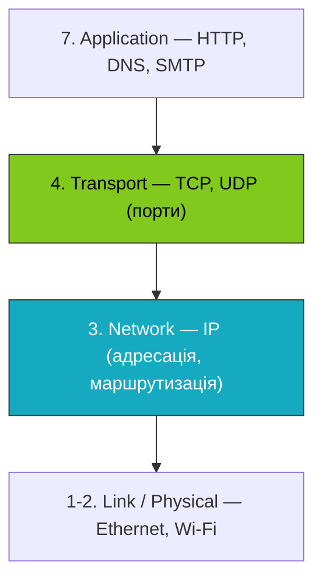
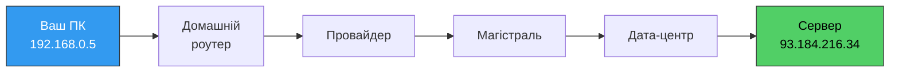
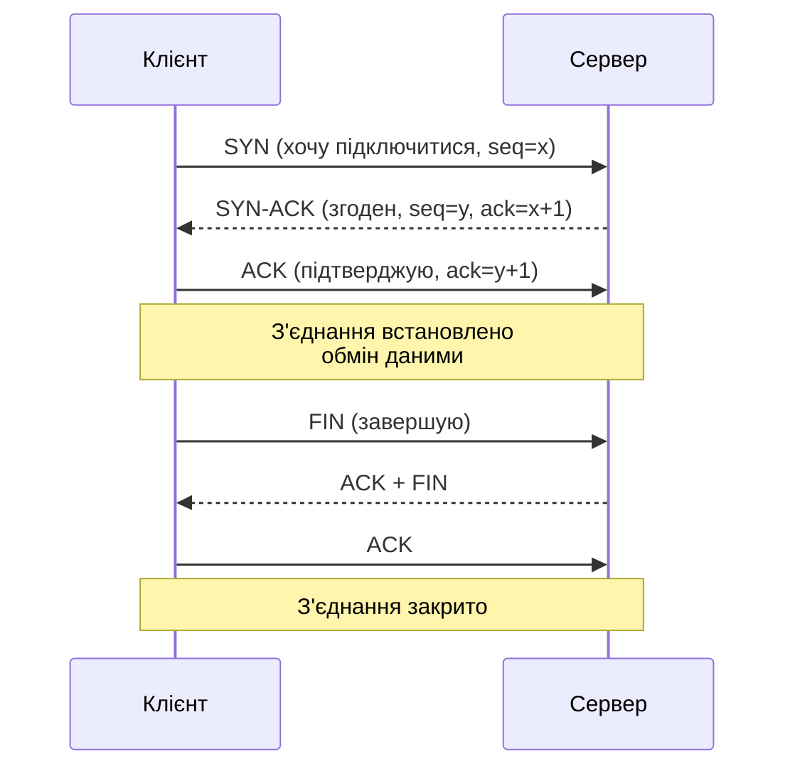
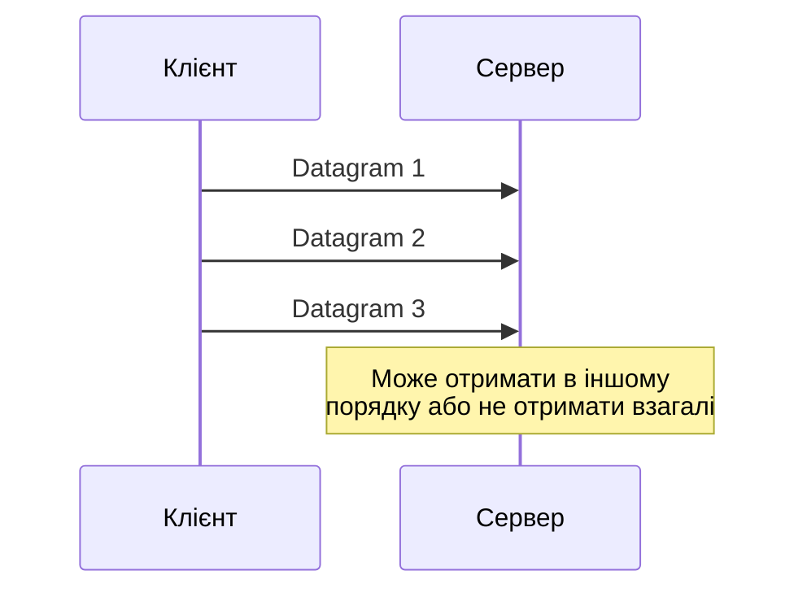

# 43. (Л) Мережевий та транспортний рівні — роль у мережевій взаємодії

## Зміст лекції

1. Місце мережевого та транспортного рівнів
2. Мережевий рівень: IP, маршрутизація, ICMP
3. Транспортний рівень: TCP та UDP
4. Порти й сокети
5. Практика: що бачить програміст у Python
6. Інструменти діагностики

## Місце мережевого та транспортного рівнів

З попередньої лекції ми знаємо сім рівнів OSI. Сьогодні зосередимось на двох найважливіших для програміста:



- **Мережевий рівень (Network)** відповідає на запитання: «**Куди** доставити дані?» — між машинами в інтернеті.
- **Транспортний рівень (Transport)** відповідає на запитання: «**Кому саме** на цій машині та **як надійно**?» — між програмами на машині.

Ці два рівні разом утворюють серцевину інтернету — саме за них відповідають такі терміни як TCP/IP.

## Мережевий рівень: IP, маршрутизація, ICMP

### IP-адреса

**IP (Internet Protocol)** — основний протокол мережевого рівня. Він задає формат адрес і правила, як пакети мандрують між мережами.

| Версія | Приклад | Розмір | Особливості |
|---|---|---|---|
| IPv4 | `192.168.1.10` | 32 біти (~4.3 млрд адрес) | Поширена; адреси майже вичерпані |
| IPv6 | `2001:0db8::1` | 128 біт (~3.4 × 10³⁸ адрес) | Майбутнє; повільне впровадження |

Кожна IP-адреса має дві частини: **префікс мережі** і **номер хоста в ній**. Записується через CIDR: `192.168.1.0/24` означає, що перші 24 біти — це адреса мережі, останні 8 — адреси конкретних пристроїв.

### Приватні vs публічні адреси

Не всі IP-адреси доступні з будь-якої точки інтернету. Для внутрішніх мереж зарезервовано спеціальні діапазони:

| Діапазон | Призначення |
|---|---|
| `10.0.0.0/8` | Великі приватні мережі |
| `172.16.0.0/12` | Приватні мережі (наприклад, Docker) |
| `192.168.0.0/16` | Домашні роутери |
| `127.0.0.0/8` | Loopback (локальний хост) |

Коли ваш ноутбук виходить в інтернет, провайдер транслює приватну адресу в публічну через **NAT** (Network Address Translation).

### Маршрутизація

Пакет із вашого комп'ютера до сервера в іншій країні проходить через десятки маршрутизаторів. Кожен маршрутизатор:

1. Дивиться на **IP призначення** в заголовку пакета.
2. Шукає у своїй **таблиці маршрутизації** найкращий шлях.
3. Передає пакет наступному маршрутизатору («hop»).



Подивитися реальний маршрут можна командою:

```bash
traceroute example.com
```

### ICMP — службові повідомлення мережевого рівня

**ICMP (Internet Control Message Protocol)** — допоміжний протокол для діагностики й помилок. Класичний приклад — `ping`:

```bash
ping example.com
```

ICMP надсилає коротке повідомлення «echo request» і чекає на «echo reply». Якщо хост недоступний або маршрут зламаний, ICMP повертає помилку (`Destination unreachable`, `TTL exceeded`).

!!! info "Цікавий факт"
    Команда `traceroute` працює саме через ICMP/UDP. Вона надсилає пакети з малим **TTL** (час життя), і кожен маршрутизатор, що відкидає пакет, відповідає ICMP-повідомленням, розкриваючи свою адресу.

## Транспортний рівень: TCP та UDP

Мережевий рівень доставляє пакет на **машину**. Але на машині працюють десятки програм одночасно — браузер, Spotify, Slack. Як зрозуміти, кому саме віддати дані?

Відповідь дає **транспортний рівень** через поняття **порту** — числа від 0 до 65535, що ідентифікує програму.

### Що таке порт

Адреса повного «з'єднання» в інтернеті — це чотири числа:

```
(IP_джерела, порт_джерела, IP_призначення, порт_призначення)
```

Цю четвірку часто називають **socket pair**.

| Порт | Призначення |
|---|---|
| 0–1023 | Системні («well-known»): 80 — HTTP, 443 — HTTPS, 22 — SSH, 53 — DNS |
| 1024–49151 | Зареєстровані для конкретних сервісів |
| 49152–65535 | Динамічні / тимчасові (вибирає ОС для клієнта) |

### TCP — Transmission Control Protocol

TCP — **надійний протокол з установленням з'єднання**. Гарантує:

- доставку всіх байтів у правильному порядку
- виявлення та повторну передачу втрачених пакетів
- контроль перевантаження (не «затопити» мережу)

#### TCP handshake — три кроки до з'єднання

Перед обміном даними клієнт і сервер встановлюють з'єднання через **3-way handshake**:



Завдяки цьому обидві сторони знають, що співрозмовник готовий, і домовляються про початкові номери послідовності.

#### Що дає TCP

| Властивість | Як працює |
|---|---|
| Надійність | Кожен сегмент підтверджується (`ACK`) |
| Порядок | Сегменти нумеруються; одержувач збирає їх у потрібному порядку |
| Контроль потоку | Одержувач каже, скільки байтів готовий прийняти (`window`) |
| Контроль перевантаження | Якщо мережа втрачає пакети — швидкість зменшується |

### UDP — User Datagram Protocol

UDP — **простий протокол без з'єднання**. Принцип «вистрелив і забув»:

- немає handshake
- немає підтверджень
- немає гарантії порядку чи доставки
- **дуже низькі накладні витрати** і затримка



### TCP vs UDP

| Критерій | TCP | UDP |
|---|---|---|
| З'єднання | Встановлюється (handshake) | Немає |
| Надійність | Гарантована | Немає |
| Порядок | Гарантований | Немає |
| Швидкість | Повільніший | Швидший |
| Розмір заголовка | 20 байт | 8 байт |
| Типові протоколи | HTTP(S), SSH, FTP, SMTP | DNS, DHCP, VoIP, ігри, відео |

!!! tip "Коли вибирати UDP"
    UDP виграє там, де **затримка важливіша за надійність**: відеоконференції, онлайн-ігри, потокове відео. Якщо один пакет втратиться, краще пропустити кадр, ніж зупинити все потокове відео для повторної передачі.

!!! warning "Коли вибирати TCP"
    Для всього, де важлива **цілісність даних**: завантаження файлів, веб, бази даних, банківські операції. Втрата одного байта в SQL-запиті — це катастрофа.

### Розширення поверх TCP/UDP

- **HTTP/2** працює поверх TCP, **HTTP/3** — поверх **QUIC** (надбудова над UDP, що додає надійність та шифрування).
- **WebSocket** — двосторонній канал поверх TCP після HTTP-handshake.
- **DNS** історично працює на UDP, але для великих відповідей переходить на TCP.

## Порти й сокети

**Сокет (socket)** — програмна абстракція, що з'єднує програму з мережею. У Python є вбудований модуль `socket`, що дозволяє працювати безпосередньо з TCP/UDP.

### TCP-сервер на Python

```python
import socket


def main() -> None:
    server = socket.socket(socket.AF_INET, socket.SOCK_STREAM)
    server.bind(("127.0.0.1", 9000))
    server.listen()
    print("Listening on 127.0.0.1:9000")

    conn, addr = server.accept()
    with conn:
        print(f"Connected by {addr}")
        data = conn.recv(1024)
        # Луна-сервер: повертаємо те саме
        conn.sendall(data)


if __name__ == "__main__":
    main()
```

Розберемо рядки:

- `AF_INET` — використовуємо IPv4 (мережевий рівень).
- `SOCK_STREAM` — TCP (транспортний рівень).
- `bind` — прив'язуємо сокет до конкретного IP та порту.
- `listen` + `accept` — приймаємо вхідні з'єднання.
- `recv` / `sendall` — обмін байтами через TCP.

### TCP-клієнт

```python
import socket


def main() -> None:
    client = socket.socket(socket.AF_INET, socket.SOCK_STREAM)
    client.connect(("127.0.0.1", 9000))
    client.sendall(b"hello")
    response = client.recv(1024)
    print("Server replied:", response.decode())
    client.close()


if __name__ == "__main__":
    main()
```

### UDP — лише два рядки відмінності

```python
sock = socket.socket(socket.AF_INET, socket.SOCK_DGRAM)
sock.sendto(b"ping", ("127.0.0.1", 9000))
data, addr = sock.recvfrom(1024)
```

Замість `SOCK_STREAM` — `SOCK_DGRAM`, замість `connect/send/recv` — `sendto/recvfrom`. Жодного handshake немає.

!!! note "На практиці"
    Прямо з модулем `socket` ми працюватимемо рідко. Зазвичай поверх нього лежать бібліотеки прикладного рівня (`requests`, `aiohttp`, `psycopg`). Але розуміння того, що відбувається на транспортному рівні, рятує під час налагодження.

## Що бачить програміст у Python

Більшість мережевих помилок Python — це повідомлення з транспортного або мережевого рівня. Розпізнавати їх — половина успіху в діагностиці.

### Часті винятки

| Помилка | Рівень | Імовірна причина |
|---|---|---|
| `ConnectionRefusedError` | Transport | На вказаному порту ніхто не слухає |
| `ConnectionResetError` | Transport | Сервер різко обірвав TCP-з'єднання |
| `TimeoutError` | Transport | TCP не дочекався відповіді |
| `socket.gaierror` | Application (DNS) | Не вдалося знайти IP за іменем |
| `OSError: [Errno 113] No route to host` | Network | Маршрут до IP відсутній |

### Приклад: розпізнаємо рівень помилки

```python
import socket


def probe(host: str, port: int) -> None:
    try:
        with socket.create_connection((host, port), timeout=2):
            print("OK:", host, port)
    except socket.gaierror as e:
        print("DNS error (Application):", e)
    except ConnectionRefusedError as e:
        print("Connection refused (Transport):", e)
    except TimeoutError as e:
        print("Timeout (Transport / Network):", e)
    except OSError as e:
        print("Network error:", e)


probe("example.com", 80)
probe("does-not-exist.invalid", 80)
probe("127.0.0.1", 1)            # майже точно ніхто не слухає
```

Дивлячись на тип винятку, ви одразу знаєте, **на якому рівні шукати причину**.

## Інструменти діагностики

| Інструмент | Що показує | Рівень |
|---|---|---|
| `ping` | Доступність хоста, втрати, RTT | Network (ICMP) |
| `traceroute` / `tracepath` | Маршрут пакета через мережу | Network |
| `nslookup` / `dig` | DNS-резолвінг | Application |
| `telnet host port`, `nc -v host port` | Чи відкритий TCP-порт | Transport |
| `ss -tulpn` (Linux) | Локальні порти, що слухаються | Transport |
| `tcpdump` / `wireshark` | Захоплення пакетів | Усі |

Приклад: перевірити, чи працює локальний сервер на порту 9000:

```bash
ss -tulpn | grep 9000
nc -vz 127.0.0.1 9000
```

!!! tip "Wireshark — друг програміста"
    Якщо ви бачите дивну поведінку клієнт-серверного коду, запустіть `wireshark` чи `tcpdump`. Перегляд реальних пакетів відповіді — найшвидший спосіб зрозуміти, що насправді надсилає ваш код.

## Підсумок

| Концепція | Опис |
|---|---|
| **IP-адреса** | Глобальний ідентифікатор машини в мережі |
| **Маршрутизація** | Шлях пакета через мережу маршрутизаторів |
| **NAT** | Перетворення приватних IP у публічні |
| **ICMP** | Службові повідомлення (ping, traceroute) |
| **Порт** | Ідентифікатор програми на машині (0–65535) |
| **TCP** | Надійний протокол з handshake, для даних, де важлива цілісність |
| **UDP** | Швидкий протокол без гарантій, для real-time даних |
| **Сокет** | Програмний об'єкт, що зв'язує програму з мережею |
| **socket pair** | (IP джерела, порт джерела, IP призначення, порт призначення) |

Ключові принципи:

- **Network** доставляє пакет на машину, **Transport** — конкретній програмі.
- **TCP — для надійності**, **UDP — для швидкості**.
- **Помилка має рівень** — від типу винятку залежить, де шукати проблему.
- **Інструменти `ping`, `traceroute`, `ss`, `tcpdump`** — мінімальний набір для мережевої діагностики.

## Корисні посилання

- [RFC 791 — Internet Protocol](https://datatracker.ietf.org/doc/html/rfc791)
- [RFC 793 — Transmission Control Protocol](https://datatracker.ietf.org/doc/html/rfc793)
- [RFC 768 — User Datagram Protocol](https://datatracker.ietf.org/doc/html/rfc768)
- [Python docs — socket](https://docs.python.org/3/library/socket.html)
- [Cloudflare — What is the network layer?](https://www.cloudflare.com/learning/network-layer/what-is-the-network-layer/)
- [Cloudflare — TCP vs UDP](https://www.cloudflare.com/learning/ddos/glossary/user-datagram-protocol-udp/)
