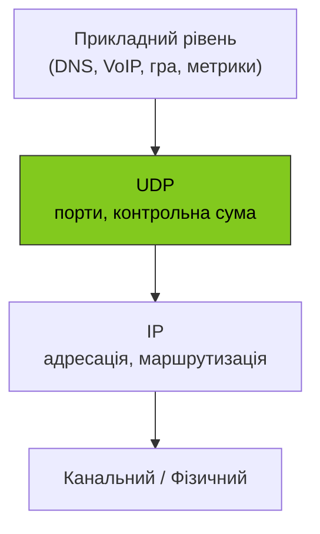

# 44. (Л) Огляд протоколу транспортного рівня UDP

## Зміст лекції

1. Місце UDP серед транспортних протоколів
2. Структура UDP-датаграми
3. Сценарії використання UDP
4. Робота з UDP у Python
5. Ненадійність — як із нею жити
6. Broadcast і multicast
7. MTU та фрагментація
8. Діагностика UDP-трафіку

## Місце UDP серед транспортних протоколів

UDP (**User Datagram Protocol**, RFC 768, 1980 рік) — один із двох основних протоколів транспортного рівня в стеку TCP/IP. Він свідомо мінімалістичний: робить буквально стільки, скільки потрібно, щоб доставити пакет від однієї програми до іншої — і ні байта більше.



UDP відрізняється від TCP трьома ключовими ознаками:

- **немає з'єднання** — нема handshake, нема стану «відкрите з'єднання»;
- **немає гарантій** — пакет може загубитися, продублюватися чи прийти не в порядку;
- **межі повідомлень зберігаються** — кожен `send` стає окремою датаграмою (на відміну від байтового потоку TCP).

!!! info "Що це означає для програміста"
    Якщо TCP — це телефонний дзвінок (встановлюємо з'єднання, говоримо, кладемо слухавку), то UDP — це поштова листівка: написав адресу, кинув у скриньку, далі — як вийде.

## Структура UDP-датаграми

UDP-заголовок має лише **8 байтів** — мінімум, який можна уявити для транспортного протоколу:

```text
 0                   1                   2                   3
 0 1 2 3 4 5 6 7 8 9 0 1 2 3 4 5 6 7 8 9 0 1 2 3 4 5 6 7 8 9 0 1
+-+-+-+-+-+-+-+-+-+-+-+-+-+-+-+-+-+-+-+-+-+-+-+-+-+-+-+-+-+-+-+-+
|        Source port (16)       |     Destination port (16)     |
+-+-+-+-+-+-+-+-+-+-+-+-+-+-+-+-+-+-+-+-+-+-+-+-+-+-+-+-+-+-+-+-+
|          Length (16)          |        Checksum (16)          |
+-+-+-+-+-+-+-+-+-+-+-+-+-+-+-+-+-+-+-+-+-+-+-+-+-+-+-+-+-+-+-+-+
|                          Data ...                              |
+---------------------------------------------------------------+
```

| Поле | Розмір | Призначення |
|---|---|---|
| Source port | 2 байти | Порт відправника (необов'язковий, може бути 0) |
| Destination port | 2 байти | Порт одержувача |
| Length | 2 байти | Довжина датаграми (заголовок + дані), мінімум 8 |
| Checksum | 2 байти | Контрольна сума заголовка й даних (необов'язкова в IPv4) |

!!! note "Контрольна сума — захист від пошкоджень, не від зловмисників"
    Checksum виявляє лише випадкові спотворення бітів на лінії. Це **не** криптографічна цілісність — атакуючий, що змінить дані, легко перерахує і checksum. Для безпеки використовують DTLS / QUIC.

### UDP усередині IP-пакета


Накладні витрати UDP — лише 8 байтів. Для порівняння: TCP — мінімум 20 байтів.

## Сценарії використання UDP

UDP виграє там, де **затримка важливіша за надійність**, або де надійність вирішується на прикладному рівні.

### Голос і відео в реальному часі

VoIP (SIP, RTP), відеодзвінки, стримінг. Якщо один пакет із голосовим фреймом загубиться — краще пропустити 20 мс звуку, ніж зупинити розмову й чекати на повторну передачу.

### DNS

Маленький запит → маленька відповідь. Заводити TCP-з'єднання заради двох пакетів — марнотратно. DNS працює на UDP/53; на TCP переходить лише для великих відповідей (понад 512 байт) або для зональних трансферів.

### DHCP, NTP, SNMP

Службові протоколи з короткими повідомленнями. NTP-запит часу взагалі займає 48 байтів — UDP ідеальний.

### Онлайн-ігри

Координати гравця оновлюються 30–60 разів на секунду. Якщо одне оновлення загубилося — наступне за 16 мс уже містить актуальніший стан, тож ретрансляція не потрібна.

### Метрики й логи

Протоколи на кшталт **statsd** надсилають короткі UDP-датаграми («counter+1», «timer=12ms») на сервер метрик. Мінімальний оверхед на джерелі: програма «вистрелила» датаграму і одразу повернулась до роботи — навіть якщо колектор недоступний, програма не блокується.

### QUIC і HTTP/3

QUIC — сучасний транспорт від Google, що працює **поверх UDP** і реалізує власну надійність + шифрування у просторі користувача. На ньому базується HTTP/3.

| Сценарій | Чому UDP |
|---|---|
| DNS-запит | Один пакет туди-сюди, TCP-handshake — зайвий |
| Voice / video | Втрата кадру терпима, затримка — ні |
| Гра-шутер | Свіжий стан важливіший за повторну доставку старого |
| Метрики (statsd) | Вистрілив-забув; колектор може лежати — це ок |
| QUIC / HTTP/3 | Власна надійність на прикладному рівні |

## Робота з UDP у Python

Стандартний модуль `socket` дає прямий доступ до UDP через тип `SOCK_DGRAM`.

### UDP-сервер (echo)

```python
import socket


def main() -> None:
    sock = socket.socket(socket.AF_INET, socket.SOCK_DGRAM)
    sock.bind(("127.0.0.1", 9001))
    print("UDP server listening on 127.0.0.1:9001")

    while True:
        # recvfrom повертає і дані, і адресу відправника
        data, addr = sock.recvfrom(4096)
        print(f"from {addr}: {data!r}")
        sock.sendto(data, addr)


if __name__ == "__main__":
    main()
```

Зверніть увагу:

- немає `listen` чи `accept` — у UDP немає поняття «вхідне з'єднання»;
- сервер обробляє пакети **по черзі** в одному циклі;
- щоб відповісти, треба знати **адресу відправника**, тому вживаємо `recvfrom`, а не `recv`.

### UDP-клієнт

```python
import socket


def main() -> None:
    sock = socket.socket(socket.AF_INET, socket.SOCK_DGRAM)
    sock.settimeout(2.0)
    sock.sendto(b"hello", ("127.0.0.1", 9001))

    try:
        data, _addr = sock.recvfrom(4096)
        print("reply:", data.decode())
    except TimeoutError:
        print("no reply")


if __name__ == "__main__":
    main()
```

Тут особливо важливий `settimeout`: без нього `recvfrom` блокуватиметься нескінченно, бо UDP не знає, чи прийде відповідь узагалі.

### Підключений UDP-сокет

UDP-сокет можна «підключити» через `connect`. Це **не** створює з'єднання в мережі — це лише локальна оптимізація: ОС запам'ятовує віддалену адресу, і далі можна писати `send`/`recv` без `sendto`/`recvfrom`. Бонус: ОС фільтрує пакети не від цієї адреси та повертає `ConnectionRefusedError`, якщо адресат відповів ICMP `Port Unreachable`.

```python
import socket


def main() -> None:
    sock = socket.socket(socket.AF_INET, socket.SOCK_DGRAM)
    sock.connect(("127.0.0.1", 9001))
    sock.send(b"hi")
    print(sock.recv(4096))


if __name__ == "__main__":
    main()
```

### Один send — одна датаграма

UDP зберігає межі повідомлень: якщо ви викликали `sendto(b"abc")` і `sendto(b"def")`, отримувач зробить два окремих `recvfrom` і отримає `b"abc"` та `b"def"`.

!!! warning "Розмір буфера в `recvfrom`"
    Якщо вказати `recvfrom(4)`, а датаграма має 100 байтів — отримаєте лише перші 4, **решта 96 байтів буде втрачена** (на відміну від TCP, де можна дочитати залишок). Тому буфер варто робити ≥ MTU, тобто принаймні 1500 — або 65535, якщо є шанс на великі пакети.

## Broadcast і multicast

UDP уміє те, що TCP не вміє в принципі: надсилати один пакет **багатьом одержувачам** одночасно.

### Broadcast — «усім у локальній мережі»

Спеціальна адреса `255.255.255.255` (або широкомовна адреса підмережі, наприклад `192.168.1.255`) доставляє пакет усім вузлам у тому самому L2-сегменті.

```python
import socket


def main() -> None:
    sock = socket.socket(socket.AF_INET, socket.SOCK_DGRAM)
    sock.setsockopt(socket.SOL_SOCKET, socket.SO_BROADCAST, 1)
    sock.sendto(b"discover-server", ("255.255.255.255", 9999))


if __name__ == "__main__":
    main()
```

Класичний приклад broadcast — DHCP: новий пристрій ще не має IP, тож кричить «хто може дати мені адресу?» усій локальній мережі.

### Multicast — «усім, хто підписався»

Multicast використовує спеціальний діапазон `224.0.0.0/4`. Одержувачі **підписуються** на групу (через IGMP), і маршрутизатори доставляють пакет лише підписаним.

Multicast застосовується для IPTV, біржових даних, виявлення сервісів (mDNS / Bonjour використовують `224.0.0.251`).

!!! warning "Broadcast і multicast не виходять за межі локальної мережі"
    Маршрутизатори не пересилають broadcast, а multicast — лише за окремої конфігурації. У публічному інтернеті ці механізми майже не працюють.

## MTU та фрагментація

**MTU (Maximum Transmission Unit)** — максимальний розмір кадру на канальному рівні. Для Ethernet — традиційно **1500 байтів**.

Якщо UDP-датаграма більша, ніж поміщається в один кадр, IP **фрагментує** її на кілька частин і збирає на боці одержувача. Це звучить зручно, але має проблеми:

- якщо хоч один фрагмент загубиться — **уся датаграма** відкидається;
- деякі маршрутизатори блокують фрагментовані пакети;
- збирання фрагментів — навантаження на одержувача.

**Практична межа** для безпечного UDP-payload:

| Сценарій | Безпечний розмір payload |
|---|---|
| LAN | ~1472 байти (1500 − 20 IP − 8 UDP) |
| Інтернет (без сюрпризів) | ~1400 байтів |
| Через VPN / тунелі | ~1200 байтів |

QUIC, наприклад, працює з пакетами ≤ 1200 байтів саме щоб уникнути фрагментації.

## Діагностика UDP-трафіку

UDP «непомітніший» за TCP — немає з'єднань, які можна побачити в `ss`, але є інструменти.

### Перевірити, що порт слухається

```bash
ss -ulnp        # u = UDP, l = listening, n = numeric, p = process
```

`ss -tuln` покаже і TCP, і UDP сокети одразу.

### Надіслати UDP вручну

`netcat` уміє і клієнта, і сервера:

```bash
# Сервер: слухає UDP/9001 і друкує отримане
nc -u -l 9001

# Клієнт: надсилає рядок (Ctrl+D — вийти)
nc -u 127.0.0.1 9001
```

### Захопити пакети

```bash
sudo tcpdump -i any -n 'udp port 9001'
```

`tcpdump` друкує заголовки (адреси, порти, довжини) у реальному часі. Для глибокого аналізу — `wireshark`.

## Підсумок

| Концепція | Опис |
|---|---|
| Без з'єднання | Жодного handshake, жодного стану |
| Межі датаграм | Один `send` = одна датаграма |
| Заголовок 8 байтів | Source/Destination port, Length, Checksum |
| Без гарантій | Можуть бути втрати, дублі, переупорядкування |
| Broadcast / Multicast | Один пакет — багатьом одержувачам |
| MTU | ~1472 байти на Ethernet, бажано тримати ≤ 1200 в інтернеті |
| Підключений UDP | `connect` для UDP — лише локальна фільтрація |
| Stop-and-wait | Найпростіший спосіб додати надійність поверх UDP |

Ключові принципи:

- **UDP — мінімальний транспорт**: лише адресація через порти і необов'язкова контрольна сума.
- **Гарантії — на вашій совісті**: ACK, ретрансляції, дедуплікація — на прикладному рівні.
- **Слідкуйте за MTU**: фрагментація вбиває надійність UDP сильніше, ніж сама ненадійність.
- **Завжди ставте `settimeout`** на клієнті: інакше програма просто зависне.
- **Перш ніж додавати надійність — подумайте про TCP**: можливо, ви відтворюєте його гірше.

## Корисні посилання

- [RFC 768 — User Datagram Protocol](https://datatracker.ietf.org/doc/html/rfc768)
- [Python docs — socket (UDP)](https://docs.python.org/3/library/socket.html#example)
- [Cloudflare — What is UDP?](https://www.cloudflare.com/learning/ddos/glossary/user-datagram-protocol-udp/)
- [Cloudflare — What is QUIC?](https://www.cloudflare.com/learning/performance/what-is-http3/)
- [Wikipedia — Maximum Transmission Unit](https://en.wikipedia.org/wiki/Maximum_transmission_unit)
