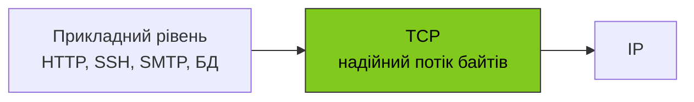
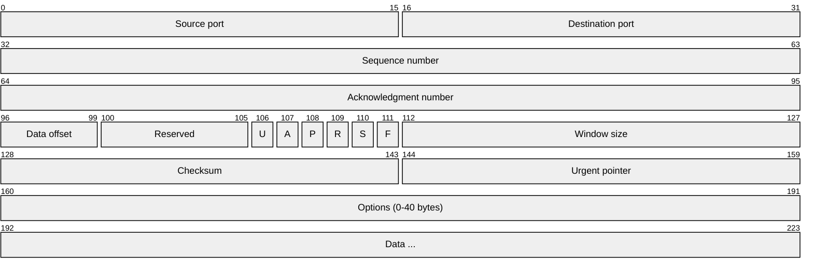
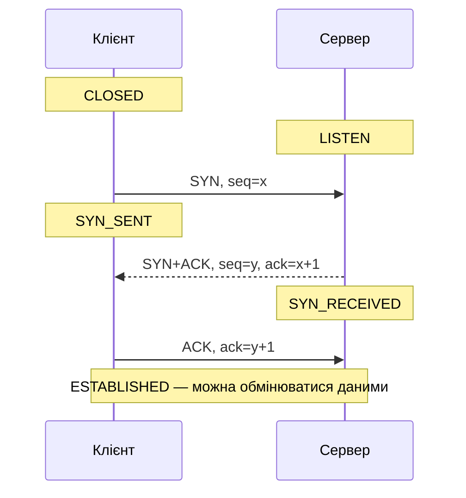
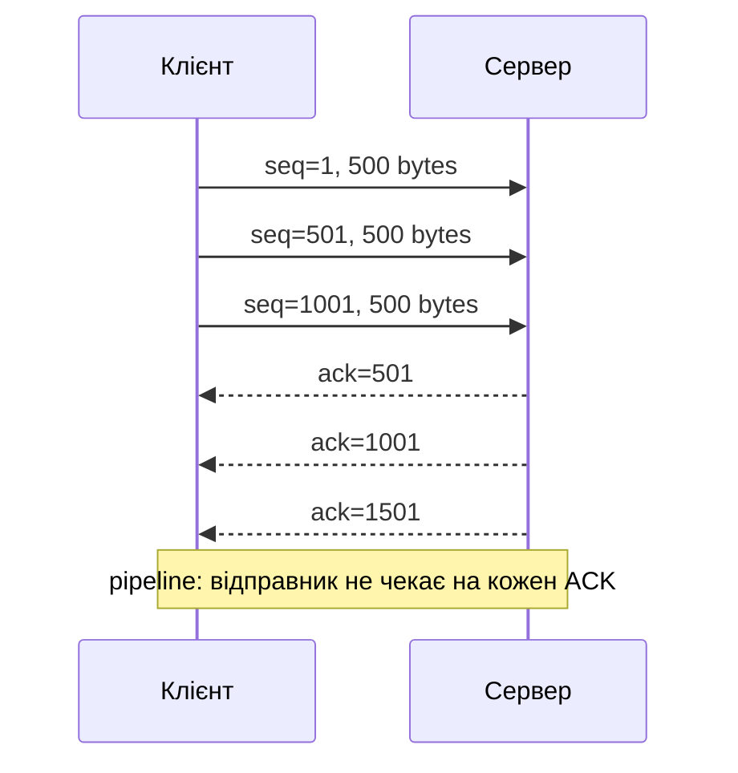
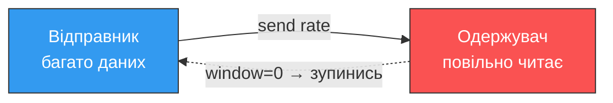
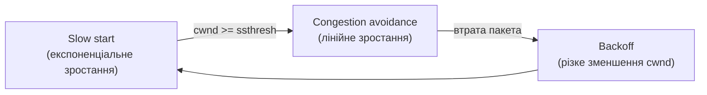
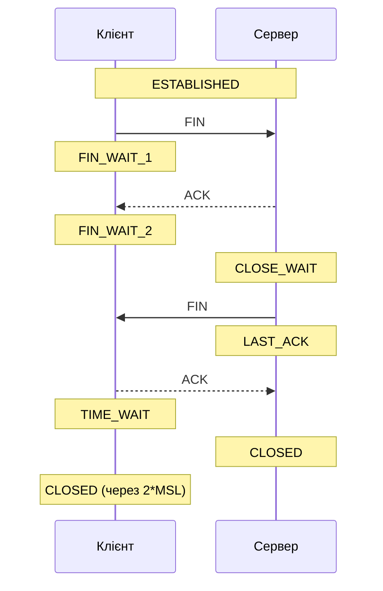

# 45. (Л) Огляд протоколу транспортного рівня TCP

## Зміст лекції

1. Що дає TCP і яку ціну за це платимо
2. Структура TCP-сегмента
3. Установлення з'єднання — 3-way handshake
4. Передача даних: sequence, ACK, sliding window
5. Контроль потоку та контроль перевантаження
6. Закриття з'єднання та стан TIME_WAIT
7. Стани TCP-з'єднання
8. Робота з TCP у Python
9. Діагностика TCP

## Що дає TCP і яку ціну за це платимо

**TCP (Transmission Control Protocol)**, RFC 793 (1981), — основний транспортний протокол інтернету. На відміну від UDP, TCP бере на себе всю «брудну роботу» з надійності, щоб прикладний код міг просто читати й писати байти.

Що TCP гарантує:

- **доставку** — кожен надісланий байт або дійде до одержувача, або з'єднання буде розірване;
- **порядок** — байти прийдуть у тому ж порядку, в якому були надіслані;
- **відсутність дублікатів** — навіть якщо мережа продублює пакет, прикладний код побачить дані лише раз;
- **контроль потоку** — повільний одержувач не буде «затоплений» швидким відправником;
- **контроль перевантаження** — швидкість підлаштовується під реальну пропускну здатність мережі.

Ціна:

- **handshake перед обміном** — мінімум один RTT затримки до першого байта даних;
- **стан на обох кінцях** — таблиця з'єднань у ядрі, обмежені ресурси;
- **заголовок 20 байтів** проти 8 у UDP;
- **повторні передачі при втратах** — рятують надійність, але збільшують затримку.



!!! info "Ключова абстракція TCP"
    TCP перетворює ненадійну пакетну мережу IP на **надійний двонаправлений потік байтів**. Прикладному коду здається, що він пише в трубу, а інша сторона читає з труби — без турботи про пакети, втрати, порядок.

## Структура TCP-сегмента

Заголовок TCP — мінімум 20 байтів (без опцій):



| Поле | Призначення |
|---|---|
| Source / Destination port | Порти джерела й одержувача |
| Sequence number | Номер першого байта в цьому сегменті |
| Acknowledgment number | Наступний очікуваний байт (у разі ACK) |
| Data offset | Довжина TCP-заголовка (через опції він може зростати) |
| Прапорці (SYN, ACK, FIN, RST, PSH, URG) | Тип сегмента: установлення, підтвердження, закриття тощо |
| Window size | Скільки байтів готовий прийняти — для контролю потоку |
| Checksum | Контрольна сума заголовка й даних |
| Options | MSS, window scale, SACK, timestamps |

### Ключові прапорці

| Прапорець | Що означає |
|---|---|
| `SYN` | Synchronize — установлення з'єднання, обмін початковими seq |
| `ACK` | Підтвердження отриманих байтів |
| `FIN` | Finish — нічого більше не надішлю, можна закривати |
| `RST` | Reset — аварійний розрив з'єднання |
| `PSH` | Push — віддай прикладному рівню негайно |
| `URG` | Urgent — є «пріоритетні» дані (на практиці майже не використовується) |

## Установлення з'єднання — 3-way handshake

Перш ніж надсилати дані, обидві сторони мають синхронізувати свої початкові sequence number (ISN — Initial Sequence Number) і переконатися, що співрозмовник готовий.



Що відбувається в цьому ритуалі:

1. **SYN (клієнт → сервер)** — клієнт каже «хочу з'єднатися» і повідомляє свій ISN = `x`.
2. **SYN+ACK (сервер → клієнт)** — сервер погоджується, повідомляє свій ISN = `y` і підтверджує отримання SYN, надсилаючи `ack = x+1`.
3. **ACK (клієнт → сервер)** — клієнт підтверджує SYN сервера, надсилаючи `ack = y+1`.

Після третього пакета з'єднання у стані **ESTABLISHED** з обох боків, і починається обмін даними.

!!! info "Чому саме три пакети"
    Двох не вистачить: відправник не може бути впевнений, що його SYN-ACK дійшов. Чотирьох не потрібно: ACK клієнта і перші дані можна об'єднати в один пакет (TCP fast open якраз і дозволяє відправляти дані в SYN, але це окрема історія).

### TCP fast open і 0-RTT

TCP Fast Open (TFO) — розширення, що дозволяє надіслати дані вже в SYN-пакеті, якщо клієнт раніше підключався до цього сервера й має cookie. Економить один RTT. Подібну логіку (а ще краще) реалізує QUIC поверх UDP.

## Передача даних: sequence, ACK, sliding window

### Sequence numbers — нумерація байтів, не пакетів

Sequence number в TCP — це номер **байта**, а не пакета. Якщо клієнт надсилає 1000 байтів послідовно, перший сегмент може мати `seq = 1000`, другий — `seq = 1500` (бо в попередньому було 500 байтів даних). Це дозволяє одержувачу збирати потік навіть якщо сегменти прийшли в іншому порядку.

### ACK — підтвердження кумулятивне

ACK = «я отримав усе до байта N включно». Якщо одержувач надсилає `ack = 2001`, він підтверджує всі байти від 1 до 2000. Один ACK може підтвердити кілька сегментів — це економить трафік.

### Sliding window — пайплайнінг

Якби TCP працював як stop-and-wait (один сегмент → ACK → наступний), пропускна здатність обмежувалася б `window / RTT`, що було б катастрофічно повільно. Натомість TCP використовує **sliding window**: відправник може надіслати кілька сегментів **до отримання ACK**, доки сума «не підтверджених» байтів не перевищить розмір вікна одержувача.



### Втрати й повторні передачі

Якщо ACK не прийшов за **RTO (Retransmission Timeout)** — відправник повторює сегмент. Сучасний TCP використовує адаптивний RTO на основі виміряного RTT.

**Швидка повторна передача (fast retransmit)**: якщо приймач отримав сегменти `1, 2, 4` (третій загубився), він на кожен наступний з'явлений сегмент відповідає **дублюючим ACK** з `ack = 3`. Три однакових ACK поспіль — сигнал відправнику негайно ретранслювати сегмент 3, не чекаючи RTO.

**SACK (Selective ACK)** — опція, що дозволяє підтвердити «отримав 1–2 і 4», щоб не пересилати весь блок з 3-го сегмента.

## Контроль потоку та контроль перевантаження

Це два **різних** механізми, які часто плутають.

### Контроль потоку (flow control) — захищає одержувача

Одержувач у кожному ACK повідомляє розмір вільного місця у своєму буфері (`window size`). Відправник не має права надіслати більше, ніж туди поміститься.

Якщо одержувач читає повільно, вікно зменшується аж до нуля — і тоді відправник зупиняється, доки одержувач не звільнить місце. Це **TCP zero window**.



### Контроль перевантаження (congestion control) — захищає мережу

Мережа поміж двома хостами може мати десятки гігабайтів трафіку інших користувачів. Якщо TCP «вистрелить» на повну швидкість, маршрутизатори почнуть відкидати пакети.

TCP підтримує власне поняття **congestion window (cwnd)** — скільки байтів дозволяє надіслати поточний стан мережі. Алгоритм (класичний Reno):

1. **Slow start**: cwnd починається малим, подвоюється з кожним RTT.
2. **Congestion avoidance**: після певного порогу (`ssthresh`) cwnd росте лінійно.
3. **Втрата → backoff**: при ознаках втрати cwnd різко зменшується (вдвічі або більше).



Реальна швидкість TCP — це **мінімум з двох вікон**:

```text
effective window = min(receiver window, congestion window)
```

!!! info "Сучасні алгоритми"
    На реальних серверах сьогодні рідко зустрінеш Reno. Linux за замовчуванням використовує **CUBIC**, Google запропонувала **BBR** — обидва значно ефективніші для сучасних мереж із великими буферами.

## Закриття з'єднання та стан TIME_WAIT

З'єднання TCP — двонаправлене й закривається в кожному напрямку окремо.



Кожна сторона надсилає `FIN` коли більше нічого не надсилатиме, і отримує `ACK` у відповідь. Це **«4-way handshake»** для закриття.

### TIME_WAIT — навіщо чекати ще

Після обміну FIN-ACK сторона, що ініціювала закриття, входить у **TIME_WAIT** і залишається там зазвичай **2 × MSL** (Maximum Segment Lifetime, ~30–120 сек). Це потрібно щоб:

- запізнілі пакети попереднього з'єднання не сплуталися з новим;
- останній ACK гарантовано дійшов (якщо загубився — інша сторона ще раз надішле FIN, і ми ще раз ACK).

!!! warning "TIME_WAIT і високонавантажені сервери"
    Якщо сервер швидко відкриває й закриває з'єднання, у нього можуть накопичитися тисячі сокетів у TIME_WAIT і вичерпатися локальні порти. Тому в HTTP-серверах із короткими з'єднаннями зазвичай **сервер чекає, доки клієнт закриє** — щоб TIME_WAIT був на боці клієнта.

### RST — аварійний розрив

`RST` — пакет, що моментально розриває з'єднання без 4-way handshake. ОС надсилає його, наприклад, коли клієнт стукається на закритий порт або коли програма крашиться, а її сокети ще «висять».

## Стани TCP-з'єднання

TCP-з'єднання — це скінченний автомат із кількома станами. Знати головні з них корисно для діагностики (`ss -t state X`).

| Стан | Що означає |
|---|---|
| `LISTEN` | Сервер чекає вхідних з'єднань на порту |
| `SYN_SENT` | Клієнт надіслав SYN, чекає SYN+ACK |
| `SYN_RECEIVED` | Сервер отримав SYN, надіслав SYN+ACK, чекає ACK |
| `ESTABLISHED` | З'єднання активне, обмін даними |
| `FIN_WAIT_1` / `FIN_WAIT_2` | Активне закриття: FIN надіслано, чекаємо ACK / FIN |
| `CLOSE_WAIT` | Інша сторона надіслала FIN — наш `close` ще не викликаний |
| `LAST_ACK` | Ми надіслали свій FIN у відповідь, чекаємо ACK |
| `TIME_WAIT` | Захисний таймер після закриття |
| `CLOSED` | Стану немає — з'єднання повністю закрите |

!!! tip "Підозрілі стани"
    Купа `CLOSE_WAIT` означає, що **ваш код забув викликати `close`**. Купа `SYN_SENT` без переходу в `ESTABLISHED` — сервер недоступний або фаєрвол. Купа `TIME_WAIT` — нормальна ситуація для активного клієнта.

## Робота з TCP у Python

### Сервер

```python
import socket


def main() -> None:
    server = socket.socket(socket.AF_INET, socket.SOCK_STREAM)
    server.setsockopt(socket.SOL_SOCKET, socket.SO_REUSEADDR, 1)
    server.bind(("127.0.0.1", 9100))
    server.listen(128)
    print("TCP server listening on 127.0.0.1:9100")

    while True:
        conn, addr = server.accept()
        with conn:
            print(f"connected: {addr}")
            while True:
                chunk = conn.recv(4096)
                if not chunk:                # клієнт закрив з'єднання
                    break
                conn.sendall(chunk)


if __name__ == "__main__":
    main()
```

Важливі деталі:

- `SO_REUSEADDR` дозволяє швидко перезапускати сервер, не чекаючи виходу зі стану `TIME_WAIT`.
- `listen(128)` — розмір черги напівустановлених з'єднань (backlog).
- `recv(4096)` повертає **порожні байти**, коли інша сторона викликала `close` — це сигнал, що даних більше не буде.

### Клієнт

```python
import socket


def main() -> None:
    with socket.create_connection(("127.0.0.1", 9100), timeout=5) as sock:
        sock.sendall(b"hello")
        # recv може повернути менше, ніж надіслано — TCP не зберігає межі
        data = sock.recv(4096)
        print("reply:", data.decode())


if __name__ == "__main__":
    main()
```

`socket.create_connection` — зручніший спосіб відкрити TCP-сокет: він обробляє DNS і таймаут.

### TCP — це потік, а не повідомлення

Це найпоширеніше джерело багів. TCP **не зберігає межі** між викликами `send`. Ось що це означає:

```python
# Відправник
sock.sendall(b"hello")
sock.sendall(b"world")

# Отримувач — отримає одне з:
sock.recv(1024)   # b"hello"        + наступний recv → b"world"
sock.recv(1024)   # b"helloworld"   ← все одразу
sock.recv(1024)   # b"hell"         + b"oworld"
```

Якщо вам потрібні «повідомлення», їх треба **позначати** в payload: префіксом довжини, роздільниками (`\n`), або форматами зі своєю розміткою (HTTP, gRPC).

```python
import struct


def send_message(sock, payload: bytes) -> None:
    # 4-byte big-endian length prefix
    sock.sendall(struct.pack("!I", len(payload)) + payload)


def recv_exactly(sock, n: int) -> bytes:
    buf = bytearray()
    while len(buf) < n:
        chunk = sock.recv(n - len(buf))
        if not chunk:
            raise ConnectionError("peer closed")
        buf.extend(chunk)
    return bytes(buf)


def recv_message(sock) -> bytes:
    header = recv_exactly(sock, 4)
    (length,) = struct.unpack("!I", header)
    return recv_exactly(sock, length)
```

## Діагностика TCP

### `ss` — стан з'єднань

```bash
ss -tnp                # усі TCP-з'єднання, числові порти, з PID процесів
ss -tnlp               # усі TCP-сокети, що слухають
ss -t state established '( dport = :443 )'   # фільтр за станом і портом
```

### `tcpdump` / `wireshark`

```bash
sudo tcpdump -i any -n 'tcp port 9100'
```

Wireshark має режим **«Follow TCP stream»**, що склеює всі сегменти з'єднання у єдиний потік — безцінно для дебагу прикладних протоколів.

### Симптоми → причини

| Симптом | Найімовірніша причина |
|---|---|
| Високий RTT, повільне завантаження | Завелика congestion window поки не «прогрілася» |
| `recv` зависає назавжди | Не виставлено `settimeout` |
| Часті `Connection reset by peer` | Сервер крашиться або фаєрвол ріже з'єднання |
| Дані «склеюються» на одержувачі | Ви ставитесь до TCP як до повідомлень — додайте розмітку |
| Багато `CLOSE_WAIT` | Забутий `close` у вашому коді |
| Порти швидко закінчуються | Не використовуєте connection pool, постійно відкриваєте нові з'єднання |

## Підсумок

| Концепція | Опис |
|---|---|
| Надійний потік байтів | TCP ховає від програміста втрати, дублі, переупорядкування |
| 3-way handshake | SYN → SYN+ACK → ACK; обмін ISN перед даними |
| Sequence / ACK | Номер байта і кумулятивне підтвердження |
| Sliding window | Можна надсилати кілька сегментів до ACK |
| Flow control | Window size захищає одержувача |
| Congestion control | Cwnd захищає мережу — slow start, AIMD |
| 4-way close | FIN → ACK → FIN → ACK |
| TIME_WAIT | 2*MSL після ініціативи закриття — захист від запізнілих пакетів |

Ключові принципи:

- **TCP — це потік, а не повідомлення** — завжди розмічайте дані самі.
- **`recv == b""` означає, що інша сторона закрила** — не плутайте з «нічого не прийшло».
- **Вмикайте `SO_REUSEADDR` на серверах** — інакше перезапуск чекатиме на TIME_WAIT.
- **Стан з'єднання багато розкаже** — `ss` і `tcpdump` мають бути першими інструментами при проблемах.

## Корисні посилання

- [RFC 9293 — Transmission Control Protocol (актуальна редакція)](https://datatracker.ietf.org/doc/html/rfc9293)
- [RFC 5681 — TCP Congestion Control](https://datatracker.ietf.org/doc/html/rfc5681)
- [Python docs — socket](https://docs.python.org/3/library/socket.html)
- [Cloudflare — What is TCP?](https://www.cloudflare.com/learning/ddos/glossary/tcp-ip/)
- [High Performance Browser Networking — TCP](https://hpbn.co/building-blocks-of-tcp/)
- [Wikipedia — TCP congestion control](https://en.wikipedia.org/wiki/TCP_congestion_control)
