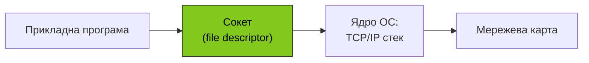
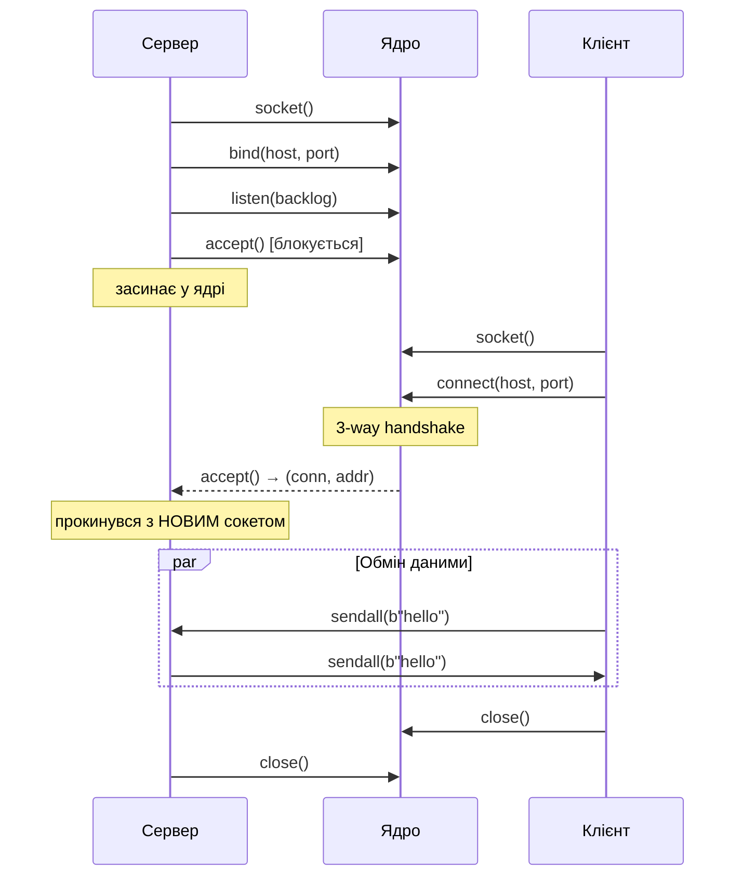
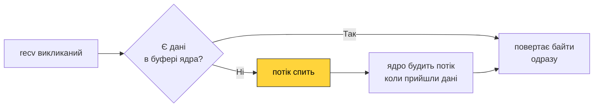

# 46. (Л) Основи сокетів та блокуючий режим роботи

## Зміст лекції

1. Що таке сокет
2. Адресні сім'ї та типи сокетів
3. Життєвий цикл TCP-сокета: сервер і клієнт
4. Блокуючий режим — що це означає
5. Модуль `socket` у Python
6. Анатомія блокуючого TCP-сервера
7. Анатомія блокуючого TCP-клієнта
8. Типові помилки і їх причини

## Що таке сокет

**Сокет** — це абстракція мережевого комунікаційного «кінця» (endpoint), яку ОС надає прикладному коду. Через сокет програма надсилає й отримує дані по мережі так само просто, як читає й пише у файл.

Інтерфейс сокетів — **Berkeley Sockets API** — з'явився у BSD 4.2 у 1983 році й відтоді став **стандартом де-факто** на всіх POSIX-системах (Linux, macOS, *BSD), а у Windows реалізований як WinSock із майже ідентичним API.



Кілька важливих ідей про сокети:

- **Сокет — це файловий дескриптор.** На POSIX-системах сокет — це звичайне ціле число (`int fd`), таке ж як у відкритого файла. Тому ті самі системні виклики `read`, `write`, `close` працюють і на файлах, і на сокетах. Python ховає це за об'єктом `socket.socket`.
- **Сокет живе в ядрі.** Прикладний код тримає лише дескриптор — а буфери прийому/передачі, стан з'єднання, лічильники sequence/ACK, тощо — все це ядро зберігає у власних структурах даних.
- **Унікальність TCP-з'єднання — це п'ятірка:** (`proto`, `src_ip`, `src_port`, `dst_ip`, `dst_port`). Якщо хоча б одна координата відрізняється — для ядра це інше з'єднання.

!!! info "Сокет ≠ з'єднання"
    Сокет — це **дескриптор** у ядрі. З'єднання — це **спільний стан** двох сокетів на двох машинах. На сервері кожне TCP-з'єднання має свій окремий сокет (повертається з `accept`), і вони всі живуть незалежно одне від одного.

## Адресні сім'ї та типи сокетів

При створенні сокет потребує два параметри: **адресну сім'ю** (де він живе) і **тип** (як працює).

### Адресні сім'ї (address family)

| Константа | Призначення |
|---|---|
| `AF_INET` | IPv4 — найпоширеніший варіант |
| `AF_INET6` | IPv6 |
| `AF_UNIX` | UNIX domain sockets — IPC між процесами на одній машині |
| `AF_PACKET` | Сирі Ethernet-кадри (Linux, потребує root) |

### Типи сокетів (socket type)

| Константа | Транспорт | Семантика |
|---|---|---|
| `SOCK_STREAM` | TCP | надійний потік байтів |
| `SOCK_DGRAM` | UDP | ненадійні датаграми зі збереженням меж |
| `SOCK_RAW` | низькорівневий | прямий доступ до IP/ICMP, потребує root |

Ці дві осі комбінуються: `socket(AF_INET, SOCK_STREAM)` — це TCP/IPv4, `socket(AF_INET6, SOCK_DGRAM)` — UDP/IPv6 і так далі.

## Життєвий цикл TCP-сокета: сервер і клієнт

Усе, що відбувається з TCP-сокетом, можна звести до невеликого набору викликів. У сервера й клієнта вони різні.



### Сервер: `socket → bind → listen → accept → recv/send → close`

| Виклик | Що робить |
|---|---|
| `socket()` | створює сокет (поки нікуди не прив'язаний) |
| `bind((host, port))` | прив'язує сокет до конкретного інтерфейсу й порту |
| `listen(backlog)` | переводить сокет у режим прослуховування; `backlog` — розмір черги напівустановлених з'єднань |
| `accept()` | блокується, поки не прийде клієнт; повертає **новий** сокет для цього клієнта |
| `recv` / `send` | обмін даними з конкретним клієнтом (через сокет із `accept`) |
| `close()` | звільняє ресурси сокета |

!!! warning "Сокет, що слухає, ≠ сокет, на якому розмовляєте"
    `accept()` повертає **новий** сокет для кожного клієнта. Слухаючий сокет залишається на місці й чекає наступного `accept()`. Не плутайте їх — і ніколи не пишіть `recv()` на слухаючому сокеті.

### Клієнт: `socket → connect → send/recv → close`

| Виклик | Що робить |
|---|---|
| `socket()` | створює сокет |
| `connect((host, port))` | ініціює 3-way handshake; блокується до завершення |
| `send` / `recv` | обмін даними |
| `close()` | звільняє ресурси сокета (надсилає FIN) |

Зверніть увагу: клієнт **не викликає `bind`**. ОС автоматично призначить йому ефемерний (тимчасовий) порт із діапазону приблизно 32768–60999 (на Linux) — побачити можна командою `cat /proc/sys/net/ipv4/ip_local_port_range`.

## Блокуючий режим — що це означає

За замовчуванням **усі сокети у POSIX є блокуючими**. «Блокуючий» означає, що системний виклик не повертає керування програмі, доки операція не завершиться.

Які виклики на TCP-сокеті можуть блокуватися:

| Виклик | Чого чекає |
|---|---|
| `accept()` | вхідного з'єднання у listen-черзі |
| `connect()` | завершення 3-way handshake |
| `recv(n)` | поки в буфері прийому з'явиться **хоч щось** (1 або більше байтів), або поки peer закриє сокет |
| `send(buf)` | поки в буфері відправки звільниться місце (на практиці рідко блокує для невеликих повідомлень) |

!!! info "Блокуючий потік не споживає CPU"
    Поки потік стоїть у блокуючому виклику, ядро переводить його у стан «sleep». CPU вільний — інші процеси й потоки спокійно працюють. Прокидається потік лише тоді, коли подія настала: прийшли дані, прийшов клієнт, peer закрив сокет.



Блокуючий режим — це **дуже зручно для простого коду**: пишеш так, ніби читаєш файл, не думаєш ні про події, ні про колбеки. Саме тому ми починаємо вивчати сокети саме з нього. Ціна цієї простоти стане видно у наступній лекції.

## Модуль `socket` у Python

`socket` зі стандартної бібліотеки — це **тонка обгортка** над BSD-сокетами. Майже кожен метод об'єкта `socket.socket` віддзеркалює відповідний системний виклик: `bind`, `listen`, `accept`, `connect`, `recv`, `send`, `close`.

### Створення сокета

```python
import socket

sock = socket.socket(socket.AF_INET, socket.SOCK_STREAM)  # TCP/IPv4
```

Цей виклик еквівалентний `socket(AF_INET, SOCK_STREAM, 0)` у C. Третій аргумент (`proto`) у Python за замовчуванням — 0, тобто ядро саме обере протокол (для `SOCK_STREAM` це TCP).

### Адреси

Адреса в Python — це кортеж:

- для `AF_INET`: `(host, port)`, наприклад `("127.0.0.1", 9100)`;
- для `AF_INET6`: `(host, port, flowinfo, scopeid)`;
- для `AF_UNIX`: шлях до сокета, наприклад `"/tmp/my.sock"`.

`host` може бути IP-адресою або іменем хоста — у другому випадку Python зробить DNS-запит.

### Контекстний менеджер

Сокет підтримує `with` — після виходу з блоку викликається `close`:

```python
with socket.socket(socket.AF_INET, socket.SOCK_STREAM) as sock:
    sock.connect(("example.com", 80))
    sock.sendall(b"GET / HTTP/1.0\r\n\r\n")
    print(sock.recv(4096))
```

!!! tip "`socket.create_connection` для клієнтів"
    Для клієнта зручніше використовувати `socket.create_connection((host, port), timeout=...)` — він сам зробить DNS, спробує IPv6 і IPv4, виставить таймаут. Для сервера такої «обгортки» немає — там завжди ручний `socket → bind → listen`.

## Анатомія блокуючого TCP-сервера

Розберімо мінімальний робочий сервер крок за кроком — це і є шаблон для практичного завдання 48.

```python
import socket


def main() -> None:
    server = socket.socket(socket.AF_INET, socket.SOCK_STREAM)
    server.setsockopt(socket.SOL_SOCKET, socket.SO_REUSEADDR, 1)
    server.bind(("127.0.0.1", 9100))
    server.listen(128)
    print("listening on 127.0.0.1:9100")

    while True:
        conn, addr = server.accept()
        with conn:
            print(f"connected: {addr}")
            while True:
                chunk = conn.recv(4096)
                if not chunk:                # peer закрив з'єднання
                    break
                conn.sendall(chunk)
            print(f"disconnected: {addr}")


if __name__ == "__main__":
    main()
```

Розглянемо кожен рядок.

### `socket(AF_INET, SOCK_STREAM)`

Створили TCP/IPv4 сокет. Ще нікуди не прив'язаний, нічого не слухає.

### `setsockopt(SO_REUSEADDR, 1)`

Дозволяє ядру **повторно використати** адресу, навіть якщо попереднє з'єднання на цьому порту ще висить у `TIME_WAIT`. Без цього прапорця після `Ctrl+C` ви секунд 30–60 будете отримувати `Address already in use`.

### `bind(("127.0.0.1", 9100))`

Прив'язали сокет до адреси `127.0.0.1` (тільки локальний інтерфейс) і порту `9100`. Якщо передати `"0.0.0.0"` — сокет слухатиме на **всіх** інтерфейсах (включно з зовнішніми).

!!! warning "Порти нижче 1024 потребують root"
    На Linux порти 1–1023 — «привілейовані» (well-known). `bind` на них вимагає root або capability `CAP_NET_BIND_SERVICE`. Для навчальних серверів вибирайте порти ≥ 1024.

### `listen(128)`

Перевели сокет у режим прослуховування. Аргумент — **backlog**, тобто максимальна довжина черги з'єднань, які вже завершили handshake, але ще не прийняті програмою через `accept`. Число 128 — розумне за замовчуванням; якщо черга переповнилася, нові SYN ігноруються і клієнт побачить timeout або `Connection refused`.

### `accept()` у циклі

`accept` блокується, доки не прийде клієнт, а потім повертає кортеж `(conn, addr)`:

- `conn` — **новий** сокет, через який ми будемо розмовляти саме з цим клієнтом;
- `addr` — адреса клієнта, кортеж `(ip, port)`.

Слухаючий сокет (`server`) залишається активним і готовий приймати наступних клієнтів.

### `with conn:`

Контекстний менеджер гарантує, що сокет клієнта закриється, навіть якщо в обробці викинеться виняток. Без цього кожна помилка призводила б до витоку файлових дескрипторів.

### Внутрішній цикл `while True: recv → sendall`

Це і є логіка ехо-сервера: прочитати чанк, повернути його назад. Ключові моменти:

- `recv(4096)` — **до** 4096 байтів. Може повернути менше — це нормально, TCP не зберігає межі повідомлень.
- `if not chunk: break` — `recv` повертає **порожні байти** (`b""`), коли peer викликав `close` (надіслав FIN). Це сигнал «даних більше не буде».
- `sendall(chunk)` — на відміну від `send`, гарантує відправку всіх байтів (виконує `send` у циклі, поки буфер не випорожниться).

!!! danger "Це сервер, що обслуговує одного клієнта за раз"
    Поки внутрішній `while` крутиться з клієнтом A — клієнт B чекає в backlog-черзі. Це **головне обмеження блокуючої моделі**, і саме воно мотивує всю наступну лекцію.

## Анатомія блокуючого TCP-клієнта

```python
import socket


def main() -> None:
    with socket.create_connection(("127.0.0.1", 9100), timeout=5) as sock:
        sock.sendall(b"hello\n")
        reply = sock.recv(4096)
        print("server said:", reply.decode())


if __name__ == "__main__":
    main()
```

Що тут важливого:

- `create_connection` сам викличе `socket → connect`, спробує IPv6/IPv4, обробить DNS.
- `timeout=5` — якщо сервер не відповідає, виняток `TimeoutError` через 5 секунд.
- `sendall(b"hello\n")` — TCP не зберігає межі: на сервері це може прийти як `b"hello\n"`, або по байту, або разом із наступним повідомленням.
- `sock.recv(4096)` — поверне **до** 4096 байтів, як тільки сервер щось надішле.

!!! tip "У клієнтських скриптах майже завжди вмикайте `timeout`"
    Без `timeout` ваш скрипт може зависнути назавжди, якщо сервер «заглух» (наприклад, втратив з'єднання, але FIN не надіслав). У production це найчастіша причина «таємничих зависань».

## Типові помилки і їх причини

| Виняток | Причина | Як уникнути |
|---|---|---|
| `OSError: [Errno 98] Address already in use` | Попередній сокет ще у `TIME_WAIT` | `SO_REUSEADDR` перед `bind` |
| `ConnectionRefusedError` | На цьому порту ніхто не слухає | Перевірити, що сервер запущено |
| `TimeoutError` | Хост недоступний / фаєрвол | Перевірити мережу, виставити `timeout` |
| `BrokenPipeError` | Пишемо у сокет після `close` peer-а | Перехопити `recv == b""` і вийти з циклу |
| `ConnectionResetError` | Peer надіслав RST (краш або фаєрвол) | Обробити як «з'єднання обірвалося» |
| `OSError: [Errno 24] Too many open files` | Витік дескрипторів — забутий `close` | Завжди використовувати `with` |

!!! note "Витік сокетів — улюблений баг початківців"
    Кожне TCP-з'єднання — це файловий дескриптор. Ліміт за замовчуванням на Linux — 1024 на процес (`ulimit -n`). Якщо ваш сервер чи клієнт «забуває» закривати сокети, після кількох тисяч клієнтів він просто перестане приймати з'єднання. Завжди закривайте — бажано через `with`.

## Підсумок

| Концепція | Опис |
|---|---|
| Сокет | Абстракція мережевого endpoint у вигляді файлового дескриптора |
| Адресна сім'я + тип | `AF_INET + SOCK_STREAM` = TCP/IPv4 |
| Сервер | `socket → bind → listen → accept → recv/send → close` |
| Клієнт | `socket → connect → send/recv → close` |
| `accept()` | Повертає **новий** сокет для кожного клієнта |
| Блокуючий режим | Виклик не повертає керування, поки операція не завершилася; CPU вільний |
| `recv == b""` | Peer закрив з'єднання |
| `sendall` | Гарантує відправку всіх байтів |
| `SO_REUSEADDR` | Дозволяє швидкий перезапуск сервера |

Ключові принципи:

- **Сокет — це файловий дескриптор**. Завжди закривайте його (через `with`).
- **Слухаючий сокет ≠ сокет з'єднання**. `accept()` повертає новий сокет для кожного клієнта.
- **Блокуючий код пишеться як для файла**. Це його сила (простота) і слабкість (один клієнт за раз).
- **TCP — це потік, а не повідомлення**. Будьте готові, що `recv` поверне будь-яку кількість байтів від 1 до запитаних.
- **Завжди вмикайте `SO_REUSEADDR` на серверах і `timeout` на клієнтах.**

## Корисні посилання

- [Python docs — socket](https://docs.python.org/3/library/socket.html)
- [Python HOWTO — Socket programming](https://docs.python.org/3/howto/sockets.html)
- [Beej's Guide to Network Programming](https://beej.us/guide/bgnet/) — класичний підручник по BSD sockets
- [man 7 socket](https://man7.org/linux/man-pages/man7/socket.7.html)
- [man 2 accept](https://man7.org/linux/man-pages/man2/accept.2.html)
