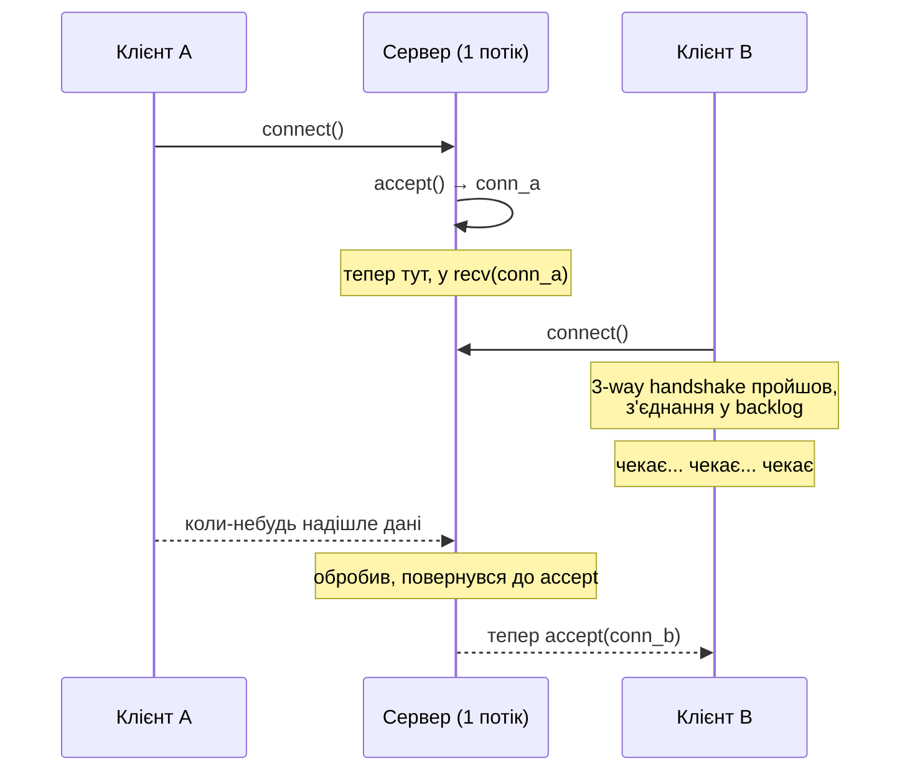
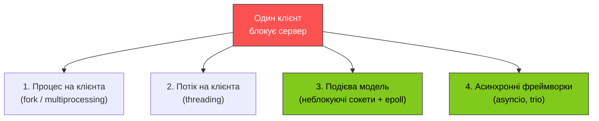
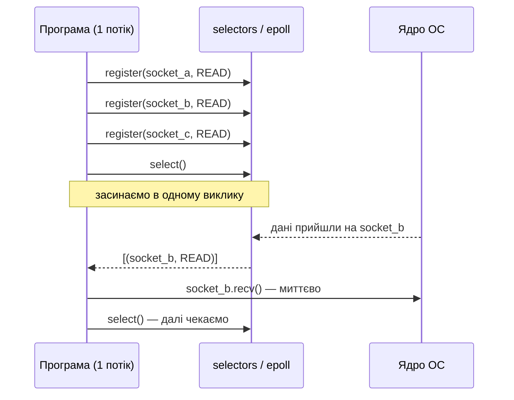

# 47. (Л) Обмеження блокуючих сокетів та підходи до їх подолання

## Зміст лекції

1. Чому блокуючий сервер не масштабується
2. Демонстрація проблеми
3. Огляд підходів до конкурентної обробки клієнтів
4. Процес на клієнта (`fork` / `multiprocessing`)
5. Потік на клієнта (`threading`)
6. Проблема C10K
7. Подієво-керована модель: неблокуючі сокети + `select`/`epoll`
8. Асинхронні фреймворки (огляд)
9. Порівняльна таблиця підходів

## Чому блокуючий сервер не масштабується

У попередній лекції ми побудували мінімальний TCP-сервер:

```python
while True:
    conn, addr = server.accept()      # (1) блокується тут
    with conn:
        while True:
            chunk = conn.recv(4096)   # (2) і тут
            if not chunk:
                break
            conn.sendall(chunk)
```

Він простий і коректний — але має одне фатальне обмеження: **обслуговує одного клієнта за раз**.

Подивіться уважно на потік виконання:

- Поки потік стоїть у `recv` (точка 2) — він **не може повернутися до `accept`** (точка 1).
- Поки потік не повернувся до `accept` — нові клієнти лежать у backlog-черзі.
- Якщо backlog заповнився — наступні клієнти отримують `ECONNREFUSED` або timeout.

Тобто навіть якщо клієнт A нічого не пише годинами (просто тримає з'єднання) — клієнт B не буде обслужений ніколи.



!!! danger "Це не просто питання продуктивності — це питання доступності"
    Один зловмисний (або просто застряглий) клієнт може повністю заблокувати сервер для всіх інших, навіть нічого не надсилаючи. Така архітектура **не годиться** ні для production-сервера, ні для чогось більш-менш реального.

## Демонстрація проблеми

Запустіть блокуючий ехо-сервер із минулої лекції. У двох терміналах запустіть `nc 127.0.0.1 9100`. Перший термінал нічого не пишіть.

Тепер у другому терміналі введіть `hello` і натисніть Enter.

Результат: **другий клієнт не отримує відповіді**. Сервер досі стоїть у `recv` для першого клієнта. Як тільки ви натиснете `Ctrl+D` (закриття з'єднання) у першому терміналі — сервер прокинеться, повернеться до `accept`, ухвалить уже встановлене з'єднання другого клієнта, і тільки після цього обслужить його.

Цей експеримент і є наш головний мотив для решти лекції.

## Огляд підходів до конкурентної обробки клієнтів

Усі способи розв'язати цю проблему зводяться до однієї ідеї: **не давати одному клієнту монополізувати потік виконання**. Способи відрізняються тим, **звідки беремо паралелізм**.



Підходи 1–2 залишають **блокуючі** сокети, а паралелізм беруть із додаткових процесів/потоків. Підходи 3–4 використовують **неблокуючі** сокети та обслуговують усіх клієнтів одним потоком.

## Процес на клієнта

Класичний UNIX-стиль ще з 70-х: на кожне нове з'єднання батьківський процес викликає `fork()`, а дочірній обслуговує клієнта своїм окремим стеком виконання.

У Python еквівалент — модуль `multiprocessing`:

```python
import socket
from multiprocessing import Process


def handle(conn: socket.socket, addr) -> None:
    with conn:
        while True:
            chunk = conn.recv(4096)
            if not chunk:
                break
            conn.sendall(chunk)


def main() -> None:
    server = socket.socket(socket.AF_INET, socket.SOCK_STREAM)
    server.setsockopt(socket.SOL_SOCKET, socket.SO_REUSEADDR, 1)
    server.bind(("127.0.0.1", 9100))
    server.listen(128)

    while True:
        conn, addr = server.accept()
        Process(target=handle, args=(conn, addr), daemon=True).start()
        conn.close()                 # дочірній процес тримає свою копію fd


if __name__ == "__main__":
    main()
```

**Плюси:**

- максимальна ізоляція: краш одного клієнта не вплине на інших;
- обхід GIL — кожен процес має власний інтерпретатор, отже й справжній паралелізм CPU.

**Мінуси:**

- **дорого**: створення процесу — десятки мілісекунд, кожен процес — 5–50 МБ пам'яті;
- **складна комунікація** між процесами (через socketpair, pipe, shared memory);
- **не масштабується** до тисяч клієнтів — ОС не справляється з контекст-світчами.

!!! info "Apache prefork MPM"
    Класичний приклад процес-на-запит — режим `prefork` веб-сервера Apache. Завдяки ізоляції він стійкий до багів у модулях (mod_php міг крашити воркер, не валячи весь сервер). Але саме через високу вартість процесів він поступається сучасним подієвим серверам (nginx) на високих навантаженнях.

## Потік на клієнта

Потік (thread) — це окремий стек виконання всередині того самого процесу. Створюється швидше за процес, споживає менше пам'яті, ділить адресний простір із батьком.

```python
import socket
import threading


def handle(conn: socket.socket, addr) -> None:
    with conn:
        while True:
            chunk = conn.recv(4096)
            if not chunk:
                break
            conn.sendall(chunk)


def main() -> None:
    server = socket.socket(socket.AF_INET, socket.SOCK_STREAM)
    server.setsockopt(socket.SOL_SOCKET, socket.SO_REUSEADDR, 1)
    server.bind(("127.0.0.1", 9100))
    server.listen(128)

    while True:
        conn, addr = server.accept()
        threading.Thread(target=handle, args=(conn, addr), daemon=True).start()


if __name__ == "__main__":
    main()
```

**Плюси:**

- швидке створення (мікросекунди проти мілісекунд для процесу);
- спільна пам'ять — простіше ділитися станом (кеш, лічильники);
- для I/O-bound коду GIL не заважає (звільняється під час `recv`).

**Мінуси:**

- кожен потік — окремий стек у пам'яті (за замовчуванням ~8 МБ на Linux);
- **GIL** обмежує справжній паралелізм для CPU-bound коду (один Python-байткод за раз);
- **синхронізація**: поділ стану — це блокування, race conditions, дедлоки;
- так само не масштабується до десятків тисяч — ОС задихається на context switch'ах.

!!! note "GIL і сокети"
    Global Interpreter Lock у CPython дозволяє виконувати лише один байткод одночасно. Але **під час блокуючих системних викликів (`recv`, `accept`, `read`) GIL автоматично звільняється** — поки потік спить у ядрі, інші потоки виконують Python-код. Тому модель «потік на клієнта» в Python нормально працює для I/O-bound навантаження. Для CPU-bound (обчислення в самому Python) — потрібен `multiprocessing` або зовнішня бібліотека на C.

## Проблема C10K

У 1999 році Dan Kegel опублікував есе [«The C10K problem»](http://www.kegel.com/c10k.html): **як обслужити 10 000 одночасних з'єднань на одній машині?**

На той час типовий веб-сервер створював процес на з'єднання. Прості розрахунки:

- 10 000 процесів × 8 МБ пам'яті стека = 80 ГБ. Серверів такого розміру у 1999 році не було ні у кого.
- 10 000 потоків — той самий стек, плюс за `pthread` ОС має зробити 10 000 context switch'ів за квант часу. CPU йде на перемикання, не на роботу.

Висновок: модель «один потік на клієнта» **принципово не масштабується** до десятків тисяч з'єднань. Потрібна інша архітектура: **один (або кілька) потоків обслуговують усіх**.

Як? Замість того, щоб блокуватися на конкретному сокеті — питати у ядра: «**які з усіх моїх сокетів зараз готові** до читання чи запису?» — і обробляти лише їх.


## Подієво-керована модель: неблокуючі сокети + `select`/`epoll`

Ключ до C10K — **модель готовності** (readiness model). Працює вона так:

1. Перевести сокети у **неблокуючий режим** (`sock.setblocking(False)`). Тепер `recv` повертається миттєво: або з даними, або з помилкою `EAGAIN/EWOULDBLOCK`, що означає «зараз нічого нема».
2. Передати ядру список усіх своїх сокетів через спеціальний системний виклик і **заснути на ньому**.
3. Ядро будить нас, коли **бодай один** із цих сокетів став готовий до операції — і повертає список саме готових.
4. Обходимо лише готові сокети, виконуємо `recv`/`send` на них (вони вже точно повернуть дані миттєво).
5. Знов засинаємо на цьому виклику.

Системні виклики, що це реалізують:

| Виклик | ОС | Особливості |
|---|---|---|
| `select()` | усі POSIX | Переносний, але O(N) на кожен виклик; ліміт 1024 fd |
| `poll()` | POSIX | Без ліміту fd, але теж O(N) |
| `epoll` | Linux | O(1) — ядро тримає набір fd між викликами |
| `kqueue` | BSD, macOS | Аналог epoll |
| IOCP | Windows | Завершення операцій (трошки інша модель) |

У Python всі ці варіанти інкапсульовано модулем **`selectors`**: він сам обере найкращий механізм для вашої ОС, а ви пишете однаковий код.



Деталі цієї моделі — наступна лекція. Поки що важливо запам'ятати **головну ідею**: один потік слухає тисячі сокетів через єдиний системний виклик, що засинає до настання будь-якої події.

!!! info "Чому це працює швидко"
    `epoll` — це структура у ядрі, яка зберігає набір fd і ефективно (O(log N) або O(1)) повідомляє про події. Програмі не потрібно щоразу передавати список — ядро саме веде його. Один потік на сучасному залізі обслуговує **сотні тисяч** одночасних з'єднань.

## Асинхронні фреймворки

Подієва модель потужна, але «голий» `selectors` некомфортний для написання бізнес-логіки: ви постійно думаєте про колбеки, стани з'єднань, буфери. Тому над `selectors` побудували високорівневі обгортки.

| Фреймворк | Мова | Стиль |
|---|---|---|
| `asyncio` (стандартний у Python) | Python | `async def` / `await` |
| `trio` | Python | structured concurrency |
| Node.js | JavaScript | колбеки + Promise + async/await |
| nginx | C | колбеки на чистому event loop |
| Tokio | Rust | async/await |

Усі вони — **тонкі обгортки над `epoll`/`kqueue`/IOCP**. `asyncio` ви вже бачили в Модулі 3 — там показано, що під капотом це і є `selectors` плюс event loop. У Модулі 4 ми йдемо в інший бік: спочатку розбираємо нижчий рівень (`socket` + `selectors`), щоб коли ви знов відкриєте `asyncio`, він не виглядав магією.

Той самий ехо-сервер на високорівневому API `asyncio`:

```python
import asyncio


async def handle(reader: asyncio.StreamReader, writer: asyncio.StreamWriter) -> None:
    addr = writer.get_extra_info("peername")
    print(f"connected: {addr}")
    try:
        while chunk := await reader.read(4096):
            writer.write(chunk)
            await writer.drain()
    finally:
        writer.close()
        await writer.wait_closed()
        print(f"disconnected: {addr}")


async def main() -> None:
    server = await asyncio.start_server(handle, "127.0.0.1", 9100)
    async with server:
        await server.serve_forever()


if __name__ == "__main__":
    asyncio.run(main())
```

Зверніть увагу: код виглядає майже як блокуючий — той самий лінійний потік «прочитав → відповів». Але одне `await reader.read(...)` під капотом реєструє сокет у `selectors` і повертає керування циклу подій, який тим часом обслуговує інших клієнтів. Один потік справляється з тисячами з'єднань.

!!! tip "Коли asyncio, а коли потоки?"
    - **I/O-bound, багато з'єднань (>100 одночасних), низька латентність** — asyncio або інший event-loop фреймворк.
    - **I/O-bound, помірна кількість з'єднань (десятки), простий код** — потоки.
    - **CPU-bound** — `multiprocessing` або зовнішні C-бібліотеки.
    - **Учбові вправи / прототипи** — блокуючий синхронний код, поки не виявиться обмеження.

## Порівняльна таблиця підходів

| Підхід | Скільки з'єднань | Витрати пам'яті | Складність коду | Коли застосовувати |
|---|---|---|---|---|
| Блокуючий + 1 потік | 1 одночасно | мінімум | мінімум | Учбові приклади, локальні утиліти |
| Процес на клієнта | сотні | висока (МБ × N) | низька | Ізоляція потрібна понад швидкодію |
| Потік на клієнта | сотні-тисячі | середня (МБ × N) | середня (синхронізація) | Внутрішні сервіси з помірним навантаженням |
| Неблокуючі + selectors | десятки тисяч | мінімум | висока | Високонавантажені сервери |
| asyncio / трио | десятки тисяч | мінімум | середня (треба вчити модель) | Сучасний Python для I/O-bound |

## Що далі

- **Лекція 49** — основи неблокуючих сокетів: `setblocking(False)`, `EAGAIN`, цикл подій на `selectors`.
- **Практичне 50** — побудова **неблокуючого** ехо-сервера, що одним потоком обслуговує багатьох клієнтів одночасно.
- А спочатку — **практичне 48**, де ви побудуєте простий блокуючий ехо-сервер і на власні очі побачите його обмеження.

## Підсумок

Ключові ідеї лекції:

- **Блокуючий сервер обслуговує одного клієнта за раз.** Будь-який «застряглий» клієнт паралізує всю систему.
- **Паралелізм можна додати ззовні (процеси/потоки) або зсередини (неблокуючі сокети + event loop).**
- **Процес-на-клієнта** — стійкий, але дорогий; не масштабується вище сотень.
- **Потік-на-клієнта** — дешевший, але GIL і кількість потоків обмежують зверху.
- **Пул воркерів** — прагматичний компроміс із передбачуваним споживанням ресурсів.
- **C10K-задача** змусила перейти на **модель готовності**: один потік + `epoll`/`selectors` обслуговують десятки тисяч сокетів.
- **`asyncio`** — це не нова модель, а **зручний синтаксис** над тим самим `epoll`.

Який підхід обрати — залежить від реальних вимог (кількості клієнтів, рівня ізоляції, обмежень по пам'яті), а не від моди. Початкова інтуїція: блокуючий код — за замовчуванням, потоки — коли мало клієнтів і простий код, asyncio — коли клієнтів багато і вони I/O-bound.

## Корисні посилання

- [Dan Kegel — The C10K problem](http://www.kegel.com/c10k.html) — есе, що змінило підхід до серверної архітектури
- [man 7 epoll](https://man7.org/linux/man-pages/man7/epoll.7.html)
- [Python docs — selectors](https://docs.python.org/3/library/selectors.html)
- [Python docs — threading](https://docs.python.org/3/library/threading.html)
- [Python docs — multiprocessing](https://docs.python.org/3/library/multiprocessing.html)
- [Python docs — asyncio](https://docs.python.org/3/library/asyncio.html)
- [High Performance Browser Networking — глава про сервери](https://hpbn.co/)
