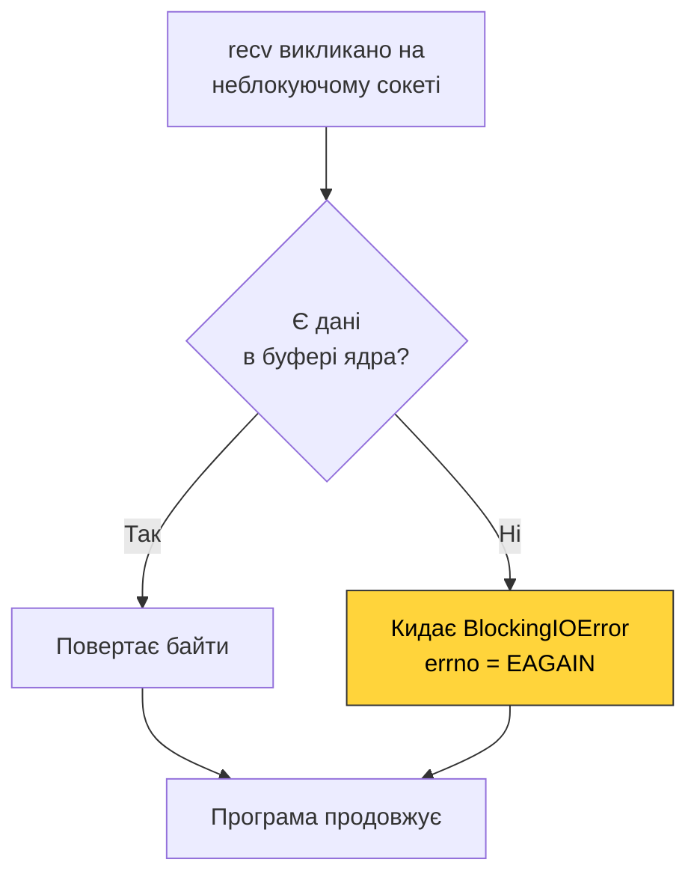
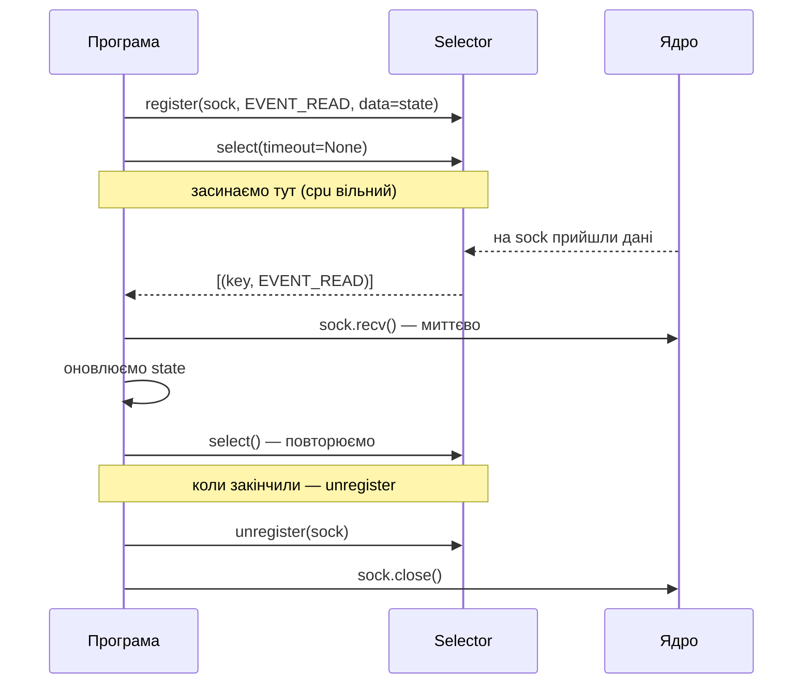
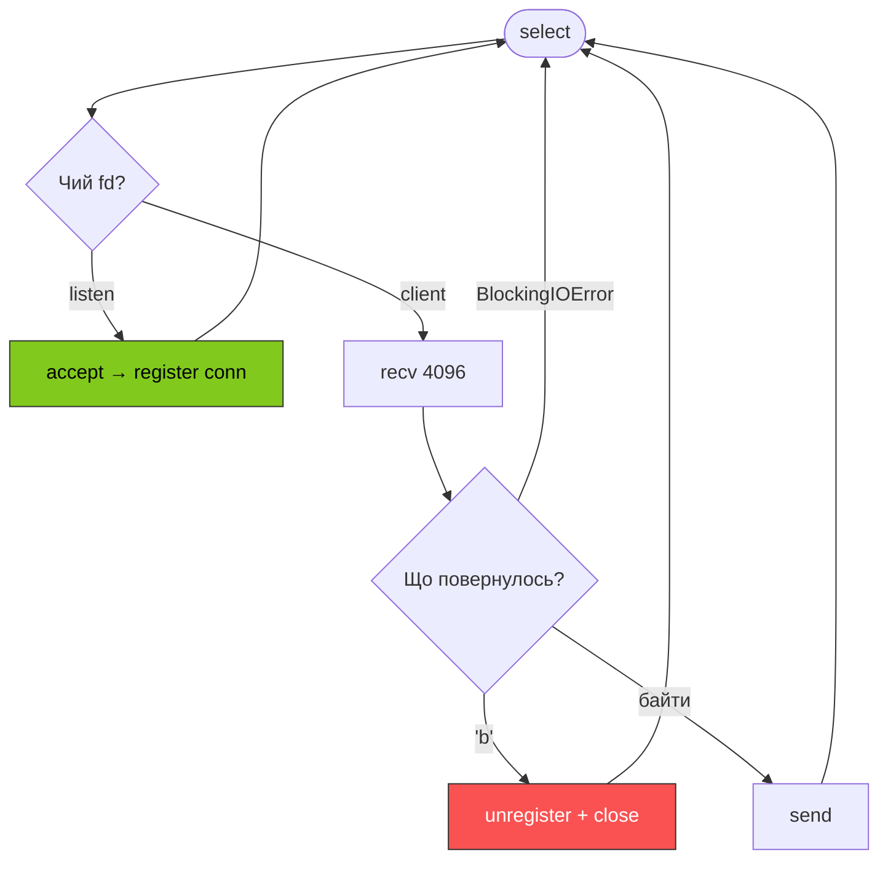

# 49. (Л) Основи роботи з неблокуючими сокетами

## Зміст лекції

1. Нагадування: чому ми тут
2. Що таке неблокуючий сокет
3. `setblocking(False)` — як перевести сокет у неблокуючий режим
4. `EAGAIN` / `EWOULDBLOCK` — головна нова помилка
5. Поведінка `accept`, `recv`, `send`, `connect` у неблокуючому режимі
6. Чому busy-loop — це поганий шлях
7. Модуль `selectors`: цикл подій за 30 рядків коду
8. Анатомія неблокуючого ехо-сервера на `selectors`

## Нагадування: чому ми тут

У минулій лекції ми побачили, що блокуючий сервер обслуговує **одного клієнта за раз**. Будь-який «застряглий» клієнт паралізує всю систему, а зовнішні рішення (процес/потік на клієнта) не масштабуються вище кількох тисяч з'єднань.

Рішення — **модель готовності**: один потік слухає набір сокетів і реагує лише на ті, які зараз готові до читання чи запису. Ця лекція — про **нижній рівень** цієї моделі: неблокуючі сокети та `selectors`. Саме на цьому фундаменті побудовано `asyncio`, Node.js, nginx і Tokio.


## Що таке неблокуючий сокет

**Неблокуючий сокет** — це той самий сокет, тільки ядро має до нього іншу інструкцію: **«ніколи не присипляй потік на цьому fd»**. Якщо операція (`recv`, `accept`, `send`, `connect`) не може завершитися негайно — ядро повертає помилку `EAGAIN` (або синонім `EWOULDBLOCK` — це **той самий код** на Linux), а програма продовжує виконуватись.

Ключова відмінність:

| Режим | Що робить `recv`, якщо даних нема |
|---|---|
| Блокуючий | потік засинає у ядрі, поки не прийдуть дані |
| Неблокуючий | повертає помилку `BlockingIOError` (errno = `EAGAIN`) одразу |

Тобто неблокуючий режим **не робить операції швидшими**. Він лише **переносить рішення «чи чекати»** з ядра у вашу програму. А програма не чекає, бо у неї є інші сокети, на яких теж можуть бути події.

!!! info "Неблокуючий — це інструкція до конкретного fd"
    Прапорець «неблокуючий» (`O_NONBLOCK`) — це атрибут саме файлового дескриптора, а не сокета як «розетки» в мережі. Слухаючий сокет може бути неблокуючим, а сокет-з'єднання, отриманий з `accept`, — успадковує цей прапорець на Linux, але на BSD/macOS — ні. **Завжди вмикайте `setblocking(False)` явно на всіх сокетах**, навіть якщо здається, що вони успадкували режим.

## `setblocking(False)`

У Python увімкнути неблокуючий режим тривіально:

```python
import socket

sock = socket.socket(socket.AF_INET, socket.SOCK_STREAM)
sock.setblocking(False)
sock.close()
```

Після цього виклику **всі** операції на `sock` стають неблокуючими. Альтернативний синтаксис — `sock.setblocking(True/False)` або `sock.settimeout(0)` — це те саме (`settimeout(0)` еквівалентно `setblocking(False)`, а `settimeout(None)` — `setblocking(True)`).

!!! tip "Не плутайте `settimeout(N)` з неблокуючим режимом"
    `settimeout(5.0)` — це **третій режим**: блокуючий, але з обмеженням 5 секунд. Кидає `TimeoutError`, якщо операція не встигає. Зручно для клієнтів, але не годиться для серверів, які мають обслуговувати багато сокетів одночасно.

## `EAGAIN` / `EWOULDBLOCK`

У Python ця помилка з'являється як виняток **`BlockingIOError`** (`errno = EAGAIN`). Це **не помилка**, а сигнал: «зараз нічого зробити не можна, спробуй пізніше».

```python
import socket

a, b = socket.socketpair()        # пара підключених сокетів — зручно для демо
a.setblocking(False)
try:
    data = a.recv(4096)
except BlockingIOError:
    # це не помилка — даних просто ще нема
    print("no data yet")

a.close()
b.close()
```



Це і є вся «магія» неблокуючого режиму. Решта — про те, **звідки програма знає, коли спробувати знову**, не споживаючи 100% CPU.

## Поведінка викликів у неблокуючому режимі

### `accept()`

- Блокуючий: чекає клієнта.
- Неблокуючий: якщо у listen-черзі є клієнт — повертає `(conn, addr)`; якщо нема — `BlockingIOError`.

### `recv(n)`

- Блокуючий: чекає, поки прийдуть дані (1 або більше байтів) або peer закриє сокет.
- Неблокуючий: якщо у буфері є дані — повертає до `n` байтів; якщо буфер порожній — `BlockingIOError`; якщо peer закрив — `b""` (як і раніше).

### `send(buf)` / `sendall(buf)`

- Блокуючий: чекає, поки в буфері відправки звільниться місце.
- Неблокуючий `send`: відправляє стільки байтів, скільки влізло, і повертає це число (може бути менше за `len(buf)`!); якщо буфер повний — `BlockingIOError`.
- Неблокуючий `sendall`: **не використовуйте** — він зсередини зациклюється на `send` і поведеться непередбачувано, якщо буфер ядра повний. Замість нього — ручний цикл або відстеження «недоданих» байтів.

!!! warning "Часткова відправка — головна пастка"
    На блокуючому сокеті ми завжди писали `sock.sendall(data)` і не думали. На неблокуючому `send(data)` може повернути, скажімо, 1024 з 4096 байтів. Решту треба зберегти й дописати пізніше, коли сокет знов стане готовий до запису. Більшість багів у наївних event-loop'ах — саме звідси.

### `connect((host, port))`

- Блокуючий: чекає завершення 3-way handshake.
- Неблокуючий: одразу повертає `BlockingIOError` (`errno = EINPROGRESS`). Реальне завершення треба відстежувати через `selectors` як подію «готовий до запису».

## Чому busy-loop — це поганий шлях

Наївна реалізація з тим, що ми вже знаємо, виглядала б так:

```python
# АНТИ-ПРИКЛАД — НЕ РОБИТИ
import socket

server = socket.socket(socket.AF_INET, socket.SOCK_STREAM)
server.setsockopt(socket.SOL_SOCKET, socket.SO_REUSEADDR, 1)
server.bind(("127.0.0.1", 9100))
server.listen(128)
server.setblocking(False)

clients = []

while True:
    try:
        conn, addr = server.accept()
        conn.setblocking(False)
        clients.append(conn)
    except BlockingIOError:
        pass

    for conn in clients:
        try:
            data = conn.recv(4096)
            if data:
                conn.send(data)
        except BlockingIOError:
            pass
```

Технічно це працює: ми не блокуємось ніде. Але:

- CPU зайнятий **на 100%** — цикл крутиться без зупинки, навіть якщо ніхто нічого не пише.
- Витрачаємо тисячі системних викликів за секунду на сокети, на яких нічого не змінилось.
- Чим більше клієнтів — тим повільніше **кожна** ітерація (`O(N)` сокетів на коло).

Це фундаментальна вада busy-loop'а: **програма постійно питає ядро «а вже?»**, замість того, щоб дочекатися реальної події.

Рішення — попросити ядро **збудити нас саме тоді**, коли бодай один із наших сокетів став готовий. Цей інтерфейс надає модуль `selectors`.

## Модуль `selectors`: цикл подій за 30 рядків

`selectors` — стандартний модуль Python, тонка обгортка над `epoll` (Linux), `kqueue` (BSD/macOS) чи `select` (Windows і fallback). API однаковий на всіх платформах.

### Базові поняття

| Поняття | Що це |
|---|---|
| **Selector** | Об'єкт, що тримає набір зареєстрованих сокетів і вміє чекати на події |
| **Реєстрація** | `selector.register(fd, events, data=...)` — додаємо сокет у спостереження |
| **Маска подій** | `EVENT_READ` (готовий до читання), `EVENT_WRITE` (готовий до запису), або їх OR |
| **`data`** | Довільний об'єкт, який повертається разом із подією — туди кладемо стан з'єднання |
| **`select(timeout)`** | Блокується до настання події, повертає список `(key, mask)` пар для готових сокетів |

```python
import selectors
import socket

a, b = socket.socketpair()
a.setblocking(False)

sel = selectors.DefaultSelector()
sel.register(a, selectors.EVENT_READ, data="my-data")

b.send(b"hello")                          # викликаємо подію READ на 'a'

events = sel.select(timeout=None)         # None = чекати безкінечно
for key, mask in events:
    sock = key.fileobj
    user_data = key.data
    # mask — це бітова маска подій:
    #   EVENT_READ        = 1  (бінарне 01)
    #   EVENT_WRITE       = 2  (бінарне 10)
    #   EVENT_READ|WRITE  = 3  (бінарне 11)
    # Оператор & перевіряє, чи увімкнено саме біт READ у цій масці.
    if mask & selectors.EVENT_READ:
        print(user_data, sock.recv(4096))

sel.close()
a.close()
b.close()
```

!!! info "`DefaultSelector` сам обере найкращий механізм"
    На Linux це буде `EpollSelector`, на macOS — `KqueueSelector`, на Windows — `SelectSelector`. У 95% випадків `DefaultSelector` — те, що треба.

### Життєвий цикл сокета у `selectors`



Два правила, які варто запам'ятати:

1. **Реєструємо ДО `select`, скасовуємо ДО `close`.** Спроба `unregister` на вже закритому сокеті — поширений баг.
2. **`select` повертає лише ті сокети, де подія настала.** Якщо ви зареєстрували 1000 сокетів і прийшло щось на одному — `select` поверне список з одного елемента.

## Анатомія неблокуючого ехо-сервера на `selectors`

Подивимось на повний код, що обслуговує **довільну** кількість клієнтів одним потоком:

```python
import selectors
import socket


def accept(server: socket.socket, sel: selectors.BaseSelector) -> None:
    conn, addr = server.accept()
    print(f"connected: {addr}")
    conn.setblocking(False)
    sel.register(conn, selectors.EVENT_READ, data={"addr": addr})


def serve(conn: socket.socket, sel: selectors.BaseSelector, addr) -> None:
    try:
        chunk = conn.recv(4096)
    except BlockingIOError:
        return                       # шумне пробудження — даних насправді нема

    if not chunk:                    # peer закрив сокет
        print(f"disconnected: {addr}")
        sel.unregister(conn)
        conn.close()
        return

    try:
        conn.send(chunk)             # для маленьких ехо send зазвичай вистачає
    except BlockingIOError:
        pass                         # буфер ядра повний — у простому ехо ігноруємо


def main() -> None:
    sel = selectors.DefaultSelector()

    server = socket.socket(socket.AF_INET, socket.SOCK_STREAM)
    server.setsockopt(socket.SOL_SOCKET, socket.SO_REUSEADDR, 1)
    server.bind(("127.0.0.1", 9100))
    server.listen(128)
    server.setblocking(False)
    sel.register(server, selectors.EVENT_READ, data=None)

    print("listening on 127.0.0.1:9100")

    try:
        while True:
            events = sel.select(timeout=None)
            for key, _mask in events:
                if key.data is None:                    # подія на listen-сокеті
                    accept(key.fileobj, sel)
                else:                                    # подія на клієнтському
                    serve(key.fileobj, sel, key.data["addr"])
    except KeyboardInterrupt:
        print("server stopped")
    finally:
        sel.close()


if __name__ == "__main__":
    main()
```

Кілька важливих місць, на які варто звернути увагу:

- **Слухаючий сокет теж зареєстрований у `selectors`.** Подія на ньому означає «прийшов новий клієнт». Ми відрізняємо його від клієнтських за `key.data is None`.
- **`conn.setblocking(False)` на сокеті з `accept`.** Без цього новий сокет буде блокуючим — і весь сервер впаде у `recv`, коли клієнт замовкне.
- **`sel.unregister(conn)` ПЕРЕД `conn.close()`.** Інакше `selectors` намагатиметься опитувати закритий fd і викине `KeyError` (або, гірше, fd буде перевикористаний для іншого сокета).
- **`BlockingIOError` навколо `recv`/`send`.** Навіть після `select` буває «шумне пробудження» — епізодична подія без реальних даних. Це нормально, просто ігноруємо й чекаємо наступної.



## Що далі

- **Практичне 50** — побудуєте робочий неблокуючий ехо-сервер на `selectors`, який одночасно обслуговує багатьох клієнтів одним потоком.
- Усе, що ви побудуєте, **`asyncio` робить під капотом**. Після практичного 50 поверніться до Модуля 3 — і `async def` стане прозорим.

## Підсумок

| Концепція | Опис |
|---|---|
| `setblocking(False)` | Перемикає сокет у неблокуючий режим |
| `BlockingIOError` (errno `EAGAIN`) | Сигнал «зараз нічого зробити не можна» — не помилка |
| Busy-loop | Працює, але споживає 100% CPU — НЕ так |
| `selectors.DefaultSelector` | Кросплатформна обгортка над `epoll`/`kqueue`/`select` |
| `EVENT_READ` / `EVENT_WRITE` | Маски подій готовності |
| `register / select / unregister` | Базовий життєвий цикл |

Ключові ідеї:

- **Неблокуючий сокет не швидший — він просто не присипляє потік.** Чекати треба все одно, але ОДРАЗУ за всі сокети, через `selectors`.
- **`selectors` дає вам «розумне» `accept` для всіх сокетів одразу:** прокидаєтесь точно тоді, коли є що робити.
- **`asyncio` — це той самий `selectors` плюс синтаксис `async/await`.** Жодної магії за лаштунками — лише event loop і неблокуючі fd.

## Корисні посилання

- [Python docs — selectors](https://docs.python.org/3/library/selectors.html)
- [Python docs — socket.setblocking](https://docs.python.org/3/library/socket.html#socket.socket.setblocking)
- [man 7 epoll](https://man7.org/linux/man-pages/man7/epoll.7.html)
- [man 2 select](https://man7.org/linux/man-pages/man2/select.2.html)
- [PEP 3156 — Asynchronous IO Support](https://peps.python.org/pep-3156/) — мотивація і дизайн `asyncio`
- [Beej's Guide to Network Programming — Non-blocking sockets](https://beej.us/guide/bgnet/html/#blocking)
