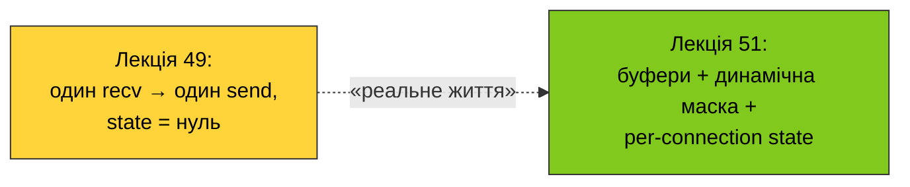
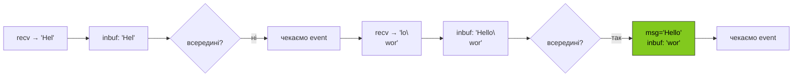
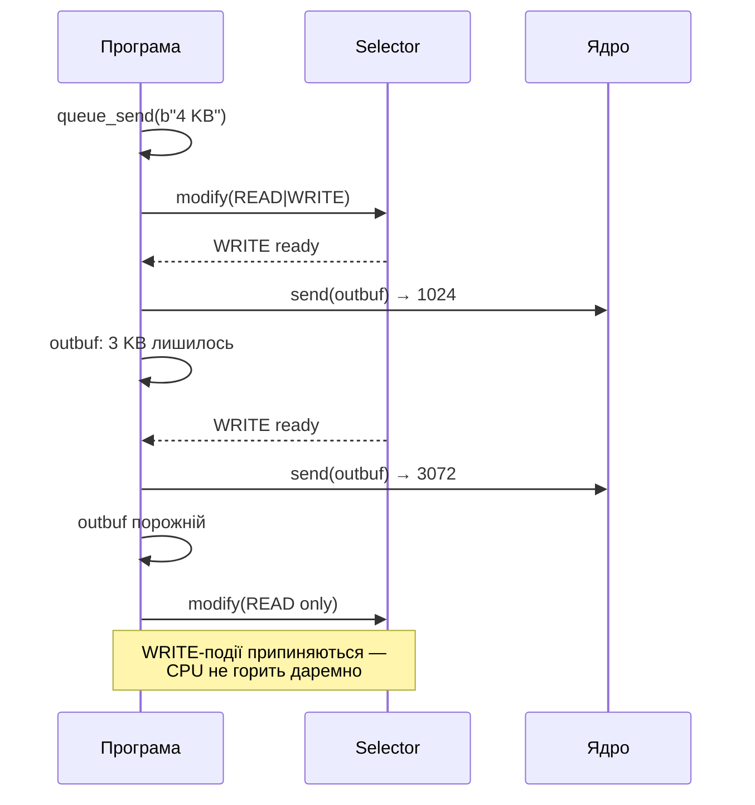
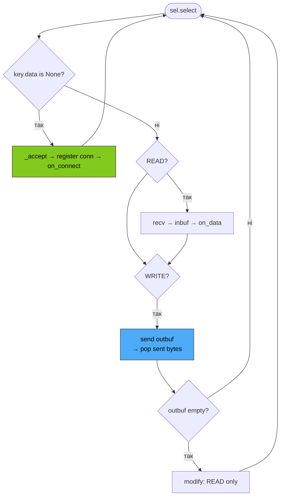

# 51. (Л) Побудова сокетного подієвого циклу на `selectors`

## Зміст лекції

1. Від наївного `selectors`-сервера до повноцінного event loop
2. Три проблеми, що ламають сервер із лекції 49
3. Per-connection state: де живуть дані з'єднання
4. Read-буфер: збирання повідомлень із потоку байтів
5. Write-буфер: партіальна відправка через `send`
6. Динамічна маска інтересу: `sel.modify(...)`
7. Тайм-аути через `select(timeout=...)`
8. Reactor — клас, що ховає `selectors`
9. Як це все стає `asyncio`

## Від наївного `selectors`-сервера до повноцінного event loop

У [лекції 49](/ua/courses/programming-2sem/module4/49-non-blocking-sockets-lecture/) ми вже зібрали робочий неблокуючий ехо-сервер: `selectors.DefaultSelector`, `register / select / unregister`, маски `EVENT_READ` / `EVENT_WRITE`. Для іграшкового ехо-сервера, де **одна порція байтів** = **одне повідомлення**, а `send` ніколи «не дає здачі», цього вистачає.

Ця лекція — про те, як той самий код перетворити на **event loop**, придатний для реального протоколу. Жодних нових інструментів — лише дисципліна довкола вже знайомих `selectors`.



## Три проблеми, що ламають сервер із лекції 49

Згадаймо ядро сервера 49:

```python
def serve(conn, sel, addr):
    chunk = conn.recv(4096)
    if not chunk:
        sel.unregister(conn); conn.close(); return
    conn.send(chunk)
```

Він коректний для одного діалекту: «надсилай ціле повідомлення цілим `recv`, і не давай більше, ніж 4 КБ за раз». Будь-який реальний протокол одразу ламає три припущення:

- **Повідомлення довше за один `recv`.** Клієнт надіслав `Hello, world!\n`, але через MTU чи timing ядро віддало вам спершу `Hello,` — а решту через 30 мс. Перша половина «зависла в повітрі»: куди її покласти?
- **`send` повертає менше байтів, ніж дали.** Буфер відправки в ядрі обмежений. Якщо клієнт читає повільно — `send(b"...4 KB...")` поверне 1024 і скаже «решту відправ потім». У нашому коді ці байти просто **губляться**.
- **Постійна підписка на `WRITE`.** Якщо «про всяк випадок» зареєструвати `READ | WRITE`, `select` пробуджуватиметься щомиті: неблокуючий сокет **майже завжди** готовий до запису. CPU летить у 100%.

Кожна з трьох проблем має одне розв'язання — і всі вони складаються в одну й ту саму структуру, яку прийнято називати **event loop**.

## Per-connection state

Перший крок — дати кожному з'єднанню «домівку». У сервері 49 ми клали в `data=` словник з 1 поля (адресу). Реальний обробник хоче тримати більше:

- `addr` — для логів;
- `inbuf` — байти, які прочитали, але ще не сформували в повідомлення;
- `outbuf` — байти, які треба відправити, але ще не влізли в буфер ядра;
- `n` — лічильник повідомлень для цього клієнта;
- `last_seen` — для idle-timeout.

Це природний `dataclass`:

```python
import socket
import time
from dataclasses import dataclass, field


@dataclass
class Connection:
    sock: socket.socket
    addr: tuple[str, int]
    inbuf: bytearray = field(default_factory=bytearray)
    outbuf: bytearray = field(default_factory=bytearray)
    n: int = 0
    last_seen: float = field(default_factory=time.monotonic)
```

При реєстрації кладемо цей об'єкт у `data`:

```python
conn = Connection(sock=client_sock, addr=client_addr)
sel.register(client_sock, selectors.EVENT_READ, data=conn)
```

Тепер у обробнику ми одним рухом дістаємо все:

```python
def on_event(key, mask):
    conn: Connection = key.data
    # доступні conn.sock, conn.addr, conn.inbuf, conn.outbuf, conn.n...
```

!!! tip "Чому не глобальний `dict[fd, state]`"
    Технічно можна тримати окремий словник «fd → стан». Але `selectors` уже дає `key.data` — це і є офіційний канал. Дві копії стану — двоїте джерело істини й ризикуєте розузгодженням при `unregister`/`close`.

## Read-буфер: збирання повідомлень із потоку байтів

TCP — це **потік байтів**, не повідомлень. `recv(4096)` повертає «скільки є», а не «один логічний пакет». Якщо ваш протокол ділить повідомлення, наприклад, символом `\n`, рамки складаєте ви, а не ядро.

Алгоритм: накопичуємо в `inbuf` усе, що прийшло, і потім «нарізаємо» по роздільнику:

```python
def on_readable(conn: Connection) -> list[bytes]:
    try:
        chunk = conn.sock.recv(4096)
    except BlockingIOError:
        return []
    if not chunk:
        return [b""]                          # peer закрив
    conn.inbuf.extend(chunk)

    # витягуємо ЦІЛІ рядки, що закінчуються на \n
    messages: list[bytes] = []
    while True:
        i = conn.inbuf.find(b"\n")
        if i == -1:
            break                             # повного рядка ще нема — чекаємо
        line = bytes(conn.inbuf[:i])
        del conn.inbuf[: i + 1]               # викидаємо рядок і сам \n
        messages.append(line)
    return messages
```

Ключове: `inbuf` накопичує **між викликами**. Подія READ спрацьовує — дочитуємо й намагаємось «нарізати», скільки виходить. Те, що не нарізалось — лежить до наступного пробудження.



!!! warning "Один `recv` ≠ одне `\n`-обмежене повідомлення"
    У `nc` так часто здається, бо stdin лінійно-буферизований. Припущення «recv поверне рівно один рядок» — це **класичний баг**: він стрілятиме рівно тоді, коли клієнт почне посилати багато повідомлень підряд або переходити по сегментах TCP.

## Write-буфер: партіальна відправка

`send` на неблокуючому сокеті повертає **число фактично записаних байтів** — і це число може бути менше за довжину того, що ви дали. Решта **не відправилась**. Якщо її загубити — клієнт отримає урізане повідомлення.

Шаблон роботи з частковим записом:

1. Усе, що треба відправити, спершу йде в `conn.outbuf`.
2. На події `EVENT_WRITE` беремо стільки з `outbuf`, скільки `send` погодиться прийняти, і **викидаємо саме цю кількість** з початку буфера.
3. Якщо `outbuf` спорожнів — **знімаємо інтерес `EVENT_WRITE`** (інакше `select` буде нескінченно прокидати нас, бо сокет «майже завжди готовий до запису»).

```python
import selectors


def queue_send(conn: Connection, sel: selectors.BaseSelector, data: bytes) -> None:
    was_empty = not conn.outbuf
    conn.outbuf.extend(data)
    if was_empty:
        # тепер є що писати — додаємо інтерес WRITE
        sel.modify(conn.sock, selectors.EVENT_READ | selectors.EVENT_WRITE, data=conn)


def on_writable(conn: Connection, sel: selectors.BaseSelector) -> None:
    if not conn.outbuf:
        return
    try:
        sent = conn.sock.send(conn.outbuf)
    except BlockingIOError:
        return
    del conn.outbuf[:sent]                    # викидаємо те, що пішло
    if not conn.outbuf:
        # черга порожня — більше не цікавимось WRITE
        sel.modify(conn.sock, selectors.EVENT_READ, data=conn)
```

Ця пара функцій — мінімально достатня для коректного запису на повільний канал. **Без неї** будь-який сервер, що пише більше, ніж кілька кілобайт, рано чи пізно загубить дані.



## Динамічна маска інтересу

`sel.modify(fd, events, data=...)` — **серце** event loop'а. Це єдиний правильний спосіб сказати «тепер мене цікавлять інші події на цьому сокеті».

Чотири канонічних патерни:

| Стан з'єднання | Маска | Чому |
|---|---|---|
| Чекаємо запиту | `READ` | Нема що відправляти — нема сенсу слухати WRITE |
| Є дані в `outbuf` | `READ \| WRITE` | Хочемо і нових запитів, і вікна відправки |
| Відповідь повністю відправлена | `READ` | Назад у режим очікування |
| Клієнт закрив свою половину, але ми ще не дописали | тільки `WRITE` | Дочитувати нема куди, лише дописати |

!!! warning "Постійно тримати `READ | WRITE` — антипатерн"
    Неблокуючий сокет **майже завжди** готовий до запису. Якщо маска `WRITE` увімкнена, а `outbuf` порожній — `select` повертатиметься щомиті, і CPU зупиниться на 100%. «Можна писати» **не означає** «треба писати».

## Тайм-аути через `select(timeout=...)`

`select` приймає необов'язковий `timeout` у секундах:

- `None` — чекати безкінечно (як у 49);
- `0` — не чекати взагалі, опитати поточний стан і повернутись;
- число `>0` — чекати, доки спрацює подія **або** мине стільки секунд.

Це дає **місце для періодичних задач**: idle-timeouts, статистика, очищення кешів, перевірка прапорця `running`.

```python
IDLE_DEADLINE = 30.0      # сек


def idle_pass(connections, sel, now):
    for conn in list(connections):
        if now - conn.last_seen > IDLE_DEADLINE:
            sel.unregister(conn.sock)
            conn.sock.close()
            connections.remove(conn)


def loop(sel, connections):
    while True:
        events = sel.select(timeout=1.0)      # просинаємось хоча б раз на секунду
        for key, mask in events:
            ...                                # обробка події
        idle_pass(connections, sel, time.monotonic())
```

!!! info "Точність — через купу таймерів"
    Замість фіксованого `timeout=1.0` зрілий event loop тримає **впорядковану купу** найближчих дедлайнів і передає в `select` різницю до найближчого з них. Саме так зроблено в `asyncio.base_events`.

## Reactor — клас, що ховає `selectors`

Складемо все докупи у мінімальний клас разом із прикладним підкласом. Це той самий скелет, що ви впізнаєте в `asyncio` чи Twisted. Файл повністю самодостатній — копіюйте в `reactor_echo.py`, запускайте `python3 reactor_echo.py`, підключайтесь через `nc 127.0.0.1 9100`.

```python
import selectors
import socket
import time
from dataclasses import dataclass, field


@dataclass
class Connection:
    sock: socket.socket
    addr: tuple[str, int]
    inbuf: bytearray = field(default_factory=bytearray)
    outbuf: bytearray = field(default_factory=bytearray)
    last_seen: float = field(default_factory=time.monotonic)


class Reactor:
    def __init__(self, host: str, port: int) -> None:
        self.host = host
        self.port = port
        self.sel = selectors.DefaultSelector()
        self.connections: dict[int, Connection] = {}      # fd -> Connection
        self.running = False

    # --- API для обробників ---

    def queue_send(self, conn: Connection, data: bytes) -> None:
        was_empty = not conn.outbuf
        conn.outbuf.extend(data)
        if was_empty:
            self.sel.modify(
                conn.sock,
                selectors.EVENT_READ | selectors.EVENT_WRITE,
                data=conn,
            )

    def close(self, conn: Connection) -> None:
        self.sel.unregister(conn.sock)
        conn.sock.close()
        self.connections.pop(conn.sock.fileno(), None)

    # --- внутрішнє ---

    def _accept(self, server: socket.socket) -> None:
        try:
            client, addr = server.accept()
        except BlockingIOError:
            return
        client.setblocking(False)
        conn = Connection(sock=client, addr=addr)
        self.connections[client.fileno()] = conn
        self.sel.register(client, selectors.EVENT_READ, data=conn)
        self.on_connect(conn)

    def _read(self, conn: Connection) -> None:
        try:
            chunk = conn.sock.recv(4096)
        except BlockingIOError:
            return
        if not chunk:
            self.on_disconnect(conn)
            self.close(conn)
            return
        conn.last_seen = time.monotonic()
        conn.inbuf.extend(chunk)
        self.on_data(conn)

    def _write(self, conn: Connection) -> None:
        if not conn.outbuf:
            return
        try:
            sent = conn.sock.send(conn.outbuf)
        except BlockingIOError:
            return
        del conn.outbuf[:sent]
        if not conn.outbuf:
            self.sel.modify(conn.sock, selectors.EVENT_READ, data=conn)

    # --- події, які перевизначає підклас ---

    def on_connect(self, conn: Connection) -> None: ...
    def on_data(self, conn: Connection) -> None: ...
    def on_disconnect(self, conn: Connection) -> None: ...

    # --- головний цикл ---

    def run(self) -> None:
        server = socket.socket(socket.AF_INET, socket.SOCK_STREAM)
        server.setsockopt(socket.SOL_SOCKET, socket.SO_REUSEADDR, 1)
        server.bind((self.host, self.port))
        server.listen(128)
        server.setblocking(False)
        self.sel.register(server, selectors.EVENT_READ, data=None)
        self.running = True
        print(f"reactor listening on {self.host}:{self.port}")
        try:
            while self.running:
                for key, mask in self.sel.select(timeout=1.0):
                    if key.data is None:
                        self._accept(key.fileobj)
                    else:
                        if mask & selectors.EVENT_READ:
                            self._read(key.data)
                        if mask & selectors.EVENT_WRITE:
                            self._write(key.data)
        except KeyboardInterrupt:
            print("reactor stopped")
        finally:
            self.sel.close()
            server.close()


# --- прикладний код: підклас, що знає лише про повідомлення ---


class LineEchoServer(Reactor):
    def on_connect(self, conn: Connection) -> None:
        print(f"connected: {conn.addr}")
        self.queue_send(conn, b"Hello!\n")

    def on_data(self, conn: Connection) -> None:
        while True:
            i = conn.inbuf.find(b"\n")
            if i == -1:
                return                                # повного рядка ще нема
            line = bytes(conn.inbuf[:i])
            del conn.inbuf[: i + 1]
            self.queue_send(conn, b"[echo] " + line + b"\n")

    def on_disconnect(self, conn: Connection) -> None:
        print(f"disconnected: {conn.addr}")


if __name__ == "__main__":
    LineEchoServer("127.0.0.1", 9100).run()
```

Зверніть увагу: прикладний код (`LineEchoServer`) **навіть не згадує `selectors`**. Він описує лише три події — підключився, прийшли дані, відключився — а вся механіка READ/WRITE-масок, буферів і `modify` ховається у Reactor.



## Як це все стає `asyncio`

Те, що ми щойно зібрали, — **це і є `asyncio` в мініатюрі**. Дослівне відображення:

| Наш Reactor | `asyncio` |
|---|---|
| `Connection` (inbuf/outbuf) | `StreamReader` + `StreamWriter` |
| `on_data` (хук на READ) | `await reader.readline()` |
| `queue_send` | `writer.write(...)` |
| Знаття інтересу WRITE при порожньому `outbuf` | `await writer.drain()` |
| Цикл `while self.running` | `asyncio.run(main())` |
| `select(timeout=1.0)` | `loop._run_once()` |

`asyncio` дозволяє писати «лінійний» код із `async/await`, який під капотом перетворюється на ту саму машину станів, що ми писали руками. **Жодної магії не з'являється** — лише зручніший синтаксис для того самого механізму.

!!! info "Чому варто було пройти руками"
    Коли `await writer.drain()` блокується довше за очікуване, або сервер їсть CPU при простої, або `asyncio.gather` дає неочікуваний порядок — без розуміння нижнього рівня причину знайти важко. Тепер ви знаєте, де шукати.

## Підсумок

| Концепція | Опис |
|---|---|
| Per-connection state | Один об'єкт на з'єднання, кладеться в `key.data` |
| `inbuf` (read buffer) | Збирає байти між подіями, поки не сформується повне повідомлення |
| `outbuf` (write buffer) | Тримає те, що `send` не зміг вмістити в буфер ядра |
| `sel.modify(...)` | Динамічно змінює маску `READ`/`WRITE` залежно від стану |
| Маска `WRITE` лише за наявності даних | Інакше CPU 100% |
| `select(timeout=N)` | Дає вікно для періодичних задач (idle-timeouts тощо) |
| Reactor | Клас, що ховає `selectors` і дає `on_connect` / `on_data` / `on_disconnect` |

Ключові ідеї:

- **Event loop — це дисципліна, а не бібліотека.** `selectors` дає примітиви, але без буферів і динамічних масок далеко не зайдеш.
- **Партіальний `send` — головна пастка реальних серверів.** Завжди майте `outbuf` і обробник `EVENT_WRITE`.
- **`asyncio` — це той самий Reactor під капотом.** Усе, що ви тут побудували, — його прозоре пояснення.

## Корисні посилання

- [Python docs — selectors](https://docs.python.org/3/library/selectors.html)
- [Python docs — Streams (asyncio)](https://docs.python.org/3/library/asyncio-stream.html)
- [CPython — asyncio/base_events.py](https://github.com/python/cpython/blob/main/Lib/asyncio/base_events.py) — як цей самий цикл написано в стандартній бібліотеці
- [Reactor pattern — Wikipedia](https://en.wikipedia.org/wiki/Reactor_pattern)
- [Doug Lea — Scalable IO in Java](https://gee.cs.oswego.edu/dl/cpjslides/nio.pdf) — класична стаття про Reactor (Java, але концепції універсальні)
