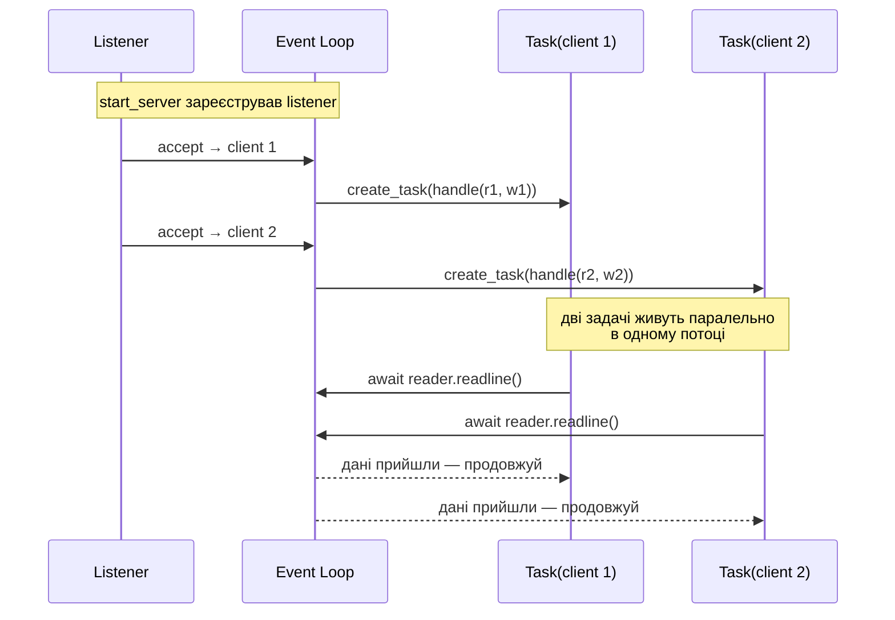
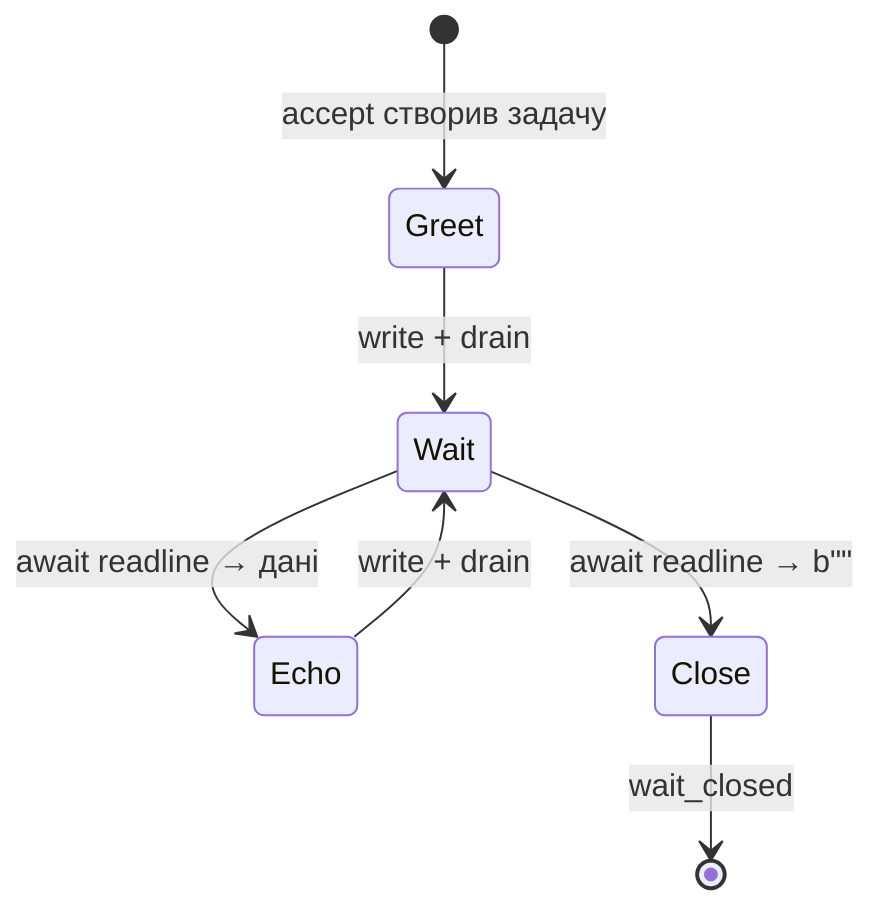
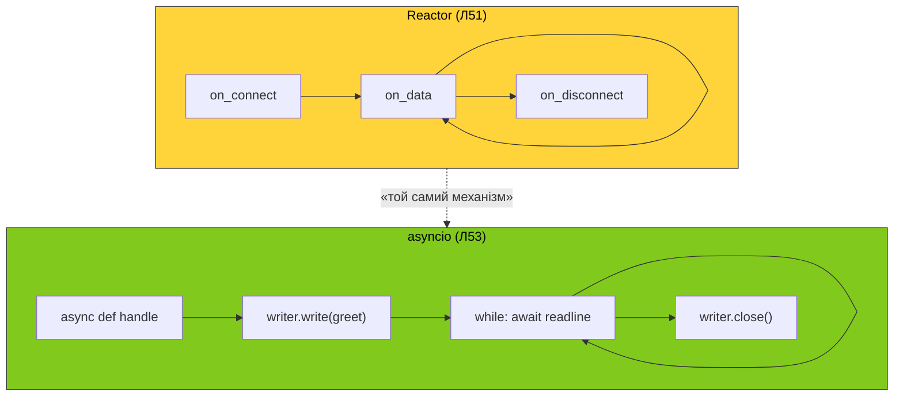

# 53. (Л) Архітектура ехо-сервера на подієвому циклі `asyncio`

## Зміст лекції

1. Від рукописного Reactor до `asyncio`
2. Що дає `asyncio` поверх `selectors`
3. `asyncio.start_server` — одна функція замість `accept`-циклу
4. `StreamReader` / `StreamWriter` — буфери, які ми вже бачили
5. Корутина-обробник: одна на з'єднання
6. Backpressure: `await writer.drain()`
7. Коректне закриття: `close` + `wait_closed`
8. Скасування і shutdown сервера
9. Анатомія повного ехо-сервера на `asyncio`
10. Чим це відрізняється від Reactor з лекції 51

## Від рукописного Reactor до `asyncio`

У [лекції 51](/ua/courses/programming-2sem/module4/51-event-loop-selectors-lecture/) ми зібрали Reactor: `selectors` + per-connection `Connection(inbuf, outbuf)` + динамічна маска `EVENT_READ`/`EVENT_WRITE` + `select(timeout=...)`. Прикладний `LineEchoServer` уже не знав про маски — лише три хуки: `on_connect`, `on_data`, `on_disconnect`.

`asyncio` робить наступний крок. Він ховає **навіть ці три хуки** і дає писати обробник з'єднання як **звичайний лінійний код** з `await`:

```python
async def handle(reader, writer):
    line = await reader.readline()
    writer.write(b"[echo] " + line)
    await writer.drain()
```

Жодних `inbuf`/`outbuf` у вашому коді. Жодних `sel.modify`. Жодних колбеків. Усе те саме виконується під капотом — ми вже бачили, як саме.

!!! info "Лекція не вводить нових концепцій"
    Усе, що тут відбудеться, — це **перейменування**. `inbuf` → `StreamReader`, `outbuf` → `StreamWriter`, `on_data` → `await reader.readline()`, «зняти інтерес WRITE» → `await writer.drain()`. Якщо лекція 51 зрозуміла, ця — суто про API.

## Що дає `asyncio` поверх `selectors`

| Що ми робили руками в Л49–Л51 | Що робить `asyncio` |
|---|---|
| `sel.register(server, EVENT_READ)` + цикл `accept` | `asyncio.start_server(handle, host, port)` |
| `Connection` з `inbuf`/`outbuf` | `StreamReader` + `StreamWriter` |
| `recv` у циклі + `inbuf.find(b"\n")` | `await reader.readline()` |
| `queue_send` + `sel.modify(READ|WRITE)` | `writer.write(data)` |
| «Зняти WRITE коли `outbuf` порожній» | `await writer.drain()` |
| `unregister` + `close` | `writer.close()` + `await writer.wait_closed()` |
| `while running: sel.select(...)` | `await server.serve_forever()` |

Усі рядки правого стовпця — це **лінійний код** усередині `async def handle(reader, writer)`. Усе керування `selectors` залишається всередині `asyncio.base_events` — там, де ми його **самі написали б**, якби розширювали Reactor з лекції 51.

## `asyncio.start_server`

Точка входу в TCP-сервер на `asyncio` — функція `asyncio.start_server`:

```python

import asyncio


async def handle(reader: asyncio.StreamReader, writer: asyncio.StreamWriter) -> None:
    print("handle")


async def main() -> None:
    server = await asyncio.start_server(handle, "127.0.0.1", 9100)
    async with server:
        print("Server started")
        await server.serve_forever()


asyncio.run(main())

```

Що тут відбувається крок за кроком:

1. `start_server` створює слухаючий сокет, кладе його в `setblocking(False)`, реєструє в `selectors` під капотом.
2. На кожен `accept` `asyncio` **створює нову задачу** (`asyncio.Task`), яка викликає `handle(reader, writer)`.
3. `serve_forever` — це нескінченний `await`, що тримає програму живою.
4. `async with server:` гарантує, що при виході (наприклад, `Ctrl+C`) сервер коректно закриється.

Ключове: `handle` запускається **одночасно для всіх клієнтів** — кожен у своїй задачі. Усі вони живуть в **одному потоці**, перемикання відбувається на `await`-точках. Це той самий event loop, тільки задачі замість колбеків.



## `StreamReader` / `StreamWriter`

Перший аргумент `handle` — це `StreamReader`. Це обгортка над тим самим `inbuf`, що ми писали в лекції 51:

```python
chunk = await reader.read(4096)                    # «прочитай скільки є», але не блокуйся
line = await reader.readline()                     # «дочитай до \n», збирай з кількох recv
data = await reader.readexactly(16)                # «дочитай рівно 16 байтів»
eof = reader.at_eof()                              # чи закрив peer свою половину
```

Усі `read*` методи — **корутини**. `await` тут означає те саме, що в Reactor означало «повернути керування циклу й зачекати події READ». Поки даних нема, інші задачі продовжують працювати.

Другий аргумент — `StreamWriter`. Це обгортка над `outbuf` + `sel.modify(...)`:

```python
writer.write(b"Hello!\n")                          # покласти в outbuf — НЕ корутина!
writer.writelines([b"a\n", b"b\n"])                # те саме, кілька шматків
await writer.drain()                               # дочекатись, поки outbuf спустіє
writer.close()                                     # закрити з'єднання
await writer.wait_closed()                         # дочекатись фактичного закриття
```

!!! warning "`writer.write` — НЕ корутина"
    `write` лише **додає байти в буфер**, як `conn.outbuf.extend(...)` в Reactor. Реальна відправка через `send` відбудеться, коли event loop отримає `EVENT_WRITE`. Тому `await writer.write(...)` — синтаксична помилка, а написати без `await` — нормально.

Адресу клієнта можна дістати в обробнику так:

```python
addr = writer.get_extra_info("peername")           # ('127.0.0.1', 51234)
```

## Корутина-обробник: одна на з'єднання

`handle` — це повна історія одного клієнта від `accept` до `close`. Усе, що ви робили в `on_connect` + `on_data` + `on_disconnect` Reactor'а, тут лежить у **одній функції** з лінійним потоком:

```python
async def handle(reader: asyncio.StreamReader, writer: asyncio.StreamWriter) -> None:
    addr = writer.get_extra_info("peername")
    print(f"connected: {addr}")

    writer.write(b"Hello!\n")
    await writer.drain()

    n = 0
    while True:
        line = await reader.readline()
        if not line:                              # peer закрив з'єднання → b""
            break
        n += 1
        writer.write(f"[{n}] ".encode() + line)
        await writer.drain()

    writer.close()
    await writer.wait_closed()
    print(f"disconnected: {addr}")
```

Прочитайте цей код порівняно з `LineEchoServer` з лекції 51 — функція робить **те саме**, але без явної машини станів. Стан `n` живе як локальна змінна. `await reader.readline()` — це й є момент, коли в Reactor стояла межа між викликами `on_data`.



## Backpressure: `await writer.drain()`

`writer.write(data)` нічого не відправляє — лише кладе в буфер. Якщо клієнт читає повільно, а сервер пише швидко, **буфер зростатиме без обмежень**. Кінчиться це або OOM, або величезними затримками.

Виправлення — `await writer.drain()`:

```python
writer.write(big_chunk)
await writer.drain()                              # відпустить керування циклу,
                                                  # поки буфер не зменшиться
```


| Без `drain` | З `drain` |
|---|---|
| `write` миттєво повертається | `drain` чекає, поки буфер не спустіє |
| Пам'ять росте лінійно з продуктивністю | Пам'ять обмежена |
| Повільний клієнт б'є по серверу | Сервер сам пригальмовує запис у повільного клієнта |

!!! tip "Правило великого пальця"
    Викликайте `await writer.drain()` після кожного `write`, який пише «значущий» обсяг (хоч щось довше за вітання). У циклі ехо — обов'язково на кожній ітерації.

## Закриття: `close` + `wait_closed`

Закрити з'єднання — це **дві операції**:

```python
writer.close()                                    # ініціюємо закриття: відправляємо FIN
await writer.wait_closed()                        # чекаємо, поки воно справді відбудеться
```

`close` сам по собі **синхронний**: він каже event loop'у «коли спустиш `outbuf` — відправ FIN». До цього моменту з'єднання ще живе. `wait_closed` — корутина, що чекає **фактичного завершення** запису й закриття дескриптора.

!!! warning "Пропускати `wait_closed` — ризик загубити байти"
    Якщо вийти з `handle` одразу після `writer.close()`, задача завершиться, але event loop ще не встигне відправити решту `outbuf`. Дані просто **зникнуть**. Завжди робіть `await writer.wait_closed()`.

## Скасування і shutdown сервера

`asyncio` дозволяє зупинити сервер не лише на `KeyboardInterrupt`, а й програмно — і робить це коректно.

```python
async def main() -> None:
    server = await asyncio.start_server(handle, "127.0.0.1", 9100)
    async with server:
        try:
            await server.serve_forever()
        except asyncio.CancelledError:
            pass

    print("server stopped")
```

`async with server:` робить дві важливих речі:

1. `__aenter__` — нічого особливого, лише запам'ятовує `server`.
2. `__aexit__` — викликає `server.close()` і `await server.wait_closed()` — закриває **слухаючий сокет** і чекає, поки всі активні з'єднання дограють.

## Повний ехо-сервер на `asyncio`

Тут зібрано все докупи. Файл повністю самодостатній — копіюйте в `asyncio_echo.py`, запускайте `python3 asyncio_echo.py`, підключайтесь через `nc 127.0.0.1 9100`.

```python
import asyncio


HOST = "127.0.0.1"
PORT = 9100


async def handle(reader: asyncio.StreamReader, writer: asyncio.StreamWriter) -> None:
    addr = writer.get_extra_info("peername")
    print(f"connected: {addr}")

    writer.write(b"Hello from asyncio!\n")
    await writer.drain()

    n = 0
    try:
        while True:
            line = await reader.readline()
            if not line:                                # peer закрив свою половину
                break
            n += 1
            msg = line.rstrip(b"\r\n")
            print(f"<- {addr}: {msg!r}")
            reply = f"[{n}] ".encode() + msg + b"\n"
            writer.write(reply)
            await writer.drain()
            print(f"-> {addr}: {reply!r}")
    except ConnectionResetError:
        # клієнт грубо обірвав з'єднання — це не помилка сервера
        pass
    finally:
        writer.close()
        await writer.wait_closed()
        print(f"disconnected: {addr} (n={n})")


async def main() -> None:
    server = await asyncio.start_server(handle, HOST, PORT)
    addrs = ", ".join(str(s.getsockname()) for s in server.sockets)
    print(f"asyncio echo listening on {addrs}")
    async with server:
        try:
            await server.serve_forever()
        except asyncio.CancelledError:
            pass
    print("server stopped")


if __name__ == "__main__":
    try:
        asyncio.run(main())
    except KeyboardInterrupt:
        pass
```

Зверніть увагу:

- Жодного `selectors` у вашому коді — він є, але всередині `asyncio`.
- `try/finally` гарантує `wait_closed` навіть при винятку всередині циклу.
- `ConnectionResetError` ловиться окремо — це нормальна ситуація (клієнт натиснув `Ctrl+C` на `nc`).
- `n` — локальна змінна корутини. Жодного `Connection`-об'єкта не потрібно: кожен клієнт — своя задача зі своїм стеком.

## Чим це відрізняється від Reactor з лекції 51

Концептуально — нічим. Поверхнево — чотирма речами.

**1. Одна корутина замість трьох хуків.** У Reactor ви писали `on_connect`/`on_data`/`on_disconnect`. У `asyncio` — одну функцію `handle` з лінійним потоком. Стан з'єднання живе як локальні змінні, а не як поля `Connection`.

**2. Задачі замість колбеків.** Кожен клієнт — `asyncio.Task`. Це означає, що ви можете:
   - **скасувати** його ззовні: `task.cancel()`;
   - **дочекатись** його результату: `await task`;
   - **зібрати в `gather`** кілька задач, як у будь-якій асинхронній програмі.

**3. Backpressure через `drain`.** У Reactor ви могли наповнювати `outbuf` без обмежень, поки event loop його повільно відправляв. `drain` робить цю проблему явною і вирішує її автоматично.

**4. Помилки = винятки.** У Reactor «клієнт обірвав з'єднання» — це `recv == b""` плюс ще, можливо, `ConnectionResetError`. У `asyncio` все приходить як `await`, тож обробляється звичайним `try/except`. Це робить код помітно ближчим до синхронного.



## Підсумок

| Концепція | Reactor (Л51) | `asyncio` (ця лекція) |
|---|---|---|
| Точка входу | `Reactor.run()` + `sel.select` | `asyncio.start_server` + `serve_forever` |
| Per-connection state | `Connection` у `key.data` | локальні змінні `handle` |
| Прийом даних | `recv` → `inbuf.find(b"\n")` | `await reader.readline()` |
| Постановка на запис | `queue_send` → `sel.modify(READ\|WRITE)` | `writer.write` |
| Очікування відправки | «зняти WRITE при порожньому `outbuf`» | `await writer.drain()` |
| Закриття | `sel.unregister` + `close` | `writer.close()` + `await wait_closed()` |
| Зупинка сервера | прапорець `running` | `async with server:` + `CancelledError` |

Ключові ідеї:

- **`asyncio` нічого нового не додає** — він систематизує те, що ми писали руками. `selectors` під капотом, той самий event loop, ті самі буфери.
- **Лінійний код замість машини станів.** `async def handle(reader, writer)` читається як синхронний сервер на потоках, але виконується одним потоком на тисячах з'єднань.
- **`drain` — це backpressure.** Без нього повільний клієнт з'їдає пам'ять сервера. Викликайте після кожного `write`.
- **Закриття — дві операції.** `close()` запускає, `wait_closed()` дочікує. Пропуск другого = загублені байти.

## Корисні посилання

- [Python docs — Streams (asyncio)](https://docs.python.org/3/library/asyncio-stream.html) — повний API `StreamReader` / `StreamWriter`
- [Python docs — `asyncio.start_server`](https://docs.python.org/3/library/asyncio-stream.html#asyncio.start_server)
- [Python docs — Transports and Protocols](https://docs.python.org/3/library/asyncio-protocol.html) — низькорівневий API під Streams
- [CPython — `asyncio/streams.py`](https://github.com/python/cpython/blob/main/Lib/asyncio/streams.py) — реалізація `StreamReader`/`StreamWriter`
- [PEP 3156 — Asynchronous IO Support](https://peps.python.org/pep-3156/) — оригінальна пропозиція з мотивацією й архітектурними рішеннями
